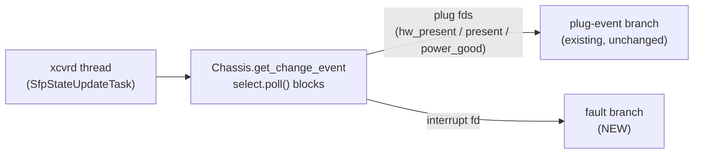
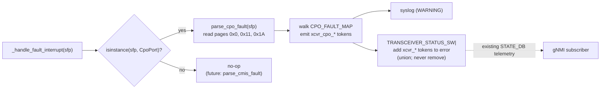
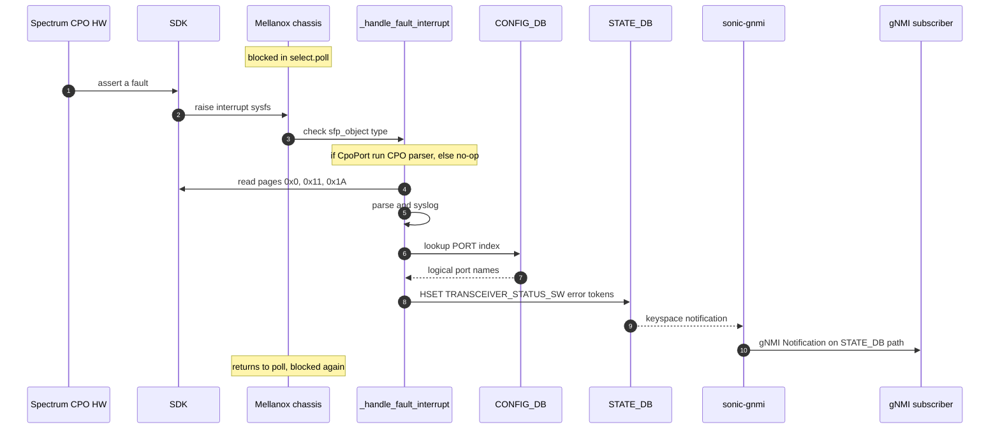

# CPO Fault Indication - HLD

## 1. Revision


| Rev | Date     | Author | Change Description |
| --- | -------- | ------ | ------------------ |
| 0.1 | May 2026 | Noa Or | Initial draft.     |


## 2. Scope

This HLD describes the design for surfacing **CPO (Co-Packaged Optics) vModule** fault indications from the Spectrum SDK kernel module to higher-level SONiC consumers (syslog, STATE_DB, gNMI subscribers) on Mellanox platforms.

In scope:

- Listening for fault interrupts on the per-vModule sysfs node `/sys/module/sx_core/asic0/module{id}/interrupt` for every CPO vModule.
- Reading the CPO fault flag pages from EEPROM: pages **0x0** (module-level + lower-memory thermal flags), **0x11** (per-lane flags, 20 bytes per lane), **0x1A** (ELS flags).
- Logging the parsed fault information to syslog with WARNING severity.
- Writing the parsed fault information into STATE_DB `TRANSCEIVER_STATUS_SW` (existing table, existing fields). gNMI subscribers receive it through the standard STATE_DB telemetry path; no new gNMI event YANG model is introduced.
- Maintaining an in-code mapping table from `(page, byte, bit) -> fault name`, sourced from the Spectrum CPO doc.
- **Extensibility hook for regular CMIS pluggables**: the handler dispatches via `isinstance(sfp, CpoPort)` so a follow-up effort can add a `CMIS_FAULT_MAP` and a `parse_cmis_fault()` body without touching the registration, dispatch, or STATE_DB write paths. In this feature the non-CPO branch is a no-op.

Out of scope:

- **Regular CMIS pluggable (QSFP+/QSFP28/QSFP-DD/OSFP) fault decoding.** Wiring is in place; populating `CMIS_FAULT_MAP` and the per-lane CMIS mapping is deferred to a separate effort and owner.
- Recovery / clearing policy. The interrupt deassertion is only an acknowledgement that the EEPROM was read.  
The `xcvr_`* tokens written to `TRANSCEIVER_STATUS_SW.error` therefore persist until cleared by an external mechanism.
- Non-Mellanox platforms (other vendors can implement equivalent platform-layer hooks).
- FW-Control mode.

## 3. Definitions/Abbreviations


| Term     | Definition                                                                                                                                                                                                                                                                                                                                                                     |
| -------- | ------------------------------------------------------------------------------------------------------------------------------------------------------------------------------------------------------------------------------------------------------------------------------------------------------------------------------------------------------------------------------ |
| CPO      | Co-Packaged Optics                                                                                                                                                                                                                                                                                                                                                             |
| ELS      | External Laser Source                                                                                                                                                                                                                                                                                                                                                          |
| OE       | Optical Engine; identified by `oe_id`                                                                                                                                                                                                                                                                                                                                          |
| vModule  | Virtual module exposed by SDK; one `(oe_id, els_id)` tuple                                                                                                                                                                                                                                                                                                                     |
| PMON     | Platform Monitor docker; hosts `xcvrd` and other platform daemons                                                                                                                                                                                                                                                                                                              |
| xcvrd    | Transceiver daemon under PMON; orchestrates SFP state and EEPROM info                                                                                                                                                                                                                                                                                                          |
| SDK      | NVIDIA Spectrum SDK (`sx_core` kernel module)                                                                                                                                                                                                                                                                                                                                  |
| gNMI     | gRPC Network Management Interface. In SONiC, the `sonic-gnmi` (a.k.a. telemetry) container runs an OpenConfig gNMI server that exposes SONiC Redis DBs to external clients over gRPC. External NMS/controllers `Subscribe` to a path such as `STATE_DB/TRANSCEIVER_STATUS_SW/<port>` and receive a stream of `Notification` messages whenever the underlying Redis key changes |
| STATE_DB | SONiC Redis instance (db 6) that stores operational state of the device; consumed by sonic-gnmi for streaming telemetry to gNMI clients                                                                                                                                                                                                                                        |
|          |                                                                                                                                                                                                                                                                                                                                                                                |


## 4. Overview

SDK exposes a single fault interrupt per module, surfaced as a pollable sysfs attribute by the kernel module:

```
/sys/module/sx_core/asic0/module{sdk_index}/interrupt
```

The same `module{sdk_index}` directory already hosts the plug-event sysfs files (`present`, `hw_present`, `power_good`) consumed by `mlnx-platform-api`. The `sdk_index` is:

- per vModule for CPO ports
- per physical port for regular SFP/QSFP ports


When the hardware asserts a fault, the SDK signals `POLLPRI` on that file. Software is expected to:

1. Wake from a blocking `poll()` on that fd.
2. If interrupt sysfs was changed from 0 to 1, it means there is a fault.
3. Read the relevant EEPROM pages to identify the exact fault class.
4. Log the information to syslog.
5. Write the parsed fault info into STATE_DB `TRANSCEIVER_STATUS_SW`.

gNMI subscribers receive the change via the existing STATE_DB telemetry path provided by sonic-gnmi.

SONiC already runs a PMON thread that blocks in `poll()` on per-module sysfs files for plug/unplug events: `xcvrd`'s `SfpStateUpdateTask` calls `Chassis.get_change_event(timeout)`, which under module-host-management mode uses `select.poll()` on `hw_present` / `present` / `power_good` fds.  
Here, we reuse that same thread and `poll()` loop for the interrupt fds, keeping the changes minimal.

## 5. Requirements

Functional:

- PMON shall block (not busy-poll) on every per-vModule interrupt sysfs for as long as no CPO fault is asserted.
- On interrupt, PMON shall determine whether the affected SFP is a CPO module (`isinstance(sfp, CpoPort)`):
  - If **CPO**: read pages **0x0** (module-level + lower-memory thermal flags), **0x11** (per-lane flags, 20 bytes per lane), and **0x1A** (ELS flags).
  - If **non-CPO**: Log to user that interrupt handling is currently not support for this kind of SFP (INFO severity)- extensibility hook reserved for a follow-up CMIS effort.
- PMON shall maintain an in-code `(page, byte, bit) -> fault-name` mapping table (`CPO_FAULT_MAP`) and shall emit one `xcvr_`* token per asserted bit found.
- PMON shall log the parsed fault info to syslog at WARNING severity.
- *PMON shall update STATE_DB* `TRANSCEIVER_STATUS_SW` for each affected logical port so that gNMI subscribers see the fault via the existing STATE_DB telemetry path.
- The feature shall be Mellanox-scoped and shall not affect non-Mellanox platforms or the legacy code path.
- PMON shall NOT remove `xcvr`_* tokens from `TRANSCEIVER_STATUS_SW.error` when the kernel interrupt deasserts. Per [Spectrum CPO doc section 8.6](https://nvidia.atlassian.net/wiki/spaces/NSWARCH/pages/2502399353/Spectrum+CPO#8.6.-Virtual-Module-Fault-Indication-in-SW-Control), the interrupt is held asserted until the EEPROM fault pages are read; deassertion is an acknowledgement of the read, not a recovery signal. Token clearing is out of scope for this design.

## 6. Architecture Design

The current SONiC PMON architecture is preserved. The only architectural change is that* `mlnx-platform-api`'s existing `select.poll()` loop inside `Chassis.get_change_event` is extended to also wait on the interrupt fds, and to dispatch a fault-handling code path in addition to the existing plug-event path.

### 6.1 Poll on interrupt sysfs




### 6.2 Fault branch use




*Notes:*

- No change to the xcvrd daemon, or sonic-gnmi.
- The path from STATE_DB to a gNMI subscriber is unchanged: sonic-gnmi already exposes `TRANSCEIVER_STATUS_SW` rows via its STATE_DB data client. The write to the table will trigger sonic-gnmi.

## 7. High-Level Design

### 7.1 Built-in vs Application Extension

Built-in SONiC feature, Mellanox platform-specific code.

### 7.2 Repositories changed

`sonic-buildimage` -> `platform/mellanox/mlnx-platform-api`

### 7.3 Modules / sub-modules modified

- [sonic-buildimage/platform/mellanox/mlnx-platform-api/sonic_platform/chassis.py](sonic-buildimage/platform/mellanox/mlnx-platform-api/sonic_platform/chassis.py)
  - Register one `interrupt` fd per entry of `get_effective_sfp_list()` into the existing `self.poll_obj` (this is the same list used for plug-event fds, so CPO ports are already deduped to one entry per vModule and regular SFPs appear once each).
  - New dispatch branch in the `poll()` event loop.
  - New method `_handle_fault_interrupt(sfp_object)`,The handler dispatches to a per-module-type parser based on the SFP class / `sfp_type`.

- New file: `sonic-buildimage/platform/mellanox/mlnx-platform-api/sonic_platform/xcvr_fault.py`
  - Lazy `swsscommon.DBConnector` for STATE_DB
  - Lazy `swsscommon.ConfigDBConnector` for CONFIG_DB
  - One static `(page, byte, bit) -> token_name` mapping dict: `CPO_FAULT_MAP`, plus a per-lane equivalent `CPO_LANE_FAULT_MAP`. Schema and full content shown in section 7.4.3.
  - Parser entry point `parse_cpo_fault(sfp)` - reads pages 0x0, 0x11, 0x1A; walks `CPO_FAULT_MAP` against the raw bytes; returns a list of asserted `xcvr_cpo_`* token names.
  - **Extensibility hook for pluggables**: The non-CPO branch is a deliberate no-op in this feature. A follow-up effort can add `CMIS_FAULT_MAP` and a `parse_cmis_fault(sfp)` function in this same file and replace the no-op - no changes to registration, or STATE_DB write paths needed.
  - `resolve_logical_ports(sfp[, lane_id]) -> List[str]`: look up CONFIG_DB `PORT|`* rows whose `index` matches `sfp.sdk_index + 1`. For a CpoPort the result is typically one logical port per `bank_id` within the same vModule. Optional `lane_id` argument restricts the result to the matching `bank_id`.
  - `update_status_sw_error(logical_port, fault_tokens: list[str])`: read existing `error`, take the **union** of existing tokens and new `xcvr_`* tokens (de-duplicated), write back with `swsscommon.Table.set(...)`. This is **add-only**: existing tokens are not removed by this feature.

### 7.4 Detected fault categories and (page, byte, bit) mapping

The fault list and the byte-level mapping below are taken directly from [Spectrum CPO doc section 8.6 "Virtual Module Fault Indication in SW Control"](https://nvidia.atlassian.net/wiki/spaces/NSWARCH/pages/2502399353/Spectrum+CPO#8.6.-Virtual-Module-Fault-Indication-in-SW-Control). The implementation encodes this table as a Python data structure inside `xcvr_fault.py` so that the handler can iterate it on every interrupt and emit one token per asserted bit, where each token name is the single source of truth for that bit.

#### 7.4.1 CPO faults (read from pages 0x0, 0x11, 0x1A)

The eight CPO fault categories defined by the doc:


| #   | Fault                            | Severity           | Flag location                                                                                                                   | Auxiliary value (where reported)         |
| --- | -------------------------------- | ------------------ | ------------------------------------------------------------------------------------------------------------------------------- | ---------------------------------------- |
| 1   | Module Thermal event - ELS       | Critical           | Page 0x0 lower memory, **byte 11**:- **bit 4** (high alarm)- **bit 6** (high warning)                                          | Temperature value: lower mem bytes 24-25 |
| 2   | Module Thermal event - OE        | Critical           | Page 0x0 lower memory, **byte 9**:- **bit 0** (high alarm)- **bit 2** (high warning)                                           | Temperature value: lower mem bytes 14-15 |
| 3   | Auto Power Control failure (APC) | Failure indication | Page **0x1A**, **byte 166** (alarm), **byte 174** (warning); fault opcode: page 0x1A bytes 212-219 (opcode=1 in bits 0-3 / 4-7) | Opcode bytes 212-219                     |
| 4   | Laser high power                 | Critical           | Page **0x1A**, **byte 190** (alarm), **byte 192** (warning)                                                                     | Laser power: page 0x1A bytes 153-154     |
| 5   | Laser low power                  | Failure indication | Page **0x1A**, **byte 191** (alarm), **byte 193** (warning)                                                                     | Laser temp: page 0x1A bytes 155-156      |
| 6   | TEC control loop failure         | Failure indication | Page **0x1A**, **byte 166**; status: page 0x1A bytes 212-219 (vendor-specific opcodes)                                          | Opcode bytes 212-219                     |
| 7   | Laser ramping timeout            | Failure indication | Page **0x1A**, **byte 166**; status: page 0x1A bytes 212-219 (vendor-specific opcodes)                                          | Opcode bytes 212-219                     |
| 8   | Fiber check failure              | Failure indication | Page **0x1A**, **byte 166**; status: page 0x1A bytes 212-219 (vendor-specific opcodes)                                          | Opcode bytes 212-219                     |
| 9   | Laser tuning failure             | Failure indication | Page **0x1A**, **byte 166**; status: page 0x1A bytes 212-219 (vendor-specific opcodes)                                          | Opcode bytes 212-219                     |


Where:

- **Severity** uses the CPO doc's classification: *Critical* = event that requires immediate action to prevent HW permanent damage. *Failure indication* = no permanent damage to ASIC/components.

Token examples in `TRANSCEIVER_STATUS_SW.error`:

```
xcvr_cpo_module_els_temp_alarm                 # page 0x0 byte 11 bit 4 asserted
xcvr_cpo_module_oe_temp_warning                # page 0x0 byte 9 bit 2 asserted
xcvr_cpo_els_laser_high_power_alarm            # page 0x1A byte 190 asserted
xcvr_cpo_els_apc_failure_alarm                 # page 0x1A byte 166 + opcode=1 in bytes 212-219
xcvr_cpo_lane2_rx_los                          # page 0x11 lane 2 has rx_los asserted
```

#### 7.4.2 Regular CMIS pluggables (out of scope - extensibility hook reserved)

Decoding of fault flags for non-CPO CMIS pluggables (QSFP+/QSFP28/QSFP-DD/OSFP) is **deferred to a follow-up effort.** This design keeps the wiring (interrupt fd registration, dispatcher, STATE_DB writer) generic so that adding CMIS later requires only:

1. A `CMIS_FAULT_MAP` (and per-lane equivalent) added inside `xcvr_fault.py`.
2. Replacing the no-op `else` branch in the dispatcher with `tokens = parse_cmis_fault(sfp)`.

No changes to `chassis.py` registration, no changes to STATE_DB write logic, no changes to tests for the CPO path.

#### 7.4.3 In-code mapping data structure (CPO only)

A single Python module `xcvr_fault.py` holds the mapping. The handler iterates the active set and emits one token per asserted bit. Schematic:

```python
# (page, byte_offset_in_page, bit_index) -> token_name  # token_name is the single source of truth for this bit
CPO_FAULT_MAP = {
    (0x0,  11, 4):  "xcvr_cpo_module_els_temp_alarm",       # ELS high alarm
    (0x0,  11, 6):  "xcvr_cpo_module_els_temp_warning",     # ELS high warning
    (0x0,   9, 0):  "xcvr_cpo_module_oe_temp_alarm",        # OE high alarm
    (0x0,   9, 2):  "xcvr_cpo_module_oe_temp_warning",      # OE high warning
    (0x1A, 166, 0): "xcvr_cpo_els_apc_failure_alarm",       # APC failure flag
    (0x1A, 174, 0): "xcvr_cpo_els_apc_failure_warning",
    (0x1A, 190, 0): "xcvr_cpo_els_laser_high_power_alarm",
    (0x1A, 192, 0): "xcvr_cpo_els_laser_high_power_warning",
    (0x1A, 191, 0): "xcvr_cpo_els_laser_low_power_alarm",
    (0x1A, 193, 0): "xcvr_cpo_els_laser_low_power_warning",
    # TEC, laser ramping timeout, fiber check, laser tuning - exact bit positions TBD (Open Item 1).
}

CPO_LANE_FAULT_MAP = {
    # (byte_offset_within_20B_lane_block, bit_index) -> token_template
    # Filled per CMIS lane-flag spec; see Open Item 4.
}

# Reserved for follow-up CMIS pluggable effort - intentionally empty here.
# CMIS_FAULT_MAP = { ... }
```

The handler logic, on each interrupt for SFP's:

```python
if isinstance(s, CpoPort):
    pages_to_read = [0x0, 0x11, 0x1A]
    raw = {page: s._read_eeprom(page_offset(page), page_size(page)) for page in pages_to_read}
    tokens = []
    for (page, byte, bit), name in CPO_FAULT_MAP.items():
        if raw[page][byte] & (1 << bit):
            tokens.append(name)
    # Plus per-lane iteration of CPO_LANE_FAULT_MAP against page 0x11 (20 bytes per lane).
else:
    # Follow-up effort: parse_cmis_fault(s)
    tokens = []
```

#### 7.4.4 Notes

- The handler emits **named tokens** (e.g. `xcvr_cpo_els_laser_high_power_alarm`).
- One token per asserted bit; multiple tokens joined by `|`.
- Tokens are **never automatically cleared** by this feature: the interrupt deasserting just means we read the EEPROM.
- Token naming convention: `xcvr_cpo_<scope>_<symbol>` where `<scope> ∈ {module, els, lane<N>}`. The same convention will be reused by the future CMIS effort with `xcvr_cmis_`*.

### 7.5 Sequence



### 7.6 DB and Schema

No schema additions. Existing tables only:

- STATE_DB `TRANSCEIVER_STATUS_SW|<logical_port>` (written): existing fields `status`, `error` are reused. Today this table is written by xcvrd ([common.py:110](sonic-buildimage/src/sonic-platform-daemons/sonic-xcvrd/xcvrd/xcvrd_utilities/common.py)). With this feature, `mlnx-platform-api` becomes an additional writer for the same row.
  - `error` is a single string holding zero-or-more error descriptions separated by the pipe character `|`.
  - Tokens written by this feature use a fixed namespace prefix `xcvr`_*.
  - The string `"N/A"` is the sentinel for "no errors".
- CONFIG_DB `PORT|`* (read-only): used to resolve the SDK module index -> logical port name via the `index` field.  
For CPO this maps a vModule (and an optional lane / bank) to one or more logical ports; for regular SFP/QSFP this is a single-port lookup.

**Two writers, one field:** xcvrd and `mlnx-platform-api` both write `TRANSCEIVER_STATUS_SW.error`. To avoid overwriting each other, this feature only ever **adds** tokens, never removes:

- Before writing, read the current `error`.
- Take the **union** of the existing tokens and the newly-asserted `xcvr`_* tokens (de-duplicated).
- Write back the `|`-joined union.

This preserves everything xcvrd wrote and also preserves any previously-asserted `xcvr`_* tokens that the current interrupt didn't re-assert.
Token clearing is intentionally out of scope.

Example with both writers active on the same row:

```
error = "Blocking error code 5|Vendor: laser fault|xcvr_cpo_module_els_temp_alarm|xcvr_cpo_lane2_rx_los"
```

### 7.7 Linux dependencies

- The kernel `sx_core` module exposes `/sys/module/sx_core/asic0/module{sdk_index}/interrupt` (one entry per vModule) as a pollable attribute.   
This is provided by the NVIDIA SDK.

### 7.8 Management interfaces

- gNMI: subscribers receive the fault through the existing STATE_DB telemetry path on `TRANSCEIVER_STATUS_SW|<port>` .

### 7.9 Serviceability and Debug

- All fault events are logged to syslog from `chassis.py` with WARNING severity.

### 7.10 Platform specificity

- Mellanox-only. Other vendors are unaffected.

## 8. SAI API

No SAI API changes. The fault path is entirely outside SAI - it is between the SDK kernel module and NVIDIA platform Python API.

## 9. Configuration and management

### 9.1 Manifest

N/A

### 9.2 CLI/YANG model Enhancements

#### 9.2.1 CLI

No CLI changes.  
Operators can observe the fault via existing `show interfaces transceiver error-status` style commands (which already read `TRANSCEIVER_STATUS_SW.error`) and via gNMI subscriptions on STATE_DB.

#### 9.2.2 YANG model

No new YANG model.

### 9.3 Config DB Enhancements

No Config DB changes.

### 9.4 State DB Enhancements

No schema changes. Reuse of existing `TRANSCEIVER_STATUS_SW|<port>` rows:

- Key: existing format `TRANSCEIVER_STATUS_SW|<logical_port_name>`.
- Fields used: existing `status` and `error`.
- Writer added: `mlnx-platform-api` (in addition to the existing xcvrd writer).
- `error` field encoding:
  - One or more error description tokens concatenated with the pipe character `|`.   
  This matches the existing xcvrd convention (`'|'.join(error_descriptions)`) - no new separator is introduced by this design.
  - Empty / no-error state is represented by the sentinel string `"N/A"` 
  - Tokens written by this feature are namespaced with the prefix `xcvr`_ so an operator can quickly identify which tokens were emitted by this feature vs. by xcvrd. The merge itself is add-only - this feature never removes any token.
- Sample `error` values (note: this feature only adds tokens, never removes them - see section 7.4.4):


| Scenario                                                  | `error` field value                                                        |
| --------------------------------------------------------- | -------------------------------------------------------------------------- |
| Healthy port (before any fault)                           | `N/A`                                                                      |
| CPO single module-level thermal alarm                     | `xcvr_cpo_module_els_temp_alarm`                                           |
| Same port, additional lane2 Rx LOS                        | `xcvr_cpo_module_els_temp_alarm\|xcvr_cpo_lane2_rx_los`                     |
| xcvrd-written error coexisting with this feature's tokens | `Blocking error code 5\|Vendor: laser fault\|xcvr_cpo_module_els_temp_alarm` |


#### 9.4.1 Live Redis example

Baseline of an actual healthy port today, taken from a real device via `redis-cli` on `STATE_DB` (db 6):

```text
127.0.0.1:6379[6]> hgetall TRANSCEIVER_STATUS_SW|Ethernet405
1) "cmis_state"
2) "READY"
3) "status"
4) "1"
5) "error"
6) "N/A"
```

After this feature processes a CPO interrupt where page 0x0 byte 11 bit 4 (ELS high temp alarm) is asserted, the same row becomes:

```text
127.0.0.1:6379[6]> hgetall TRANSCEIVER_STATUS_SW|Ethernet405
1) "cmis_state"
2) "READY"
3) "status"
4) "1"
5) "error"
6) "xcvr_cpo_module_els_temp_alarm"
```

If a lane2 Rx LOS then asserts as well on a later interrupt, the parser re-reads pages 0x0, 0x11, 0x1A, finds both flag bits still asserted, and writes:

```text
5) "error"
6) "xcvr_cpo_module_els_temp_alarm|xcvr_cpo_lane2_rx_los"
```


Note that `cmis_state` and `status` are never written by this feature - they are owned by xcvrd. The row above stays asserted indefinitely; an operator wanting to clear it needs an out-of-band action (Open Item 6).

## 10. Warmboot and Fastboot Design Impact

No impact on fast/warm boot. 

## 11. Restrictions/Limitations

- This feature is relevant only when CMIS host mgmt mode is enabled.
- **Only CPO fault decoding is implemented**: regular CMIS pluggables are out of scope. The dispatcher contains a no-op `else` branch as the extensibility hook for the CMIS follow-up (Open Item 3).
- This feature never clears `xcvr_`* tokens from `TRANSCEIVER_STATUS_SW.error`. Per [CPO doc 8.6](https://nvidia.atlassian.net/wiki/spaces/NSWARCH/pages/2502399353/Spectrum+CPO#8.6.-Virtual-Module-Fault-Indication-in-SW-Control), the kernel `interrupt` sysfs deasserting only means the EEPROM has been read; it does not imply HW recovery. 

## 13. Testing Requirements/Design

### 13.1 Unit Test cases

Add to `sonic-buildimage/platform/mellanox/mlnx-platform-api/tests/test_chassis.py` and `tests/test_change_event.py`:

1. Type dispatch: simulated `POLLPRI` on a `CpoPort` interrupt fd reads pages **0x0, 0x11, 0x1A** and runs the CPO parser. Simulated `POLLPRI` on a non-`CpoPort` interrupt fd is a **no-op** (no EEPROM read, no STATE_DB write).
2. CPO mapping coverage: for each entry in `CPO_FAULT_MAP`, set the corresponding `(page, byte, bit)` in the mocked EEPROM data and assert that the matching named token (e.g. `xcvr_cpo_module_els_temp_alarm`, `xcvr_cpo_els_laser_high_power_alarm`) appears in `error`.
3. Multiple simultaneous bits: assert multiple tokens get joined with `|` in the right order.
4. Make sure that CPO module faults and CPO ELS-page faults writes to all logical ports for the affected vModule.
5. No-clear behavior: when the next interrupt is fired with all flag bits cleared, the `xcvr_`* tokens in `error` are **preserved**, not removed. Validates that this feature never auto-clears.

### 13.2 System Test cases

In order to simulate interrupt raised, we can use 'mlxreg' tool. 

a command for example:

```
mlxreg -d /dev/mst/mt53124_pciconf0 --reg_name PMFT -i module_index=0,sub_module=0,lane_mask=1 -s num_of_faults_to_trigger=3,fault_type=0,time_interval_between_faults=1,set_laser_source_fault=3
```

To simulate interrupt raised in SIMx platform, do the following:

```
docker exec -it syncd bash

mkdir -p /simx_tools

mount -t 9p -o trans=virtio /simx_tools /simx_tools -oversion=9p2000.L

/simx_tools/simx_module_manager.py inject_apc_failure --id 0 --laser 0 --severity warn
```

Test cases:

1. Inject a CPO fault via mlxreg on a CPO testbed; verify a syslog WARNING entry on the device and the expected `xcvr_cpo_*` token (e.g. `xcvr_cpo_els_laser_high_power_alarm`) in `TRANSCEIVER_STATUS_SW|<port>.error`.
2. Subscribe via the sonic-gnmi telemetry server to the STATE_DB path that addresses the `error` field of the affected row, using sonic-gnmi's DB-target path syntax `<DB>/<TABLE>/<TABLE-KEY>/<FIELD>`. Example with `gnmic`:

```bash
gnmic -a switch1:8080 -u admin -p admin --insecure \
    subscribe --mode stream --stream-mode on_change \
    --path 'STATE_DB/TRANSCEIVER_STATUS_SW/Ethernet405/error' \
    --target STATE_DB
```

Verify a streaming `Notification` arrives for test case 1 with the expected `xcvr_cpo_*` token in `val`.

1. **No-clear verification (system level):** after test 1, clear the underlying HW flag (or trigger a second `mlxreg` event that targets nothing); verify the `xcvr_cpo_`* token remains in the `error` field. This validates the design's decision to never auto-clear (see section 7.4.4).
2. Verify that during the test, normal plug/unplug events continue to be reported via `get_change_event` and that xcvrd's writes to `TRANSCEIVER_STATUS_SW.error` are not overwritten by `mlnx-platform-api`.
3. Cold reboot test on a representative platform: device boots, xcvrd starts, interrupt fds are registered for every effective SFP entry, no errors in syslog.


