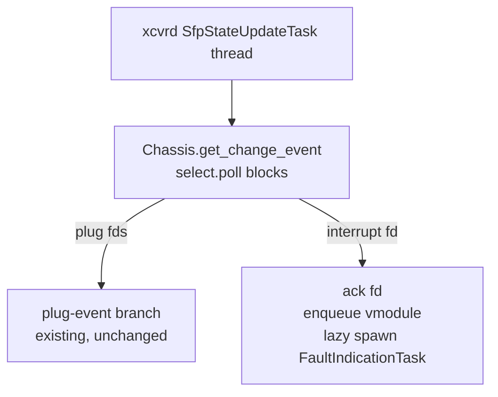
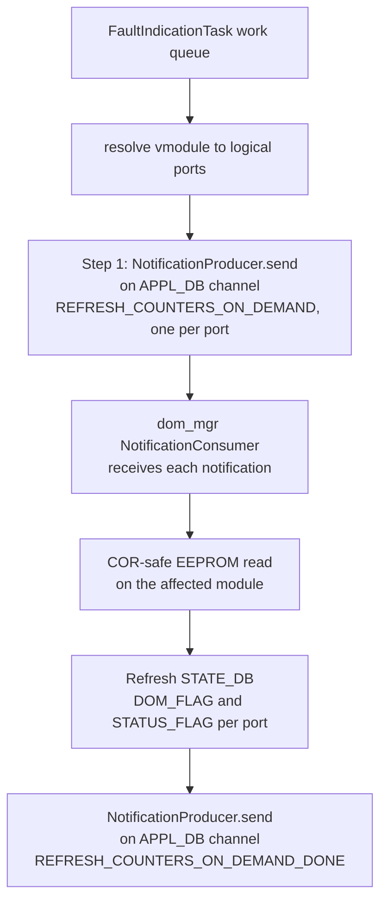
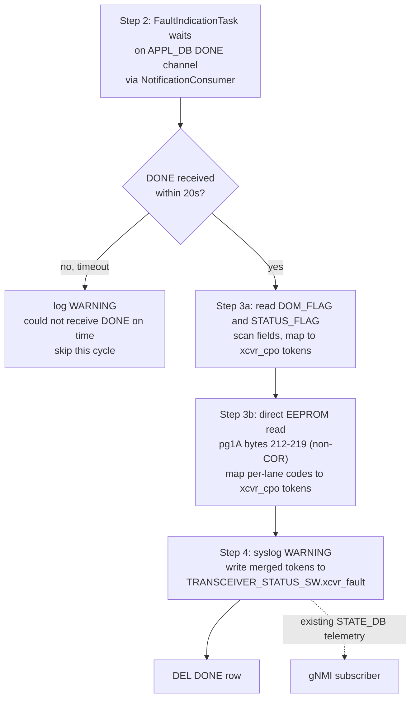
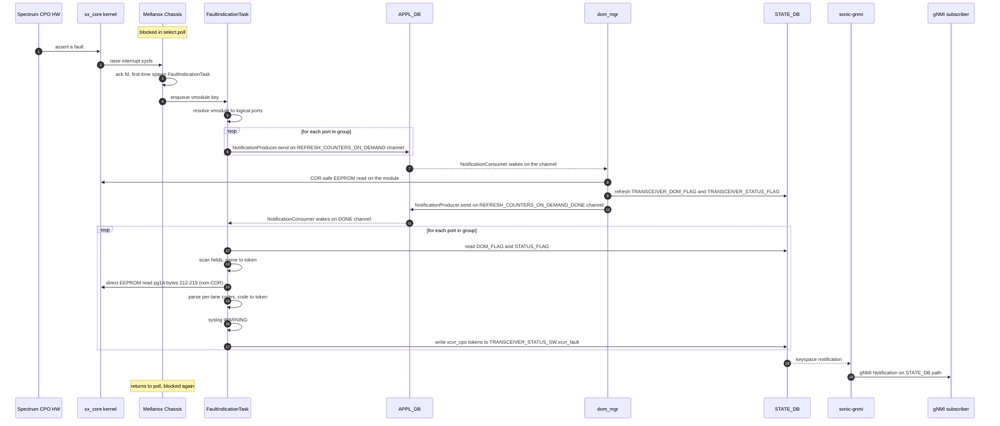

# CPO Fault Indication - HLD

## 1. Revision

| Rev | Date       | Author | Change Description                                                                                                                                                                                                                     |
| --- | ---------- | ------ | -------------------------------------------------------------------------------------------------------------------------------------------------------------------------------------------------------------------------------------- |
| 0.1 | May 2026   | Noa Or | Initial draft.                                                                                                                                                                                                                        |
| 0.2 | Jul 2026   | Noa Or | Delegate COR-safe EEPROM reads to `dom_mgr` via two new APPL_DB pub/sub channels (`REFRESH_COUNTERS_ON_DEMAND` request, `REFRESH_COUNTERS_ON_DEMAND_DONE` completion).|

## 2. Scope

This HLD describes the design for surfacing **CPO (Co-Packaged Optics) vModule** fault indications on Mellanox platforms.

In scope:

- Listening for fault interrupts on the per-vModule sysfs node `/sys/module/sx_core/asic0/module{sdk_index}/interrupt` for every CPO vModule.
- Delegating the COR-safe EEPROM read of the CPO fault pages to `dom_mgr` (xcvrd's DOM manager) via two new APPL_DB Redis pub/sub channels: `REFRESH_COUNTERS_ON_DEMAND` (request) and `REFRESH_COUNTERS_ON_DEMAND_DONE` (completion), both using `swss::NotificationProducer` / `swss::NotificationConsumer`.
- Consuming the existing STATE_DB flag tables `TRANSCEIVER_DOM_FLAG` and `TRANSCEIVER_STATUS_FLAG` that dom_mgr already populates.
- Mapping each asserted flag field to a canonical `xcvr_cpo_*` token via an in-code name-to-token dictionary.
- Logging the parsed fault information to syslog with WARNING severity.
- Writing the tokens into a new dedicated field `xcvr_fault` on the existing STATE_DB `TRANSCEIVER_STATUS_SW|<port>` row. This feature is the sole writer of `xcvr_fault`; xcvrd's existing fields (`status`, `cmis_state`, `error`) are untouched. gNMI subscribers receive the change through the existing STATE_DB telemetry path; subscribers who want to watch only fault events may need to add a new subscription to the `xcvr_fault` field.
- Asymmetric fan-out on interrupt: one REFRESH request per **underlying physical port** of the vModule (first split only, since dom_mgr's per-physical-port poll refreshes the flag tables for every logical split), and one `xcvr_fault` write per **logical port** of the vModule (including every breakout split, so operators watching any split see the fault).

Out of scope:

- **Regular CMIS pluggable (QSFP+/QSFP28/QSFP-DD/OSFP) fault decoding.** The registration filter in `chassis.py` is CPO-only; extending it to regular CMIS pluggables is deferred to a separate effort.
- **Recovery / clearing policy.** Per Spectrum CPO doc 8.6 the kernel `interrupt` sysfs deasserts as soon as the EEPROM is read — that is only an acknowledgement of the read, not a HW recovery signal. `xcvr_*` tokens therefore persist until cleared by an external mechanism (Open Item 4).
- Non-Mellanox platforms.
- FW-Control mode (the design is wired into `get_change_event_for_module_host_management_mode` only).
- SFF-8472 legacy SFP/SFP+ pluggables.

## 3. Definitions/Abbreviations

| Term                              | Definition                                                                                                                                                                                                                                                                                                                              |
| --------------------------------- | --------------------------------------------------------------------------------------------------------------------------------------------------------------------------------------------------------------------------------------------------------------------------------------------------------------------------------------- |
| CPO                               | Co-Packaged Optics                                                                                                                                                                                                                                                                                                                     |
| ELS                               | External Laser Source                                                                                                                                                                                                                                                                                                                  |
| OE                                | Optical Engine; identified by `oe_id`                                                                                                                                                                                                                                                                                                  |
| vModule                           | Virtual module exposed by the SDK; one `(oe_id, els_id)` tuple maps to N logical ports                                                                                                                                                                                                                                                 |
| PMON                              | Platform Monitor docker; hosts `xcvrd` and other platform daemons                                                                                                                                                                                                                                                                     |
| xcvrd                             | Transceiver daemon under PMON                                                                                                                                                                                                                                                                                                          |
| SfpStateUpdateTask                | xcvrd thread that owns plug/unplug event handling and calls `Chassis.get_change_event()`                                                                                                                                                                                                                                              |
| dom_mgr (DomInfoUpdateTask)       | xcvrd thread that periodically reads DOM/status/VDM data from transceiver EEPROMs and publishes them to STATE_DB                                                                                                                                                                                                                       |
| FaultIndicationTask               | New Mellanox-only `threading.Thread` subclass introduced in this design; lives in `mlnx-platform-api`                                                                                                                                                                                                                                  |
| COR                               | Clear-On-Read. A hardware register that returns 1 on read then auto-resets to 0. If two software components both read it, whoever reads second sees zeros                                                                                                                                                                             |
| NotificationProducer / Consumer   | swsscommon primitives on top of Redis pub/sub. Producer sends a `(op, data, params)` triple to a named channel; every subscribed Consumer receives it. Fire-and-forget: consumers not attached at send time do not see the message. Used e.g. by `WatermarkOrch` for `WM_CLEAR_NOTIFICATIONS`.                                          |
| SDK                               | NVIDIA Spectrum SDK (`sx_core` kernel module)                                                                                                                                                                                                                                                                                          |
| gNMI                              | gRPC Network Management Interface. In SONiC, the `sonic-gnmi` container exposes SONiC Redis DBs to external clients over gRPC. Subscribers on `STATE_DB/TRANSCEIVER_STATUS_SW/<port>` receive a `Notification` whenever the underlying Redis key changes                                                                                |
| STATE_DB                          | SONiC Redis instance (db 6) that stores operational state of the device                                                                                                                                                                                                                                                                |
| APPL_DB                           | SONiC Redis instance (db 0) used for inter-application request/response channels                                                                                                                                                                                                                                                        |
| HLD                               | High-Level Design                                                                                                                                                                                                                                                                                                                     |

## 4. Overview

Spectrum CPO hardware exposes a single fault interrupt per vModule, surfaced as a pollable sysfs attribute by the SDK kernel module:

```
/sys/module/sx_core/asic0/module{sdk_index}/interrupt
```

The same `module{sdk_index}` directory already hosts the plug-event sysfs files (`present`, `hw_present`, `power_good`) that Mellanox `Chassis.get_change_event()` polls today.

The CPO fault information itself lives in three EEPROM pages: **0x0** (module-level + lower-memory thermal flags), **0x11** (per-lane flags), and **0x1A** (ELS flags). Most of the bits in those pages are **Clear-On-Read (COR)** — reading them returns their latched value and simultaneously resets them to zero. If two independent readers touch the same COR bytes they lose events. In today's SONiC, the periodic reader of those bytes is `dom_mgr`, which polls every 60 s and publishes the parsed flag values into `TRANSCEIVER_DOM_FLAG` and `TRANSCEIVER_STATUS_FLAG`.

**Key design choice:** this feature does NOT read the CPO CoR fault pages directly. Instead it asks `dom_mgr` to do an on-demand read, then consumes the tables that `dom_mgr` publishes. That keeps `dom_mgr` as the sole COR reader and completely avoids the two-readers-racing-on-COR problem.

The flow is:

1. Mellanox `Chassis.get_change_event()` polls the interrupt sysfs alongside the plug-event fds. On the first assertion, it lazily spawns a Mellanox-only `FaultIndicationTask` thread and enqueues the affected vModule.
2. The task resolves the vModule to its 1..N logical ports and sends one notification per port on the APPL_DB `REFRESH_COUNTERS_ON_DEMAND` channel via `NotificationProducer`, carrying the port name, the list of flag tables to refresh, and a correlation timestamp.
3. `dom_mgr`'s `NotificationConsumer` on that channel wakes for each notification, performs its COR-safe read on the module, refreshes `TRANSCEIVER_DOM_FLAG` and `TRANSCEIVER_STATUS_FLAG` for those ports, and sends a corresponding notification on `REFRESH_COUNTERS_ON_DEMAND_DONE` with status + timestamps.
4. The task, woken by the DONE notification, reads both flag tables for each port and scans every field. Each field whose value is `true`/`1` maps via `_FLAG_TO_TOKEN` to an `xcvr_cpo_*` token. Multiple simultaneous faults naturally produce multiple tokens.
5. The task logs a WARNING to syslog and writes the tokens into a new dedicated `xcvr_fault` field on `TRANSCEIVER_STATUS_SW|<port>`. This feature is the **only writer** of `xcvr_fault`; xcvrd continues to own `status`, `cmis_state`, and `error` (never touched by us). No cross-writer coordination is needed.

**Why Redis pub/sub, not tables**: requests are one-shot messages, not state. Pub/sub delivers them once and forgets, so there is nothing to clean up and nothing to replay after a restart. Same pattern as `WatermarkOrch`'s `WM_CLEAR_NOTIFICATIONS` channel.

## 5. Requirements

Functional:

1. PMON shall register interrupt fds only for `CpoPort` instances. Regular pluggables are not monitored by this feature.
2. PMON shall wait for CPO fault interrupts with the `poll(2)` syscall on the interrupt fds.
3. `FaultIndicationTask` shall be spawned once, on the first interrupt. It is a long-lived worker for the rest of xcvrd's lifetime. Subsequent interrupts do not spawn additional threads.
4. On every interrupt (first or subsequent), PMON shall enqueue the affected vModule to the running `FaultIndicationTask`'s work queue.
5. `FaultIndicationTask` shall run as a `daemon=True` thread, so the Python runtime reaps it when xcvrd exits. No generic-xcvrd code change is required for shutdown. See section 7.3.1 for the safety analysis of abrupt teardown.
6. For every dequeued vModule, `FaultIndicationTask` shall send one notification per **underlying physical port** on the APPL_DB `REFRESH_COUNTERS_ON_DEMAND` channel, using the **first split** (lowest-index breakout logical port) of each physical port as the message's `op` value. It shall **not** send an additional notification for the other breakout splits of the same physical port. Rationale: `dom_mgr` performs a single EEPROM read per physical port and writes the refreshed flags to the `TRANSCEIVER_DOM_FLAG` / `TRANSCEIVER_STATUS_FLAG` rows of **all** logical ports mapped to that physical port; sending additional REFRESHes for the other splits would trigger redundant EEPROM reads with no new information. Example — vModule 0 covers physical ports {1, 9, 17, 25}, each broken out into two logical ports (Ethernet0/4, Ethernet8/12, Ethernet16/20, Ethernet24/28). This requirement produces exactly four notifications, addressed to Ethernet0, Ethernet8, Ethernet16, Ethernet24. Duplicate interrupts on the same vModule while a previous request is in flight are **not** coalesced — each interrupt produces its own set of four notifications.
7. `FaultIndicationTask` shall wait up to **20 s** for the corresponding notification on `REFRESH_COUNTERS_ON_DEMAND_DONE`. On timeout it shall log a WARNING and skip that request (no retry).
8. After the DONE indication, `FaultIndicationTask` shall read `TRANSCEIVER_DOM_FLAG|<port>` and `TRANSCEIVER_STATUS_FLAG|<port>`, iterate all fields, and emit one `xcvr_cpo_*` token per field whose value is `true` (or `1`), using the in-code `_FLAG_TO_TOKEN` mapping.
9. `FaultIndicationTask` shall log the parsed fault info to syslog at WARNING severity **on every processed interrupt**, even when all parsed tokens are already present in `xcvr_fault`. Repeated log entries are the operator's signal that the underlying HW fault keeps re-asserting. It shall also write the tokens into the new dedicated `xcvr_fault` field of `TRANSCEIVER_STATUS_SW|<port>` for **every logical port of the vModule, including every breakout split** — not just the first splits used in R6's REFRESH fan-out. Since dom_mgr's on-demand poll refreshes the `TRANSCEIVER_DOM_FLAG` / `TRANSCEIVER_STATUS_FLAG` rows for every logical port of the physical port, the same set of tokens is applicable to every split, and any operator watching any split's `xcvr_fault` must see the fault. Following the same example as R6, the write fan-out reaches **eight** rows (Ethernet0, Ethernet4, Ethernet8, Ethernet12, Ethernet16, Ethernet20, Ethernet24, Ethernet28), each getting the same tokens. This feature is the **sole writer** of `xcvr_fault`. It does not touch `status`, `cmis_state`, or `error`.
10. `FaultIndicationTask` shall NOT remove previously-emitted `xcvr_cpo_*` tokens from `xcvr_fault` just because the underlying flag deasserted. Interrupt deassertion is not a HW recovery signal (per CPO doc 8.6); token clearing is an operator-driven action (Open Item 4). Implementation: read `xcvr_fault`, take the **set union** with the newly-computed tokens (each token appears **at most once** in the stored string), write back — a **read-modify-write (RMW)** pattern. Re-asserting a fault that is already in `xcvr_fault` therefore produces a no-op write; a token is never duplicated. This is safe because the feature is the only writer of the field.
11. The feature shall be Mellanox-scoped and shall not affect non-Mellanox platforms or the legacy `get_change_event_legacy` path. On non-Mellanox platforms, the `xcvr_fault` field is simply absent from `TRANSCEIVER_STATUS_SW` rows.

Non-functional:

1. Zero added wake-ups on platforms with no CPO ports (`FaultIndicationTask` is never spawned).
2. No new dockers or services; only code changes in `mlnx-platform-api` and a small addition to `dom_mgr` in `sonic-xcvrd`.
3. One new field (`xcvr_fault`) on the existing `TRANSCEIVER_STATUS_SW` row. No other schema changes. No YANG model impact (this table has no YANG model in `sonic-yang-models`).

## 6. Architecture Design

The current SONiC PMON architecture is preserved. Two additions:

1. `Chassis.get_change_event()` polls one extra kind of fd (per-CpoPort `interrupt`) and lazily spawns a Mellanox-only thread on the first assertion.
2. `dom_mgr` gains a new on-demand poll handler triggered by writes to a new APPL_DB request table.

### 6.1 Interrupt registration and spawn


```mermaid
flowchart TD
  thread["xcvrd SfpStateUpdateTask thread"] --> chassis["Chassis.get_change_event<br/>select.poll blocks"]
  chassis -->|"plug fds"| plug["plug-event branch<br/>existing, unchanged"]
  chassis -->|"interrupt fd"| fault["ack fd<br/>enqueue vmodule<br/>lazy spawn FaultIndicationTask"]
```

### 6.2 Fault handling flow — request phase

Triggered when `FaultIndicationTask` dequeues a vModule. Ends when dom_mgr publishes a DONE row.


```mermaid
flowchart TD
  q["FaultIndicationTask work queue"]
  q --> resolve["resolve vmodule to logical ports"]
  resolve --> req["Step 1: NotificationProducer.send<br/>on APPL_DB channel<br/>REFRESH_COUNTERS_ON_DEMAND, one per port"]
  req --> sub["dom_mgr NotificationConsumer<br/>receives each notification"]
  sub --> read["COR-safe EEPROM read<br/>on the affected module"]
  read --> refresh["Refresh STATE_DB<br/>DOM_FLAG and STATUS_FLAG per port"]
  refresh --> done["NotificationProducer.send<br/>on APPL_DB channel<br/>REFRESH_COUNTERS_ON_DEMAND_DONE"]
```

### 6.3 Fault handling flow — response phase

Triggered when the DONE row appears (or a 20 s timeout fires). Ends when tokens are visible to gNMI subscribers.


```mermaid
flowchart TD
  wait["Step 2: FaultIndicationTask waits<br/>on APPL_DB DONE channel<br/>via NotificationConsumer"]
  wait --> check{"DONE received<br/>within 20s?"}
  check -->|no, timeout| logto["log WARNING<br/>could not receive DONE on time<br/>skip this cycle"]
  check -->|yes| parse["Step 3a: read DOM_FLAG and STATUS_FLAG<br/>scan fields, map to xcvr_cpo tokens"]
  parse --> direct["Step 3b: direct EEPROM read<br/>pg1A bytes 212-219 (non-COR)<br/>map per-lane codes to xcvr_cpo tokens"]
  direct --> write["Step 4: syslog WARNING<br/>write merged tokens to<br/>TRANSCEIVER_STATUS_SW.xcvr_fault"]
  write --> cleanup["DEL DONE row"]
  write -.->|existing STATE_DB telemetry| gnmi["gNMI subscriber"]
```

Notes:

- The plug-event branch is untouched. `Chassis.get_change_event()` returns to its caller as fast as before; all EEPROM work happens off the critical path.
- `dom_mgr` remains the **sole reader** of the CPO COR flag pages. No new EEPROM readers.
- `dom_mgr` publishes to STATE_DB tables it already owns; no schema growth on those tables.

## 7. High-Level Design

### 7.1 Built-in vs Application Extension

Built-in SONiC feature, Mellanox platform-specific code plus a small addition to xcvrd.

### 7.2 Repositories changed

| Repository | Change size |
| --- | --- |
| `sonic-buildimage` -> `platform/mellanox/mlnx-platform-api` | Two new files, small edit to `chassis.py`. |
| `sonic-buildimage` -> `src/sonic-platform-daemons/sonic-xcvrd` | Small addition to `dom_mgr.py`: subscribe to `REFRESH_COUNTERS_ON_DEMAND`, on-demand poll path, publish `REFRESH_COUNTERS_ON_DEMAND_DONE`. Generic mechanism (not Mellanox-specific), reusable by other vendors later. |

No changes to `sonic-swss`, `sonic-syncd`, `sonic-swss-common`, `sonic-platform-common`, `sonic-gnmi`, `sonic-yang-models`.

### 7.3 Modules / sub-modules modified

- [sonic-buildimage/platform/mellanox/mlnx-platform-api/sonic_platform/chassis.py](sonic-buildimage/platform/mellanox/mlnx-platform-api/sonic_platform/chassis.py)
  - Register one `interrupt` fd per `CpoPort` into the existing `self.poll_obj` (registration filter is `isinstance(sfp, CpoPort)`).
  - New dispatch branch in the `poll()` event loop: on assertion, `read()` the fd to ack, then enqueue the CpoPort to `FaultIndicationTask`'s work queue. On the first-ever assertion, lazily construct and `start()` the task.
  - On lazy spawn, set `daemon=True` on the fault thread. Nothing else — no shutdown hook, no `atexit`, no signal handler. See section 7.3.1.

- [sonic-buildimage/platform/mellanox/mlnx-platform-api/sonic_platform/sfp.py](sonic-buildimage/platform/mellanox/mlnx-platform-api/sonic_platform/sfp.py)
  - No code change. The existing `Sfp.get_fd(fd_type)` already opens `/sys/module/sx_core/asic0/module{sdk_index}/{fd_type}`, so passing `'interrupt'` gives the correct path.

- **New file**: `sonic-buildimage/platform/mellanox/mlnx-platform-api/sonic_platform/fault_indication_task.py`
  - `class FaultIndicationTask(threading.Thread)`.
  - Owns: a work queue (fed by `Chassis`), a `NotificationProducer` on the APPL_DB `REFRESH_COUNTERS_ON_DEMAND` channel, a `NotificationConsumer` on the APPL_DB `REFRESH_COUNTERS_ON_DEMAND_DONE` channel, STATE_DB readers for the flag tables, and a `TRANSCEIVER_STATUS_SW` writer.
  - Loop: pop from work queue → send request → wait for DONE (or 20 s timeout) → parse → syslog → write tokens to `xcvr_fault`.
  - Lifecycle: created lazily by `Chassis` on the first interrupt as a `daemon=True` thread. Reaped by the Python runtime when xcvrd exits. Exposes a `request_stop()` method used only by unit tests. See section 7.3.1.

- **New file**: `sonic-buildimage/platform/mellanox/mlnx-platform-api/sonic_platform/xcvr_fault.py`
  - Static `_FLAG_TO_TOKEN` dict: maps flag field name (as published by `dom_mgr` in `TRANSCEIVER_DOM_FLAG` / `TRANSCEIVER_STATUS_FLAG`) to the corresponding `xcvr_cpo_*` token name. Full listing in section 7.4.
  - Helpers: `get_all_logical_ports_of_vmodule(cpo_port) -> List[str]`, `update_xcvr_fault_field(port, tokens)` (RMW union on the `xcvr_fault` field only), and the parse-and-tokenise loop.
  - Lazy `swsscommon.DBConnector` for STATE_DB (pattern from [pcie.py](sonic-buildimage/platform/mellanox/mlnx-platform-api/sonic_platform/pcie.py)) and `swsscommon.ConfigDBConnector` for CONFIG_DB (pattern from [utils.py](sonic-buildimage/platform/mellanox/mlnx-platform-api/sonic_platform/utils.py)).

- [sonic-buildimage/src/sonic-platform-daemons/sonic-xcvrd/xcvrd/dom/dom_mgr.py](sonic-buildimage/src/sonic-platform-daemons/sonic-xcvrd/xcvrd/dom/dom_mgr.py)
  - New `NotificationConsumer` on APPL_DB channel `REFRESH_COUNTERS_ON_DEMAND`. Registered into the existing `swsscommon.Select` object that the main loop already polls (no new thread).
  - New `NotificationProducer` on APPL_DB channel `REFRESH_COUNTERS_ON_DEMAND_DONE`.
  - On each incoming notification: parse `requested_tables`, do a COR-safe on-demand read for that logical port (reuses the existing per-port poll infrastructure that already handles link-change fast-path polls), refresh the requested STATE_DB tables, then send a DONE notification with `status`, `requested_timestamp` (copied from the request notification), and `completed_timestamp`.
  - No rows to create or delete. No cleanup logic. No behavioural change to the periodic 60 s poll loop.

#### 7.3.1 Lifecycle & shutdown

`FaultIndicationTask` is created lazily on the first interrupt and lives for the rest of xcvrd's lifetime. It is spawned with `daemon=True`, so when xcvrd exits, the Python interpreter reaps the thread automatically.

Being killed mid-loop is safe because:

- Each write reads the current `xcvr_fault` value, adds the new tokens using **set union**, and writes back. Duplicates are impossible, and if we are killed mid-way the next fault redoes the same merge — nothing is lost, nothing is duplicated.
- Interrupt fds, Redis connections, and the `NotificationProducer` / `NotificationConsumer` handles are released by the kernel on process exit.
- Any lost in-flight fault re-fires after xcvrd restarts, because HW flags are latched and the sysfs interrupt reasserts.


### 7.4 Detected fault categories

`dom_mgr` already exposes every CPO fault byte we care about, with existing CMIS + Nvidia-specific APIs. The mapping between CPO bits, the API that reads them, and the STATE_DB table they land in is as follows (per the Spectrum CPO doc):

| #  | Fault source                                     | Latch behaviour                       | Read via                                                                                                              | Lands in                        |
| -- | ------------------------------------------------ | ------------------------------------- | --------------------------------------------------------------------------------------------------------------------- | ------------------------------- |
| 1  | pg0: byte 9 bits 0,2 (case-temp lo-alarm, hi-warn)     | Latched / COR                         | `CmisApi.get_module_level_flag()` -> `get_transceiver_dom_flags()`                                                    | `TRANSCEIVER_DOM_FLAG`          |
| 2  | pg0: byte 11 bits 0-3 (Aux3 flags)                     | Latched / COR                         | Same as #1                                                                                                            | `TRANSCEIVER_DOM_FLAG`          |
| 3  | pg0: byte 11 bits 4-7 (Custom Mon flags)               | Latched / COR                         | (a) `CmisApi.get_module_level_flag()` -> `custom_mon_*_flag` keys; (b) on CPO-ELS modules `NvidiaCpoElsCmisApi.get_els_dom_flags()` re-reads byte 11 -> `els_custom_mon_*` keys | `TRANSCEIVER_DOM_FLAG`          |
| 4  | pg1A: byte 166 (FaultFlagLane bank 1)                  | Latched / COR                         | `elsfp_cmis.get_elsfp_status_flags()` (reads bytes 166-177) -> `get_transceiver_status_flags()`                       | `TRANSCEIVER_STATUS_FLAG`       |
| 5  | pg1A: byte 174 (WarnFlagLane bank 1)                   | Latched per spec                      | Same call as #4                                                                                                       | `TRANSCEIVER_STATUS_FLAG`       |
| 6  | pg1A: byte 190 (HighPowerAlarm)                        | Latched / COR                         | `elsfp_cmis.get_elsfp_lane_flags()` (reads bytes 186-219) -> `get_transceiver_dom_flags()`                            | `TRANSCEIVER_DOM_FLAG`          |
| 7  | pg1A: byte 191 (LowPowerAlarm)                         | Latched / COR                         | Same call as #6                                                                                                       | `TRANSCEIVER_DOM_FLAG`          |
| 8  | pg1A: byte 192 (HighPowerWarn)                         | Latched / COR                         | Same call as #6                                                                                                       | `TRANSCEIVER_DOM_FLAG`          |
| 9  | pg1A: byte 193 (LowPowerWarn)                          | Latched / COR                         | Same call as #6                                                                                                       | `TRANSCEIVER_DOM_FLAG`          |
| 10 | pg1A: bytes 212-219 (per-lane 4-bit fault/warn codes)  | Not spec-COR (read-only, non-latched) | **Direct EEPROM read** by `FaultIndicationTask` (see 7.4.1); the existing `elsfp_cmis.get_elsfp_fault_warning_codes()` -> `get_transceiver_status()` path is defined but not exercised on CPO today | Not read from STATE_DB (direct)  |

Consequence for this design:

- Rows #1-9 (single-bit latched flags on COR pages): we consume the two existing STATE_DB tables `TRANSCEIVER_DOM_FLAG` and `TRANSCEIVER_STATUS_FLAG` that `dom_mgr` refreshes on demand.
- Row #10 (4-bit reason codes on **non-COR** bytes): `FaultIndicationTask` reads pg1A bytes 212-219 **directly** from the module's EEPROM (see section 7.4.1). No new STATE_DB table is introduced.
- No new STATE_DB flag table is introduced.
- Our in-code maps are:
  - `_FLAG_TO_TOKEN` — flag field name (from `TRANSCEIVER_DOM_FLAG` / `TRANSCEIVER_STATUS_FLAG`) -> `xcvr_cpo_*` token. All bit-level decoding stays inside `dom_mgr` / the CMIS APIs.
  - `_ELS_CODE_TO_TOKEN` — `(numeric code, fault/warn)` -> `xcvr_cpo_*` token. Decoding of pg1A bytes 212-219 into per-lane codes happens in `FaultIndicationTask` (see 7.4.1).

#### 7.4.1 Direct read of non-COR ELS reason codes (pg1A:212-219)

Row #10 in the table above is intentionally read **directly** from EEPROM rather than through `dom_mgr` + STATE_DB. Rationale:

- These bytes are **non-COR**: reading them does not clear anything. Two readers (any future `dom_mgr` read + our read) cannot race — so the single-reader invariant that motivates the rest of the design does not apply here.
- The existing `dom_mgr` path for these codes (`get_transceiver_status()`) is defined but not exercised for CPO ports today. Getting it wired into `dom_mgr` + published on a new STATE_DB table would require a separate community HLD revision. That is a preferable long-term shape but not required for correctness given the non-COR property.
- Doing the read locally in `FaultIndicationTask` after the DONE arrives adds one small EEPROM read per fault event (sub-millisecond); it keeps the whole feature landable inside `mlnx-platform-api` with no new cross-repo coordination.

Extending `dom_mgr` to publish these codes (Option 1 in the design discussion) is **still under consideration** as a follow-up. For this version we go with the direct read (Option 2). See Open Item 5.

The read + parse logic sits in `xcvr_fault.py` next to the flag-based path:

```python
_ELS_CODE_TO_TOKEN = {
    # (code_value, kind) -> base token; lane index appended when emitting
    (1, 'fault'): 'xcvr_cpo_els_apc_failure',
    (2, 'fault'): 'xcvr_cpo_els_tec_failure',
    (3, 'fault'): 'xcvr_cpo_els_laser_ramping_timeout',
    (4, 'fault'): 'xcvr_cpo_els_fiber_check_failure',
    (5, 'fault'): 'xcvr_cpo_els_laser_tuning_failure',
    (1, 'warn'):  'xcvr_cpo_els_apc_warn',
    # ... full listing per the Spectrum CPO doc appendix ...
}

def parse_els_fault_codes(sfp):
    """Read pg 0x1A bytes 212-219 directly. Non-COR, safe alongside dom_mgr."""
    raw = sfp._read_eeprom_page(page=0x1A, offset=212, num_bytes=8)
    if raw is None:
        return []
    tokens = []
    for lane_idx, byte in enumerate(raw, start=1):
        fault_code = byte & 0x0F
        warn_code  = (byte >> 4) & 0x0F
        if fault_code:
            base = _ELS_CODE_TO_TOKEN.get((fault_code, 'fault'))
            if base:
                tokens.append(f'{base}_lane{lane_idx}')
        if warn_code:
            base = _ELS_CODE_TO_TOKEN.get((warn_code, 'warn'))
            if base:
                tokens.append(f'{base}_lane{lane_idx}')
    return tokens
```

The `FaultIndicationTask` response-phase handler calls both parsers and merges their outputs before writing:

```python
tokens = parse_and_tokenize(port)                    # from STATE_DB flag tables (rows #1-9)
tokens += parse_els_fault_codes(sfp)                 # direct EEPROM read (row #10)
if tokens:
    logger.log_warning(...)
    update_xcvr_fault_field(port, tokens)            # RMW union in TRANSCEIVER_STATUS_SW.xcvr_fault (single-writer)
```

Schematic of `_FLAG_TO_TOKEN` in `xcvr_fault.py`:

```python
_FLAG_TO_TOKEN = {
    # ---- from TRANSCEIVER_DOM_FLAG ----
    'case_temp_low_alarm':               'xcvr_cpo_module_case_temp_low_alarm',
    'case_temp_high_warning':            'xcvr_cpo_module_case_temp_high_warning',
    'aux3_high_alarm':                   'xcvr_cpo_module_aux3_high_alarm',
    'aux3_low_alarm':                    'xcvr_cpo_module_aux3_low_alarm',
    'aux3_high_warning':                 'xcvr_cpo_module_aux3_high_warning',
    'aux3_low_warning':                  'xcvr_cpo_module_aux3_low_warning',
    'custom_mon_high_alarm':             'xcvr_cpo_module_custom_mon_high_alarm',
    'custom_mon_low_alarm':              'xcvr_cpo_module_custom_mon_low_alarm',
    'custom_mon_high_warning':           'xcvr_cpo_module_custom_mon_high_warning',
    'custom_mon_low_warning':            'xcvr_cpo_module_custom_mon_low_warning',
    'els_custom_mon_high_alarm':         'xcvr_cpo_els_custom_mon_high_alarm',
    'els_custom_mon_low_alarm':          'xcvr_cpo_els_custom_mon_low_alarm',
    'els_custom_mon_high_warning':       'xcvr_cpo_els_custom_mon_high_warning',
    'els_custom_mon_low_warning':        'xcvr_cpo_els_custom_mon_low_warning',
    'els_high_power_alarm_lane_1':       'xcvr_cpo_els_high_power_alarm_lane1',
    'els_high_power_alarm_lane_2':       'xcvr_cpo_els_high_power_alarm_lane2',
    # ... one per lane per power fault type ...

    # ---- from TRANSCEIVER_STATUS_FLAG ----
    'fault_flag_lane_1':                 'xcvr_cpo_els_fault_lane1',
    'fault_flag_lane_2':                 'xcvr_cpo_els_fault_lane2',
    'warn_flag_lane_1':                  'xcvr_cpo_els_warn_lane1',
    'warn_flag_lane_2':                  'xcvr_cpo_els_warn_lane2',
    # ...
}
```

Parse pseudocode:

```python
def parse_and_tokenize(port):
    tokens = []
    for tbl in (dom_flag_tbl, status_flag_tbl):
        row = tbl.get(port) or {}
        for field, value in row.items():
            if str(value).lower() in ('true', '1'):
                token = _FLAG_TO_TOKEN.get(field)
                if token:
                    tokens.append(token)
    return tokens
```

Multiple simultaneous faults on the same port produce multiple tokens; they are joined with `|` when written to `TRANSCEIVER_STATUS_SW.xcvr_fault` (section 7.6.3).

### 7.5 Sequence


```mermaid
sequenceDiagram
    autonumber
    participant HW as Spectrum CPO HW
    participant SDK as sx_core kernel
    participant CH as Mellanox Chassis
    participant FT as FaultIndicationTask
    participant AD as APPL_DB
    participant DM as dom_mgr
    participant SD as STATE_DB
    participant GN as sonic-gnmi
    participant CL as gNMI subscriber

    Note over CH: blocked in select.poll
    HW->>SDK: assert a fault
    SDK->>CH: raise interrupt sysfs
    CH->>CH: ack fd, first-time spawn FaultIndicationTask
    CH->>FT: enqueue vmodule key
    FT->>FT: resolve vmodule to logical ports
    loop for each port in group
        FT->>AD: NotificationProducer.send on REFRESH_COUNTERS_ON_DEMAND channel
    end
    AD-->>DM: NotificationConsumer wakes on the channel
    DM->>SDK: COR-safe EEPROM read on the module
    DM->>SD: refresh TRANSCEIVER_DOM_FLAG and TRANSCEIVER_STATUS_FLAG
    DM->>AD: NotificationProducer.send on REFRESH_COUNTERS_ON_DEMAND_DONE channel
    AD-->>FT: NotificationConsumer wakes on DONE channel
    loop for each port in group
        FT->>SD: read DOM_FLAG and STATUS_FLAG
        FT->>FT: scan fields, name to token
        FT->>SDK: direct EEPROM read pg1A bytes 212-219 (non-COR)
        FT->>FT: parse per-lane codes, code to token
        FT->>FT: syslog WARNING
        FT->>SD: write xcvr_cpo tokens to TRANSCEIVER_STATUS_SW.xcvr_fault
    end
    SD-->>GN: keyspace notification
    GN->>CL: gNMI Notification on STATE_DB path
    Note over CH: returns to poll, blocked again
```

### 7.6 DB and Schema

No schema changes to any Redis table. Two new APPL_DB Redis pub/sub channels are used for the request/done handshake; the flag data itself continues to live in existing STATE_DB tables that `dom_mgr` already writes.

#### 7.6.1 New APPL_DB notification channels

Both channels use `swss::NotificationProducer` (send side) and `swss::NotificationConsumer` (receive side). Nothing is persisted in Redis — messages are delivered to whoever is attached at send time and are then gone.

**`REFRESH_COUNTERS_ON_DEMAND`** — request channel. Sent by `FaultIndicationTask`, received by `dom_mgr`.

Message shape (using swsscommon's `NotificationProducer::send(op, data, fvs)` triple):

| Slot | Value | Purpose |
| --- | --- | --- |
| `op` (string) | logical port name, e.g. `Ethernet405` | Which logical port to refresh. `FaultIndicationTask` addresses only the **first split** of each of the vModule's physical ports (see requirement 6). |
| `fvs.requested_tables` | `TRANSCEIVER_DOM_FLAG,TRANSCEIVER_STATUS_FLAG` | Comma-separated STATE_DB tables `dom_mgr` should refresh. Unknown names are silently ignored. |
| `fvs.timestamp` | `Wed Jul 08 15:08:00 2026` | UTC timestamp using the DOM `get_current_time()` format (`"%a %b %d %H:%M:%S %Y"`), copied verbatim into DONE for correlation. |

The `data` string of `NotificationProducer::send(op, data, fvs)` is not used on requests; senders pass an empty string.

**`REFRESH_COUNTERS_ON_DEMAND_DONE`** — completion channel. Sent by `dom_mgr`, received by `FaultIndicationTask`.

| Slot | Value | Purpose |
| --- | --- | --- |
| `op` (string) | logical port name | Which port the completion is for. |
| `data` (string) | `OK` / `PARTIAL` / `ERROR:<reason>` | Outcome. `PARTIAL` = at least one requested table was unknown and skipped, the others succeeded. |
| `fvs.requested_timestamp` | copied verbatim from request | Correlation with the originating request. |
| `fvs.completed_timestamp` | current UTC time | When `dom_mgr` finished the on-demand read. |

#### 7.6.2 Existing STATE_DB tables (read-only for this feature)

- `TRANSCEIVER_DOM_FLAG|<logical_port>` — dom_mgr writes it; we read every field on DONE.
- `TRANSCEIVER_STATUS_FLAG|<logical_port>` — same.

#### 7.6.3 Existing STATE_DB row, one new field for this feature

`TRANSCEIVER_STATUS_SW|<logical_port>` gets one new field: `xcvr_fault`. Existing fields (`status`, `cmis_state`, `error`) are unchanged and continue to be owned by xcvrd. This feature writes **only** `xcvr_fault`; xcvrd writes **only** the other three.

Because each writer owns its own field, there is no cross-writer race — HSET on distinct hash fields is atomic and independent.

- `xcvr_fault` is a single string of pipe-separated `xcvr_cpo_*` tokens, one per currently- or previously-asserted fault. Sentinel value for "no faults recorded" is `"N/A"` (matching the convention of `error`).
- The write is a **read-modify-write (RMW)** on the `xcvr_fault` field only: read the current value, take the **set union** with the newly-computed tokens (each token appears at most once in the stored string), write back. Re-asserting a fault that is already in `xcvr_fault` produces a no-op write, so the field never accumulates duplicates like `xcvr_cpo_XXX|xcvr_cpo_XXX`. RMW is safe here because `FaultIndicationTask` is the only writer of this field, and the task is single-threaded — no other thread or daemon competes.
- Persistence: tokens are never removed by this feature. Interrupt deassertion is not a HW recovery signal (per CPO doc 8.6). An external clearing mechanism is out of scope (Open Item 4).

Sample healthy row (no faults ever recorded on this port):

```
STATE_DB TRANSCEIVER_STATUS_SW|Ethernet0
  cmis_state:  READY       ← xcvrd
  status:      1           ← xcvrd
  error:       N/A         ← xcvrd
  xcvr_fault:  (absent)    ← fault-indication; field only appears once we write it
```

Sample after two simultaneous faults on Ethernet0:

```
STATE_DB TRANSCEIVER_STATUS_SW|Ethernet0
  cmis_state:  READY
  status:      1
  error:       N/A
  xcvr_fault:  xcvr_cpo_module_case_temp_high_warning|xcvr_cpo_els_high_power_alarm_lane2
```

Sample where xcvrd has separately reported an unrelated SFP error (both fields present, independent):

```
STATE_DB TRANSCEIVER_STATUS_SW|Ethernet0
  cmis_state:  READY
  status:      1
  error:       Blocking error code 5|Vendor: laser fault      ← xcvrd
  xcvr_fault:  xcvr_cpo_module_els_temp_alarm                 ← fault-indication
```

**Vendor-neutral naming convention.** The field name `xcvr_fault` and the `xcvr_*` token prefix are deliberately vendor-neutral. If another platform vendor implements a similar feature later, they are encouraged to write into the same field with their own `xcvr_<vendor>_*` token names, so gNMI subscribers can consume fault data from every vendor via a single path.

### 7.7 Linux dependencies

- The kernel `sx_core` module must expose `/sys/module/sx_core/asic0/module{sdk_index}/interrupt` as a pollable attribute (`sysfs_notify` on assertion). Provided by the NVIDIA SDK; no SONiC-side kernel changes.

### 7.8 Management interfaces

- gNMI: subscribers consume the fault via the existing STATE_DB telemetry path on `TRANSCEIVER_STATUS_SW|<port>`, subscribing to the new field. Path shape: `STATE_DB/TRANSCEIVER_STATUS_SW/<port>/xcvr_fault`. No new sonic-gnmi code is needed — sonic-gnmi's DB-target subscribe handles any STATE_DB field generically via Redis keyspace notifications (`db_client.go:1319 dbSingleTableKeySubscribe`).
- No new CLI. See section 9.2.1 for how operators manually inspect the tokens.

### 7.9 Serviceability and Debug

- All fault events are logged from `FaultIndicationTask` at WARNING severity, with the port name and the joined token list.
- Timeouts on DONE are logged at WARNING with the port and elapsed time.
- Redis inspection: `redis-cli -n 6 HGET TRANSCEIVER_STATUS_SW|<port> xcvr_fault` returns the current token list for a given port. The APPL_DB request/done channels are Redis pub/sub — they carry no persistent state, so `redis-cli KEYS` will not show in-flight requests. For live diagnostic of the pub/sub traffic, use `redis-cli PSUBSCRIBE '__key*__:REFRESH_COUNTERS_ON_DEMAND*'`.

#### 7.9.1 Simulating a fault

To reproduce a fault interrupt on a real testbed, use the `mlxreg` tool:

```
mlxreg -d /dev/mst/mt53124_pciconf0 --reg_name PMFT \
  -i module_index=0,sub_module=0,lane_mask=1 \
  -s num_of_faults_to_trigger=3,fault_type=0,time_interval_between_faults=1,set_laser_source_fault=3
```

On the SIMx simulation platform:

```
docker exec -it syncd bash
mkdir -p /simx_tools
mount -t 9p -o trans=virtio /simx_tools /simx_tools -oversion=9p2000.L
/simx_tools/simx_module_manager.py inject_apc_failure --id 0 --laser 0 --severity warn
```

### 7.10 Platform specificity

- Mellanox-only. Other vendors are unaffected: `Chassis` on other platforms simply doesn't define the interrupt-fd hook or the `FaultIndicationTask` class. The dom_mgr addition is generic (any vendor could send `REFRESH_COUNTERS_ON_DEMAND`) but nobody else does today.
- Active only when CMIS host management mode is enabled in `mlnx-platform-api` (this design is wired into `get_change_event_for_module_host_management_mode`).

## 8. SAI API

No SAI API changes. The fault path is entirely outside SAI — kernel SDK -> platform Python -> Redis.

## 9. Configuration and management

### 9.1 Manifest

Not applicable (built-in feature).

### 9.2 CLI/YANG model Enhancements

#### 9.2.1 CLI

No CLI changes. This feature does not touch the `error` field, so the existing `show interfaces transceiver error-status` command continues to behave as it does today for other writers. Our tokens live in the new `xcvr_fault` field, which no existing CLI reads.

Operators who need to inspect fault tokens directly should query Redis:

```bash
redis-cli -n 6 HGET TRANSCEIVER_STATUS_SW|Ethernet405 xcvr_fault
# -> "xcvr_cpo_module_case_temp_high_warning|xcvr_cpo_els_high_power_alarm_lane2"
```

For programmatic / remote consumption, subscribe via gNMI on the STATE_DB path shown in section 13.2. Adding a proper CLI reader for `xcvr_fault` (e.g. `show interfaces transceiver fault`) can be a follow-up in `sonic-utilities` if operators want a friendly display.

#### 9.2.2 YANG model

No new YANG model. `TRANSCEIVER_STATUS_SW` has no YANG model in `sonic-yang-models` today; nothing to extend.

### 9.3 Config DB Enhancements

No Config DB changes.

### 9.4 STATE_DB / APPL_DB Enhancements

- STATE_DB: one new field `xcvr_fault` added to the existing `TRANSCEIVER_STATUS_SW|<port>` row. This feature is the sole writer; xcvrd continues to own `status`, `cmis_state`, and `error` (untouched). No YANG model impact (`TRANSCEIVER_STATUS_SW` has no YANG model today).
- APPL_DB: two new Redis pub/sub channels — `REFRESH_COUNTERS_ON_DEMAND` (request) and `REFRESH_COUNTERS_ON_DEMAND_DONE` (completion). No tables, no rows, no persisted state. Message format is defined in section 7.6.1.

## 10. Warmboot and Fastboot Design Impact

No impact on warmboot or fastboot. `xcvr_fault` values survive an xcvrd restart (xcvrd's init writes only `status` + `error`, never `xcvr_fault`). On a cold reboot, STATE_DB itself is flushed and any pre-reboot `xcvr_fault` values are lost — which is correct behavior, since the hardware state is also re-evaluated on boot. Any still-asserted CPO fault will re-fire its interrupt shortly after xcvrd starts polling, and the tokens will re-populate through the normal flow.

## 11. Restrictions/Limitations

- This feature is relevant only when CMIS host management mode is enabled.
- **Only CPO fault decoding is implemented**: regular CMIS pluggables (QSFP+/QSFP28/QSFP-DD/OSFP) are out of scope. Extensibility hook lives in the CpoPort registration filter in `chassis.py`.
- This feature never clears `xcvr_cpo_*` tokens from `TRANSCEIVER_STATUS_SW.xcvr_fault`. Per CPO doc 8.6, kernel `interrupt` sysfs deassertion is a read-ack, not a HW recovery signal. An external clearing mechanism is out of scope (Open Item 4).
- Worst-case fault → STATE_DB latency is bounded by the 20 s DONE timeout. In the healthy case (dom_mgr responsive) latency is tens to hundreds of ms.
- Depends on `dom_mgr`. If `dom_mgr` is stopped, disabled (`dom_polling=disabled` in CONFIG_DB), or crashed at the moment of a fault interrupt, that request notification is lost (Redis pub/sub is fire-and-forget), the 20 s timeout fires, and no tokens are written for that fault. Future interrupts on the same port work again once `dom_mgr` is back up.
- **No operator visibility into in-flight requests.** Because the request/done channels are pub/sub, `redis-cli KEYS '*REFRESH_COUNTERS_ON_DEMAND*'` returns nothing during a live request cycle. Live diagnostic requires `redis-cli PSUBSCRIBE` on the channel names (see section 7.9).

## 13. Testing Requirements/Design

Unit tests added to `sonic-buildimage/platform/mellanox/mlnx-platform-api/tests/`:

1. **Registration on a CPO platform**: build an `_sfp_list` of `CpoPort` instances only; assert every port gets an interrupt fd registered with the chassis `poll_obj`.
2. **Registration on a non-CPO platform**: build an `_sfp_list` of regular `Sfp` instances only; assert no interrupt fd is registered and `FaultIndicationTask` is never constructed. Only the existing plug-event fds are present.
3. **Lazy spawn**: simulate the first `POLLPRI` on a CpoPort interrupt fd; assert `FaultIndicationTask` is constructed and `start()`ed exactly once. A second interrupt does not spawn a second thread.
4. **Enqueue on interrupt**: simulate `POLLPRI`; assert the CpoPort reference lands on the task's work queue and `Chassis.get_change_event()` returns without doing any EEPROM read.
5. **vModule REFRESH fan-out (first split only)**: mock a vModule whose 4 physical ports are each broken out into two logical ports (Ethernet0/4, Ethernet8/12, Ethernet16/20, Ethernet24/28). Assert `FaultIndicationTask._send_request()` sends exactly **4** notifications on the `REFRESH_COUNTERS_ON_DEMAND` channel, addressed to Ethernet0, Ethernet8, Ethernet16, Ethernet24 (the first splits), all with the same timestamp. Assert that no notification is sent for Ethernet4, Ethernet12, Ethernet20, Ethernet28.
6. **vModule write fan-out (all splits)**: same breakout mock as UT 5, and mocked `TRANSCEIVER_DOM_FLAG` / `TRANSCEIVER_STATUS_FLAG` rows populated for every logical port after the DONE. Assert `FaultIndicationTask` writes `xcvr_fault` for all **8** logical ports (Ethernet0, Ethernet4, Ethernet8, Ethernet12, Ethernet16, Ethernet20, Ethernet24, Ethernet28), each row receiving the same token set. Validates requirement 9's write-side fan-out.
7. **DONE consumption**: mock a DONE notification for one of the ports (`op=Ethernet0`, `data=OK`, `fvs.requested_timestamp=<matching>`); assert the parse+write pipeline runs and tokens are computed from the mocked `TRANSCEIVER_DOM_FLAG` / `TRANSCEIVER_STATUS_FLAG` rows.
8. **`_FLAG_TO_TOKEN` coverage**: for every field in `_FLAG_TO_TOKEN`, set the corresponding value to `"true"` in the mocked flag tables and assert the matching `xcvr_cpo_*` token appears in the write to `TRANSCEIVER_STATUS_SW.xcvr_fault`.
9. **Direct read of pg1A:212-219**: mock `sfp._read_eeprom_page(0x1A, 212, 8)` to return per-lane bytes with specific fault/warn nibble values. Assert `parse_els_fault_codes()` returns the expected `xcvr_cpo_els_*_laneN` tokens per `_ELS_CODE_TO_TOKEN`. Cover: (a) all zero bytes → empty list, (b) fault-only, warn-only, both set, (c) unknown code value → not emitted, (d) all 8 lanes populated.
10. **Multiple simultaneous faults**: set multiple flag fields to `"true"` at once **and** populate pg1A:212-219 with codes; assert all tokens (flag-derived and code-derived) are joined with `|` in the `xcvr_fault` field.
11. **Sticky union across calls**: pre-populate `xcvr_fault` with `xcvr_cpo_module_case_temp_high_warning` (from a prior write). Trigger the flow with `xcvr_cpo_els_high_power_alarm_lane2` as the newly-computed token. Assert the final `xcvr_fault` value is the union `xcvr_cpo_module_case_temp_high_warning|xcvr_cpo_els_high_power_alarm_lane2` — both preserved.
12. **Same fault re-asserts, no duplication**: pre-populate `xcvr_fault` with `xcvr_cpo_XXX`. Trigger the flow twice with the same token `xcvr_cpo_XXX`. Assert the final `xcvr_fault` value is still exactly `xcvr_cpo_XXX` (not `xcvr_cpo_XXX|xcvr_cpo_XXX`). Assert that the syslog WARNING was emitted **on every triggering** — the warning fires even though the write is a no-op.
13. **Non-interference with `error`**: pre-populate `error` with `"Blocking error code 5"` (written by xcvrd in a mock). Trigger the flow; assert `error` is left completely untouched and `xcvr_fault` gets only the `xcvr_cpo_*` tokens. Validates requirement 9 (single-writer, single-field).
14. **No auto-clear**: after tokens are written, simulate a subsequent DONE where every flag is `"false"`. Assert the tokens in `xcvr_fault` are unchanged.
15. **Timeout**: send a request notification; do not deliver DONE within 20 s (mocked clock); assert a WARNING is logged and no tokens are written for that port.
16. **Duplicate request**: trigger two interrupts on the same vModule within 500 ms of each other; assert two request notifications are sent with different `timestamp` values (T1, T2), and that each incoming DONE is matched to its originating in-flight request by comparing `requested_timestamp` — the T1-DONE clears the T1 waiter, the T2-DONE clears the T2 waiter.
17. **Daemon thread + test-only stop**: assert `FaultIndicationTask.daemon is True` immediately after `Chassis` spawns it. Call the test-only `request_stop()`, assert the internal stop event is set and `join()` returns within `POLL_TIMEOUT_MS + margin`. No `atexit` registration to verify.

## 14. Open/Action items

1. **`dom_mgr` on-demand poll API** — needs sign-off from the dom_mgr owner: the two new APPL_DB `NotificationConsumer` / `NotificationProducer` channels (`REFRESH_COUNTERS_ON_DEMAND` / `_DONE`), the message format (`op` / `data` / `fvs` triple), and reuse of the existing link-change-fast-path infrastructure for the on-demand poll.
2. **DONE-wait timeout value** — currently set to 20 s. Confirm with the dom_mgr owner that 20 s is a safe upper bound for a single on-demand poll of the CPO flag pages and not overly generous. If typical latency is tens to hundreds of ms as expected, tighten the timeout accordingly. Also confirm the current no-retry policy on timeout (log WARNING and skip) or specify a retry strategy.
3. **Direct EEPROM read of pg1A:212-219 vs. `dom_mgr` publication** (see 7.4.1) — for row #10 (non-COR reason codes) this design reads EEPROM directly from `FaultIndicationTask`. The alternative (extend `dom_mgr` to publish these codes to a new STATE_DB table, then consume via the existing `REFRESH_COUNTERS_ON_DEMAND` channel) is architecturally cleaner but requires a community HLD revision. **Option 1 is still under consideration** as a follow-up; for this version we go with the direct read. Revisit once the community mechanism is landed and there is a second consumer that would benefit from a shared STATE_DB publication.
