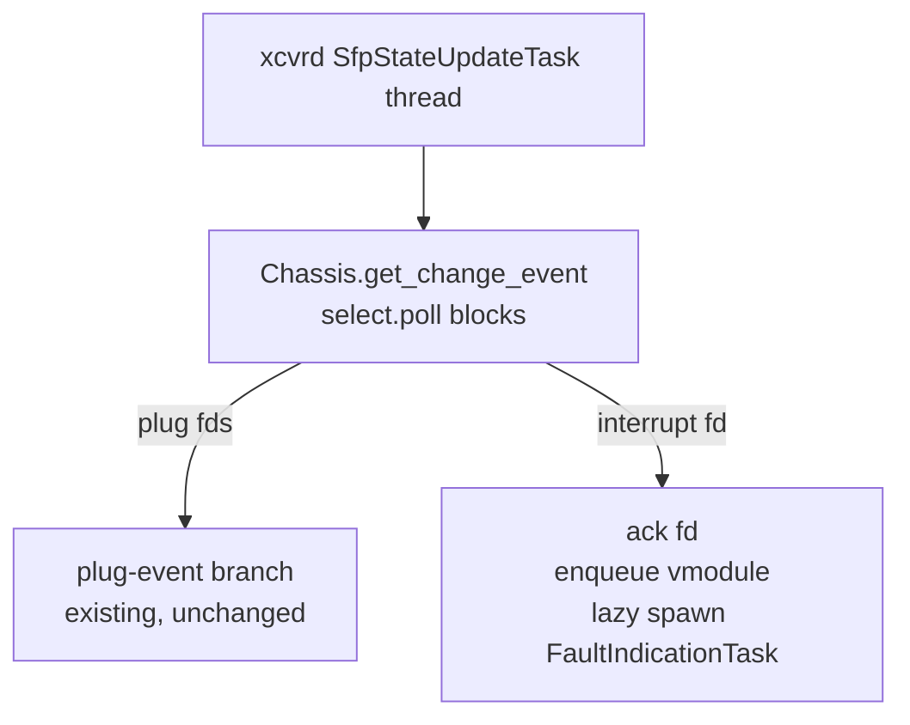
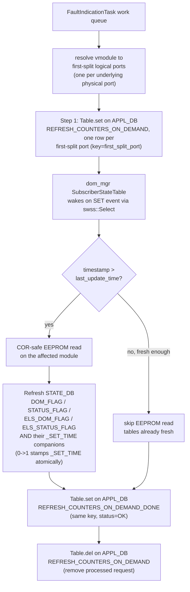

# CPO Fault Indication - HLD

## 1. Revision

| Rev | Date       | Author | Change Description                                                                                                                                                                                                                     |
| --- | ---------- | ------ | -------------------------------------------------------------------------------------------------------------------------------------------------------------------------------------------------------------------------------------- |
| 0.1 | May 2026   | Noa Or | Initial draft.                                                                                                                                                                                                                        |
| 0.2 | Jul 2026   | Noa Or | Delegate COR-safe EEPROM reads to `dom_mgr` via two new APPL_DB request/response channels (`REFRESH_COUNTERS_ON_DEMAND` request, `REFRESH_COUNTERS_ON_DEMAND_DONE` completion). Originally implemented on top of `swss::NotificationProducer` / `NotificationConsumer`; later reworked to plain APPL_DB tables in 0.5.|
| 0.3 | Jul 2026   | Noa Or | Align design to community dom_mgr design changes. |
| 0.4 | Jul 2026   | Noa Or | Read `_SET_TIME` metadata tables instead of the `_FLAG` value tables, and add a per-port / per-field `_FaultCache` inside `FaultIndicationTask`. This closes a race between `dom_mgr`'s 60 s timer and our on-demand refresh whereby the timer could re-read (and thus COR-clear) a flag whose value the response phase was about to read. Under the new algorithm we compare each field's `_SET_TIME` against the last value we cached; because `_SET_TIME` in the metadata tables advances only on a 0→1 transition and never regresses, the timer's follow-up read cannot erase evidence of a fault we have not yet processed. The §7.4 detected-fault-categories table and the §7.4.1 schematic map were also refreshed to reference both the `_FLAG` value table and its `_SET_TIME` companion for each row, and to use the actual `dom_mgr` field names (`tempHAlarm`, `lasertempHAlarm`, `els_HighPowerAlarm1..8`, `els_fault_flag_lane1..8`, …) verified in `cmis.py`, `elsfp_cmis.py`, `elsfp_pages.py`, and `cpo_els.py`. |
| 0.5 | Jul 2026   | Noa Or | Switch the `REFRESH_COUNTERS_ON_DEMAND` / `REFRESH_COUNTERS_ON_DEMAND_DONE` transport from swss pub/sub (`NotificationProducer` / `NotificationConsumer`) to regular APPL_DB **tables** consumed via `swss::SubscriberStateTable` — same pattern the rest of SONiC uses for APPL_DB request/response flows (e.g. `FLEX_COUNTER_TABLE`, `WARM_RESTART`). The two identifiers are now **table names**, not channel names. Rows are keyed by the first-split logical port; consumers `DEL` each row after processing. This makes the transport durable across daemon restarts (a REFRESH written while `dom_mgr` was down is picked up on its next start via `SubscriberStateTable`'s initial-state scan; symmetrically, a DONE written while xcvrd was down is picked up when `FaultIndicationTask` reconnects), removes the "no operator visibility into in-flight requests" limitation (`redis-cli -n 0 KEYS 'REFRESH_COUNTERS_ON_DEMAND*'` and `HGETALL` now work), and eliminates the possibility of losing a fault event to a fire-and-forget send. The `_FaultCache` algorithm and the `_SET_TIME` read path are **unchanged**; only the request/response transport was swapped. Two follow-up refinements in the same revision: (a) the explicit `DEL`-after-processing contract for both tables — see §7.6.1.1 for why it is required (avoids `dom_mgr` re-doing work and `FaultIndicationTask` re-syslogging historical faults on daemon restart); (b) the pub/sub-era **20 s per-request DONE deadline is removed entirely**. The main loop is now purely event-driven via `swss::Select`, matching the orchagent `Orch::execute()` / `doTask()` pattern — DONEs are processed whenever they arrive, no client-side deadline bookkeeping, and no `_pending` structure. The `_FaultCache` / RMW-union path is idempotent so a slow or delayed DONE is correct by construction. `FaultIndicationTask` maintains a stable spawn-time `_first_split_to_cpo_port` map so the R9 write fan-out works for the normal case, the delayed-DONE case, and the cross-restart case uniformly. Operator visibility into stuck REFRESHes is provided by `redis-cli KEYS 'REFRESH_COUNTERS_ON_DEMAND*'`; stuck-daemon detection is `dom_mgr`'s own supervision responsibility, not ours. Third refinement in the same revision: (c) the `force` flag on the REFRESH row was removed. `FaultIndicationTask` always used `force=false` and no other caller of the API exists, so the flag was YAGNI. `dom_mgr` unconditionally compares the row's `timestamp` against the per-table `last_update_time` and skips the EEPROM read if the STATE_DB tables are already fresher (see §7.6.1). A future caller that needs to bypass the freshness check can add the flag back at that time. |

## 2. Scope

This HLD describes the design for surfacing **CPO (Co-Packaged Optics) vModule** fault indications on Mellanox platforms.

In scope:

- Listening for fault interrupts on the per-vModule sysfs node `/sys/module/sx_core/asic0/module{sdk_index}/interrupt` for every CPO vModule.
- Delegating the COR-safe EEPROM read of the CPO fault pages to `dom_mgr` (xcvrd's DOM manager) via two new **APPL_DB tables**: `REFRESH_COUNTERS_ON_DEMAND` (request; written by `FaultIndicationTask`, consumed by `dom_mgr`) and `REFRESH_COUNTERS_ON_DEMAND_DONE` (completion; written by `dom_mgr`, consumed by `FaultIndicationTask`). Each side writes with `swss::Table::set()` and consumes with `swss::SubscriberStateTable` plumbed into `swss::Select` — the same pattern SONiC uses for CONFIG_DB / APPL_DB event flows elsewhere (e.g. `FLEX_COUNTER_TABLE`, `WARM_RESTART`). Each row is keyed by the **first-split logical port name** of the port being refreshed; consumers `DEL` each row after processing.
- Consuming the four `_SET_TIME` metadata tables `TRANSCEIVER_DOM_FLAG_SET_TIME`, `TRANSCEIVER_STATUS_FLAG_SET_TIME`, `TRANSCEIVER_ELS_DOM_FLAG_SET_TIME`, and `TRANSCEIVER_ELS_STATUS_FLAG_SET_TIME` that `dom_mgr` populates alongside its `_FLAG` value tables (see §7.3.2 for why `_SET_TIME` and not `_FLAG` — the exact per-field schema of the two ELS tables is provided in a follow-up revision; this design references them by name and by which fault categories land in them).
- Mapping each asserted flag field to a canonical `xcvr_cpo_*` token via an in-code name-to-token dictionary.
- Logging the parsed fault information to syslog with WARNING severity.
- Writing the tokens into a new dedicated field `xcvr_fault` on the existing STATE_DB `TRANSCEIVER_STATUS_SW|<port>` row. This feature is the sole writer of `xcvr_fault`; xcvrd's existing fields (`status`, `cmis_state`, `error`) are untouched. gNMI subscribers receive the change through the existing STATE_DB telemetry path; subscribers who want to watch only fault events may need to add a new subscription to the `xcvr_fault` field.
- Asymmetric fan-out on interrupt: one REFRESH request per **underlying physical port** of the vModule (first split only, since dom_mgr's per-physical-port poll refreshes the flag tables for every logical split), and one `xcvr_fault` write per **logical port** of the vModule (including every breakout split, so operators watching any split see the fault).

Out of scope:

- **Regular CMIS pluggable (QSFP+/QSFP28/QSFP-DD/OSFP) fault decoding.** The registration filter in `chassis.py` is CPO-only; extending it to regular CMIS pluggables is deferred to a separate effort.
- **Recovery / clearing policy.** Per Spectrum CPO doc 8.6 the kernel `interrupt` sysfs deasserts as soon as the EEPROM is read — that is only an acknowledgement of the read, not a HW recovery signal. `xcvr_*` tokens therefore persist until cleared by an external mechanism (Open Item 3).
- Non-Mellanox platforms.
- FW-Control mode (the design is wired into `get_change_event_for_module_host_management_mode` only).
- SFF-8472 legacy SFP/SFP+ pluggables.

## 3. Definitions/Abbreviations

| Term                              | Definition                                                                                                                                                                                                                                                                                                                              |
| --------------------------------- | --------------------------------------------------------------------------------------------------------------------------------------------------------------------------------------------------------------------------------------------------------------------------------------------------------------------------------------- |
| CPO                               | Co-Packaged Optics                                                                                                                                                                                                                                                                                                                     |
| ELS                               | External Laser Source                                                                                                                                                                                                                                                                                                                  |
| OE                                | Optical Engine; identified by `oe_id`                                                                                                                                                                                                                                                                                                  |
| vModule                           | Virtual module exposed by the SDK; one `(oe_id, els_id)` tuple maps to N logical ports                                                                                                                                                                                                                                                 |
| PMON                              | Platform Monitor docker; hosts `xcvrd` and other platform daemons                                                                                                                                                                                                                                                                     |
| xcvrd                             | Transceiver daemon under PMON                                                                                                                                                                                                                                                                                                          |
| SfpStateUpdateTask                | xcvrd thread that owns plug/unplug event handling and calls `Chassis.get_change_event()`                                                                                                                                                                                                                                              |
| dom_mgr (DomInfoUpdateTask)       | xcvrd thread that periodically reads DOM/status/VDM data from transceiver EEPROMs and publishes them to STATE_DB                                                                                                                                                                                                                       |
| FaultIndicationTask               | New Mellanox-only `threading.Thread` subclass introduced in this design; lives in `mlnx-platform-api`                                                                                                                                                                                                                                  |
| COR                               | Clear-On-Read. A hardware register that returns 1 on read then auto-resets to 0. If two software components both read it, whoever reads second sees zeros                                                                                                                                                                             |
| Table / SubscriberStateTable      | swsscommon primitives on top of Redis hashes and keyspace notifications. Producer writes with `Table::set(key, fvs)` (Python: `swsscommon.Table(db, "TABLE_NAME").set(...)`), which HSETs the fields under `TABLE_NAME\|<key>` and emits a keyspace SET event. Consumer opens a `SubscriberStateTable`, plumbs it into a `swss::Select`, and drains events with `pop()` returning `(key, op, fvs)` where `op` is `SET` or `DEL`. Unlike Notification pub/sub, rows are **persisted** — a consumer that starts after the write still sees the row via its initial-state scan on construction. Consumers `DEL` rows after processing to prevent replay. Used e.g. by `FLEX_COUNTER_TABLE` in CONFIG_DB, `WARM_RESTART` in STATE_DB, and countless APPL_DB event flows.|
| SDK                               | NVIDIA Spectrum SDK (`sx_core` kernel module)                                                                                                                                                                                                                                                                                          |
| gNMI                              | gRPC Network Management Interface. In SONiC, the `sonic-gnmi` container exposes SONiC Redis DBs to external clients over gRPC. Subscribers on `STATE_DB/TRANSCEIVER_STATUS_SW/<port>` receive a `Notification` whenever the underlying Redis key changes                                                                                |
| STATE_DB                          | SONiC Redis instance (db 6) that stores operational state of the device                                                                                                                                                                                                                                                                |
| APPL_DB                           | SONiC Redis instance (db 0) used for inter-application request/response tables and events                                                                                                                                                                                                                                                |
| HLD                               | High-Level Design                                                                                                                                                                                                                                                                                                                     |

## 4. Overview

Spectrum CPO hardware exposes a single fault interrupt per vModule, surfaced as a pollable sysfs attribute by the SDK kernel module:

```
/sys/module/sx_core/asic0/module{sdk_index}/interrupt
```

The same `module{sdk_index}` directory already hosts the plug-event sysfs files (`present`, `hw_present`, `power_good`) that Mellanox `Chassis.get_change_event()` polls today.

The CPO fault information itself lives in three EEPROM pages: **0x0** (module-level + lower-memory thermal flags), **0x11** (per-lane flags), and **0x1A** (ELS flags). Most of the bits in those pages are **Clear-On-Read (COR)** — reading them returns their latched value and simultaneously resets them to zero. If two independent readers touch the same COR bytes they lose events. In today's SONiC, the periodic reader of those bytes is `dom_mgr`, which polls every 60 s and publishes the parsed flag values into `TRANSCEIVER_DOM_FLAG` / `TRANSCEIVER_STATUS_FLAG` (module-level) and `TRANSCEIVER_ELS_DOM_FLAG` / `TRANSCEIVER_ELS_STATUS_FLAG` (ELS-specific). Alongside each `_FLAG` table `dom_mgr` also maintains a companion `_SET_TIME` metadata table that records **the last time each field transitioned 0→1** (`Wed Jul 08 15:08:00 2026` format, UTC), initialised to the sentinel `"never"`.

**Key design choice #1:** this feature does NOT read the CPO CoR fault pages directly. Instead it asks `dom_mgr` to do an on-demand read, then consumes the STATE_DB rows that `dom_mgr` publishes. That keeps `dom_mgr` as the sole COR reader and completely avoids the two-readers-racing-on-COR problem.

**Key design choice #2:** even with `dom_mgr` as the sole COR reader, there is still a subtle race between `dom_mgr`'s **own two read paths** — the periodic 60 s timer and our on-demand refresh — because both paths COR-clear the same bytes. If the timer fires immediately after our on-demand refresh finished writing the `_FLAG` tables but before we read them, its read observes the flag already cleared by the on-demand read, writes `_FLAG=0` back to the row, and the response phase sees `false` in a table that briefly said `true`. To close this race, `FaultIndicationTask` reads the `_SET_TIME` metadata tables — not the `_FLAG` value tables — and compares each field's set-time against a per-port / per-field `_FaultCache` living in the task's own memory. `_SET_TIME` advances only on 0→1 transitions and never regresses (verified in `dom_mgr`'s `_update_flag_metadata_tables`), so once a fault event has been recorded there, no follow-up read can erase it. Section 7.3.2 gives the full derivation.

The flow is:

1. Mellanox `Chassis.get_change_event()` polls the interrupt sysfs alongside the plug-event fds. On the first assertion, it lazily spawns a Mellanox-only `FaultIndicationTask` thread and enqueues the affected vModule.
2. The task resolves the vModule to its underlying physical ports and **writes one row per physical port** into the APPL_DB `REFRESH_COUNTERS_ON_DEMAND` table via `swss::Table::set()`, using the **first-split logical port** of each physical port as the row key (see requirement 6). Each row's fields carry the list of `_FLAG` tables to refresh and a UTC asctime timestamp. Additional splits of the same physical port do **not** get their own rows — `dom_mgr` refreshes every split's `_FLAG` / `_SET_TIME` row from a single physical read. If a new interrupt fires on the same first-split port while a previous REFRESH is still in-flight, the new `set()` **overwrites** the row (last-writer-wins) — this is desirable: `dom_mgr`'s read is idempotent and the merged request still triggers exactly one COR-safe EEPROM read.
3. `dom_mgr`'s `SubscriberStateTable` on `REFRESH_COUNTERS_ON_DEMAND` wakes on each SET event via `swss::Select`, parses the row, and if the STATE_DB tables are not already fresher than the request (per-table `last_update_time` compared with the row's `timestamp` — see 7.6.1) performs its COR-safe read on the module, refreshing both the requested `_FLAG` value tables **and their companion `_SET_TIME` metadata tables** for that port in a single call chain (the `_SET_TIME` refresh is atomic with the `_FLAG` write inside `_update_flag_metadata` — we do not need to list `_SET_TIME` names in `requested_tables`). In both branches (read performed, or skipped as already fresh), `dom_mgr` writes a matching row into `REFRESH_COUNTERS_ON_DEMAND_DONE` keyed by the same first-split port with status + timestamp fields, and then **`DEL`s the REFRESH row** so it will not be re-processed on a future `dom_mgr` restart.
4. `FaultIndicationTask`'s `SubscriberStateTable` on `REFRESH_COUNTERS_ON_DEMAND_DONE` wakes on each SET event, reads **the four `_SET_TIME` metadata tables** for the DONE row's first-split logical port and, for each field, compares its set-time to the value stored for that (port, field) pair in `_FaultCache`. Any field whose `_SET_TIME` has advanced since the cached value (or whose cache entry is still `"never"` while `_SET_TIME` holds a real timestamp) is treated as a newly-observed fault: the cache entry is updated in place, and the field is mapped via `_FLAG_TO_TOKEN` to an `xcvr_cpo_*` token. Multiple simultaneous faults naturally produce multiple tokens. If no field's `_SET_TIME` advanced, the DONE cycle ends silently — no syslog, no STATE_DB write. Once the row is processed, `FaultIndicationTask` **`DEL`s the DONE row** so it will not be re-processed on a future xcvrd restart.
5. When a DONE produces at least one new token, the task logs a WARNING to syslog naming the first-split port and the tokens, and RMW-unions the tokens into the new dedicated `xcvr_fault` field on `TRANSCEIVER_STATUS_SW|<port>` **for every logical port of the vModule, including every breakout split** (see requirement 9). A vModule-wide fault that touches all N physical ports therefore produces up to N syslog lines (one per DONE that surfaces new tokens) but the RMW-union writes are idempotent — the vModule's final `xcvr_fault` value is exactly the union. A single-physical-port fault produces exactly one syslog line. This feature is the **only writer** of `xcvr_fault`; xcvrd continues to own `status`, `cmis_state`, and `error` (never touched by us). No cross-writer coordination is needed.

**Why tables, not pub/sub**: the request/done handshake is a request/response pattern, not a fire-and-forget event. Using tables gives us three properties that pub/sub would not:
- **Durability across daemon restarts.** A REFRESH row written while `dom_mgr` was stopped is picked up when `dom_mgr` starts — its `SubscriberStateTable` snapshots the current keys on construction and delivers each one as a SET event. Symmetrically, a DONE written while xcvrd was down is picked up by the next `FaultIndicationTask` on the same mechanism. Pub/sub sends drop on the floor if no consumer is attached at send time.
- **Coalescing under interrupt storms.** If the SDK asserts the same vModule's `interrupt` sysfs repeatedly (which it does — the file stays asserted until read), the second and later `Table::set()` calls for the same first-split port overwrite the row and only one COR-safe EEPROM read is triggered. Pub/sub would have sent one notification per interrupt.
- **Operator visibility.** `redis-cli -n 0 KEYS 'REFRESH_COUNTERS_ON_DEMAND*'` shows every in-flight or unclaimed request, and `HGETALL` shows its fields. With pub/sub there would be nothing in Redis to inspect.

This is the same pattern SONiC already uses for CONFIG_DB `FLEX_COUNTER_TABLE` (syncd subscribes), STATE_DB `WARM_RESTART` (many daemons subscribe), and APPL_DB `PORT_TABLE` (portsyncd/orchagent). We are not inventing a new IPC style.

## 5. Requirements

Functional:

1. PMON shall register interrupt fds only for `CpoPort` instances. Regular pluggables are not monitored by this feature.
2. PMON shall wait for CPO fault interrupts with the `poll(2)` syscall on the interrupt fds.
3. `FaultIndicationTask` shall be spawned once, on the first interrupt. It is a long-lived worker for the rest of xcvrd's lifetime. Subsequent interrupts do not spawn additional threads.
4. On every interrupt (first or subsequent), PMON shall enqueue the affected vModule to the running `FaultIndicationTask`'s work queue.
5. `FaultIndicationTask` shall run as a `daemon=True` thread, so the Python runtime reaps it when xcvrd exits. No generic-xcvrd code change is required for shutdown. See section 7.3.1 for the safety analysis of abrupt teardown.
6. For every dequeued vModule, `FaultIndicationTask` shall write one row per **underlying physical port** into the APPL_DB `REFRESH_COUNTERS_ON_DEMAND` table via `swss::Table::set()`, using the **first split** (lowest-index breakout logical port) of each physical port as the **row key**. It shall **not** write a row for the other breakout splits of the same physical port. Rationale: `dom_mgr` performs a single EEPROM read per physical port and writes the refreshed flags to the `TRANSCEIVER_DOM_FLAG` / `TRANSCEIVER_STATUS_FLAG` / `TRANSCEIVER_ELS_DOM_FLAG` / `TRANSCEIVER_ELS_STATUS_FLAG` rows of **all** logical ports mapped to that physical port; writing additional REFRESH rows for the other splits would trigger redundant EEPROM reads with no new information. Example — vModule 0 covers physical ports {1, 9, 17, 25}, each broken out into two logical ports (Ethernet0/4, Ethernet8/12, Ethernet16/20, Ethernet24/28). This requirement produces exactly four rows in `REFRESH_COUNTERS_ON_DEMAND`, keyed by Ethernet0, Ethernet8, Ethernet16, Ethernet24. Duplicate interrupts on the same vModule while a previous request is still in flight **coalesce**: the second `set()` on the same key overwrites the row, `dom_mgr` sees at most one additional SET event (or none, if the two writes land within one `SubscriberStateTable::pop()` window), and one COR-safe EEPROM read services both interrupts. Coalescing is safe because the `_SET_TIME` compare in R8 is idempotent — any fault latched since the last cache update is observed regardless of how many interrupts fired.
7. `FaultIndicationTask`'s main loop shall be **event-driven via `swss::Select`**, following the same pattern as orchagent's `Orch::execute()` / `doTask()`. There is **no per-request deadline**, no timeout bookkeeping, and no in-memory pending-request tracking. The `Select` uses a short bounded wake-up interval (e.g. 1 s, `POLL_TIMEOUT_MS`) purely for stop-event responsiveness — not for tracking outstanding requests.
   
   Each wake-up fires because one of three things happened:
   1. A DONE SET event arrived on the `SubscriberStateTable` — processed immediately per R8/R9 (read `_SET_TIME`, compare against `_FaultCache`, syslog + RMW-union if new tokens, then `Table.del()` the DONE row).
   2. A new work-queue item arrived from `Chassis` — the corresponding REFRESH rows are written to APPL_DB via `Table.set()`. Interrupt bursts on the same port coalesce naturally at the Redis layer (successive `Table.set()`s overwrite the row) and `dom_mgr`'s own freshness check short-circuits redundant EEPROM work, so no client-side dedup structure is required.
   3. The wake-up interval expired — the loop only checks the stop flag and re-enters `Select`.
   
   A DONE that arrives arbitrarily long after the REFRESH was written is processed correctly with no special handling: the `_FaultCache` compare and RMW-union write are fully idempotent, so nothing about correctness depends on when the DONE lands. If `dom_mgr` is stopped, hung, or slow, the REFRESH row simply waits in APPL_DB until `dom_mgr` returns; on its next `SubscriberStateTable` pop (live or via startup replay), `dom_mgr` writes the DONE, `FaultIndicationTask` consumes it, and the fault is surfaced — **no data loss and no per-request timer needed**.
   
   Operator visibility into stuck REFRESHes is provided by `redis-cli -n 0 KEYS 'REFRESH_COUNTERS_ON_DEMAND*'` (see §7.9). A genuinely stuck `dom_mgr` is caught by its own supervision (monit / systemd / process health) — the correct layer to detect and surface daemon-health problems. Duplicating that at the caller side would only produce spurious WARNs under transient `dom_mgr` contention without adding real diagnostic value.
   
   For the R9 write fan-out, `FaultIndicationTask` maintains a stable, task-lifetime **`_first_split_to_cpo_port` map** built once at spawn from `chassis._sfp_list`. Every DONE handler resolves the row key (a first-split logical port name) back to its owning `CpoPort` via this map. Because the map is independent of any per-request state, it works uniformly for (a) the normal case (we sent the REFRESH ourselves), (b) the delayed-response case (DONE arrives minutes after the REFRESH), and (c) the cross-restart case (DONE row exists in APPL_DB from a previous `FaultIndicationTask` incarnation and is delivered via `SubscriberStateTable`'s initial-state scan on the new incarnation's startup).
8. After the DONE indication, `FaultIndicationTask` shall read the **`_SET_TIME` metadata tables** `TRANSCEIVER_DOM_FLAG_SET_TIME|<port>`, `TRANSCEIVER_STATUS_FLAG_SET_TIME|<port>`, `TRANSCEIVER_ELS_DOM_FLAG_SET_TIME|<port>`, and `TRANSCEIVER_ELS_STATUS_FLAG_SET_TIME|<port>` (**not** the `_FLAG` value tables). `<port>` here is the **first-split logical port** of each physical port, matching where `dom_mgr` writes the rows (`dom_mgr.py:316-318`). For every field name known to `_FLAG_TO_TOKEN`, it shall compare the `_SET_TIME` value read from the table against the cached value in `_FaultCache[first_split][field]`; a field is treated as a newly-observed fault iff the table timestamp is strictly newer than the cached value (with the sentinel `"never"` treated as −∞ on both sides — see §7.3.2 for the full algorithm and short-circuits). Every newly-observed field is emitted as an `xcvr_cpo_*` token via the in-code `_FLAG_TO_TOKEN` mapping. The cache entry is updated to the table's `_SET_TIME` in the same pass.
9. `FaultIndicationTask` shall log the parsed fault info to syslog at WARNING severity **on every processed DONE row that yields at least one newly-observed fault**. (Because the algorithm in §7.3.2 only surfaces `_SET_TIME` deltas, a DONE whose fields all match the cache produces no new tokens and therefore no syslog line — the DONE itself is not enough to re-log a fault we have already reported.) In the typical case where a single physical port latched the fault, only that port's DONE surfaces new tokens and exactly one syslog line is emitted per vModule interrupt; in the rarer case where the same fault latches on all N physical ports of a vModule simultaneously, up to N syslog lines can be emitted (one per DONE) — but see below on the write side. When a DONE produces at least one new token, `FaultIndicationTask` shall RMW-union the token set into the new dedicated `xcvr_fault` field of `TRANSCEIVER_STATUS_SW|<port>` for **every logical port of the CpoPort the DONE belongs to, including every breakout split** — not just the first splits used in R6's REFRESH fan-out and R8's `_SET_TIME` reads. Since `dom_mgr`'s on-demand poll refreshes the flag tables for every logical port of the physical port and the underlying fault is per-vModule (or per physical port), any operator watching any split's `xcvr_fault` must see the fault. Following the same example as R6, each such write fan-out reaches **eight** rows (Ethernet0, Ethernet4, Ethernet8, Ethernet12, Ethernet16, Ethernet20, Ethernet24, Ethernet28), each getting the same tokens. RMW-union writes are idempotent, so multiple DONEs producing the same token converge to a single union with no duplicates. This feature is the **sole writer** of `xcvr_fault`. It does not touch `status`, `cmis_state`, or `error`.
10. `FaultIndicationTask` shall NOT remove previously-emitted `xcvr_cpo_*` tokens from `xcvr_fault` just because the underlying flag deasserted. Interrupt deassertion is not a HW recovery signal (per CPO doc 8.6); token clearing is an operator-driven action (Open Item 3). Implementation: read `xcvr_fault`, take the **set union** with the newly-computed tokens (each token appears **at most once** in the stored string), write back — a **read-modify-write (RMW)** pattern. Re-asserting a fault that is already in `xcvr_fault` therefore produces a no-op write; a token is never duplicated. This is safe because the feature is the only writer of the field.
11. The feature shall be Mellanox-scoped and shall not affect non-Mellanox platforms or the legacy `get_change_event_legacy` path. On non-Mellanox platforms, the `xcvr_fault` field is simply absent from `TRANSCEIVER_STATUS_SW` rows.

Non-functional:

1. Zero added wake-ups on platforms with no CPO ports (`FaultIndicationTask` is never spawned).
2. No new dockers or services; only code changes in `mlnx-platform-api` and a small addition to `dom_mgr` in `sonic-xcvrd`.
3. One new field (`xcvr_fault`) on the existing `TRANSCEIVER_STATUS_SW` row. No other schema changes. No YANG model impact (this table has no YANG model in `sonic-yang-models`).

## 6. Architecture Design

The current SONiC PMON architecture is preserved. Two additions:

1. `Chassis.get_change_event()` polls one extra kind of fd (per-CpoPort `interrupt`) and lazily spawns a Mellanox-only thread on the first assertion.
2. `dom_mgr` gains a new on-demand poll handler triggered by writes to a new APPL_DB request table.

### 6.1 Interrupt registration and spawn


```mermaid
flowchart TD
  thread["xcvrd SfpStateUpdateTask thread"] --> chassis["Chassis.get_change_event<br/>select.poll blocks"]
  chassis -->|"plug fds"| plug["plug-event branch<br/>existing, unchanged"]
  chassis -->|"interrupt fd"| fault["ack fd<br/>enqueue vmodule<br/>lazy spawn FaultIndicationTask"]
```

### 6.2 Fault handling flow — request phase

Triggered when `FaultIndicationTask` dequeues a vModule. Ends when dom_mgr publishes a DONE row.


```mermaid
flowchart TD
  q["FaultIndicationTask work queue"]
  q --> resolve["resolve vmodule to<br/>first-split logical ports<br/>(one per underlying physical port)"]
  resolve --> req["Step 1: Table.set on APPL_DB<br/>REFRESH_COUNTERS_ON_DEMAND, one row per<br/>first-split port (key=first_split_port)"]
  req --> sub["dom_mgr SubscriberStateTable<br/>wakes on SET event via swss::Select"]
  sub --> check{"timestamp &gt;<br/>last_update_time?"}
  check -->|no, fresh enough| skip["skip EEPROM read<br/>tables already fresh"]
  check -->|yes| read["COR-safe EEPROM read<br/>on the affected module"]
  read --> refresh["Refresh STATE_DB<br/>DOM_FLAG / STATUS_FLAG /<br/>ELS_DOM_FLAG / ELS_STATUS_FLAG<br/>AND their _SET_TIME companions<br/>(0-&gt;1 stamps _SET_TIME atomically)"]
  refresh --> done["Table.set on APPL_DB<br/>REFRESH_COUNTERS_ON_DEMAND_DONE<br/>(same key, status=OK)"]
  skip --> done
  done --> cleanup["Table.del on APPL_DB<br/>REFRESH_COUNTERS_ON_DEMAND<br/>(remove processed request)"]
```

### 6.3 Fault handling flow — response phase

Triggered when the DONE row appears. Ends when tokens are visible to gNMI subscribers. The loop is purely event-driven — no per-request deadline (see R7).


```mermaid
flowchart TD
  wait["Step 2: FaultIndicationTask<br/>SubscriberStateTable on<br/>REFRESH_COUNTERS_ON_DEMAND_DONE<br/>waits on swss::Select<br/>(bounded wake-up ~1s, stop-flag only)"]
  wait --> check{"DONE SET event popped?"}
  check -->|no| wait
  check -->|DONE event popped| readset["Step 3a: for the DONE row's<br/>first-split port, read the four<br/>_SET_TIME tables (DOM_FLAG_SET_TIME /<br/>STATUS_FLAG_SET_TIME / ELS_DOM_FLAG_SET_TIME /<br/>ELS_STATUS_FLAG_SET_TIME)"]
  readset --> cmp{"Step 3b: for each field in _FLAG_TO_TOKEN<br/>set_time &gt; _FaultCache&#91;port&#93;&#91;field&#93; ?"}
  cmp -->|no| noop["skip field<br/>(already-known or never-set)"]
  cmp -->|yes| token["Step 3c: update _FaultCache&#91;port&#93;&#91;field&#93; = set_time<br/>map field to xcvr_cpo_* token"]
  token --> delrow["Table.del<br/>REFRESH_COUNTERS_ON_DEMAND_DONE<br/>(consumer removes processed row)"]
  noop --> delrow
  delrow --> collect["Collect tokens across all fields<br/>on this port"]
  collect --> hasnew{"any new tokens?"}
  hasnew -->|no| endnew["done, nothing to report"]
  hasnew -->|yes| write["Step 4: syslog WARNING<br/>RMW union into<br/>TRANSCEIVER_STATUS_SW.xcvr_fault<br/>(fan-out: every logical port of the vModule)"]
  write -.->|existing STATE_DB telemetry| gnmi["gNMI subscriber"]
```

Notes:

- The plug-event branch is untouched. `Chassis.get_change_event()` returns to its caller as fast as before; all EEPROM work happens off the critical path.
- `dom_mgr` remains the **sole reader** of the CPO COR flag pages. No new EEPROM readers.
- `dom_mgr` publishes to STATE_DB tables it already owns; no schema growth on those tables.

## 7. High-Level Design

### 7.1 Built-in vs Application Extension

Built-in SONiC feature, Mellanox platform-specific code plus a small addition to xcvrd.

### 7.2 Repositories changed

| Repository | Change size |
| --- | --- |
| `sonic-buildimage` -> `platform/mellanox/mlnx-platform-api` | Two new files, small edit to `chassis.py`. |
| `sonic-buildimage` -> `src/sonic-platform-daemons/sonic-xcvrd` | Small addition to `dom_mgr.py`: subscribe to `REFRESH_COUNTERS_ON_DEMAND`, on-demand poll path, publish `REFRESH_COUNTERS_ON_DEMAND_DONE`. Generic mechanism (not Mellanox-specific), reusable by other vendors later. |

No changes to `sonic-swss`, `sonic-syncd`, `sonic-swss-common`, `sonic-platform-common`, `sonic-gnmi`, `sonic-yang-models`.

### 7.3 Modules / sub-modules modified

- [sonic-buildimage/platform/mellanox/mlnx-platform-api/sonic_platform/chassis.py](sonic-buildimage/platform/mellanox/mlnx-platform-api/sonic_platform/chassis.py)
  - Register one `interrupt` fd per `CpoPort` into the existing `self.poll_obj` (registration filter is `isinstance(sfp, CpoPort)`).
  - New dispatch branch in the `poll()` event loop: on assertion, `read()` the fd to ack, then enqueue the CpoPort to `FaultIndicationTask`'s work queue. On the first-ever assertion, lazily construct and `start()` the task.
  - On lazy spawn, set `daemon=True` on the fault thread. Nothing else — no shutdown hook, no `atexit`, no signal handler. See section 7.3.1.

- [sonic-buildimage/platform/mellanox/mlnx-platform-api/sonic_platform/sfp.py](sonic-buildimage/platform/mellanox/mlnx-platform-api/sonic_platform/sfp.py)
  - No code change. The existing `Sfp.get_fd(fd_type)` already opens `/sys/module/sx_core/asic0/module{sdk_index}/{fd_type}`, so passing `'interrupt'` gives the correct path.

- **New file**: `sonic-buildimage/platform/mellanox/mlnx-platform-api/sonic_platform/fault_indication_task.py`
  - `class FaultIndicationTask(threading.Thread)`.
  - Owns: a work queue (fed by `Chassis`), an APPL_DB `swsscommon.Table` writer on `REFRESH_COUNTERS_ON_DEMAND`, an APPL_DB `swsscommon.SubscriberStateTable` on `REFRESH_COUNTERS_ON_DEMAND_DONE` plumbed into a `swsscommon.Select` (same pattern as orchagent's `Orch::execute()`), a stable **`_first_split_to_cpo_port` map** built once from `chassis._sfp_list` at spawn (used by every DONE handler to resolve the row key back to a `CpoPort` for the R9 write fan-out — see R7 and §7.6.1.1), STATE_DB readers for the four `_SET_TIME` metadata tables (`TRANSCEIVER_DOM_FLAG_SET_TIME`, `TRANSCEIVER_STATUS_FLAG_SET_TIME`, `TRANSCEIVER_ELS_DOM_FLAG_SET_TIME`, `TRANSCEIVER_ELS_STATUS_FLAG_SET_TIME`), a `TRANSCEIVER_STATUS_SW` writer, and a `_FaultCache` instance (owned exclusively by this thread; see §7.3.2). No per-request deadline bookkeeping — the loop is fully event-driven (see R7).
  - Loop: `swss::Select::select(POLL_TIMEOUT_MS)` in a tight loop, with `POLL_TIMEOUT_MS` in the ~1 s range (small enough for prompt stop-event response, not a per-request deadline). Each wake-up: (a) if the work queue has items, write REFRESH rows (keyed by first-split port) via `Table.set()` for every first-split of every enqueued vModule; (b) if the DONE `SubscriberStateTable` returned pops, for each pop resolve the row key to a `CpoPort` via `_first_split_to_cpo_port` (works for the normal case, the delayed-DONE case, and the cross-restart case where the DONE row predates this task incarnation), read the four `_SET_TIME` rows for that first-split port, compare each field against `_FaultCache[port][field]`, emit `xcvr_cpo_*` tokens for newly-observed faults, `Table.del()` the DONE row, and — if any new tokens were produced — syslog a WARNING and RMW-union the tokens into `xcvr_fault` on every logical port of the CpoPort (all splits); (c) if the wake was a plain timeout, check the stop flag and re-enter `Select`. A slow or delayed DONE is correct by construction — the `_FaultCache` compare and RMW-union write are idempotent regardless of how much time has elapsed since the REFRESH was written.
  - Startup replay: because `SubscriberStateTable` snapshots the current keys of `REFRESH_COUNTERS_ON_DEMAND_DONE` on construction, any DONE row left over from a previous xcvrd instance is delivered as an initial SET event; the task processes it under Case B of §7.3.2.3 (empty cache), which is exactly the "recover state after restart" behaviour we already document.
  - Lifecycle: created lazily by `Chassis` on the first interrupt as a `daemon=True` thread. Reaped by the Python runtime when xcvrd exits. Exposes a `request_stop()` method used only by unit tests. See section 7.3.1.

- **New file**: `sonic-buildimage/platform/mellanox/mlnx-platform-api/sonic_platform/xcvr_fault.py`
  - Static `_FLAG_TO_TOKEN` dict: maps flag field name (as published by `dom_mgr` in `TRANSCEIVER_DOM_FLAG` / `TRANSCEIVER_STATUS_FLAG` / `TRANSCEIVER_ELS_DOM_FLAG` / `TRANSCEIVER_ELS_STATUS_FLAG`; the companion `_SET_TIME` tables use the same field names) to the corresponding `xcvr_cpo_*` token name. Full listing in section 7.4.1.
  - `class _FaultCache`: per-port / per-field last-known `_SET_TIME`, owned exclusively by `FaultIndicationTask`. Not thread-safe by itself. See §7.3.2 for the algorithm and rationale.
  - Helpers: `get_first_split_logical_ports_of_vmodule(cpo_port) -> List[str]` (used to address REFRESH rows, `_SET_TIME` rows, and cache keys), `get_all_logical_ports_of_vmodule(cpo_port) -> List[str]` (used to fan the `xcvr_fault` write out to every breakout split), `build_first_split_to_cpo_port_map(sfp_list) -> Dict[str, CpoPort]` (inverse of `get_first_split_logical_ports_of_vmodule`; built once at task spawn and used by every DONE handler to resolve the row key back to a `CpoPort` — see R7 and §7.6.1.1), `read_set_time_row(port) -> Dict[str, str]` returning the merged view across all four `_SET_TIME` tables for one port, `update_xcvr_fault_field(port, tokens)` (RMW union on the `xcvr_fault` field only), and `_is_never`/`_parse_set_time` timestamp helpers.
  - Lazy `swsscommon.DBConnector` for STATE_DB (pattern from [pcie.py](sonic-buildimage/platform/mellanox/mlnx-platform-api/sonic_platform/pcie.py)) and `swsscommon.ConfigDBConnector` for CONFIG_DB (pattern from [utils.py](sonic-buildimage/platform/mellanox/mlnx-platform-api/sonic_platform/utils.py)).

- [sonic-buildimage/src/sonic-platform-daemons/sonic-xcvrd/xcvrd/dom/dom_mgr.py](sonic-buildimage/src/sonic-platform-daemons/sonic-xcvrd/xcvrd/dom/dom_mgr.py)
  - New APPL_DB `swsscommon.SubscriberStateTable` on the `REFRESH_COUNTERS_ON_DEMAND` table. Registered into the existing `swsscommon.Select` object that the main loop already polls (no new thread).
  - New APPL_DB `swsscommon.Table` writer on `REFRESH_COUNTERS_ON_DEMAND_DONE`.
  - On each `pop()` from the `SubscriberStateTable` (whether from a live SET event or from the initial-state scan that fires on `dom_mgr` startup): parse the row's `requested_tables` and `timestamp` fields. If the per-table `last_update_time` in the requested STATE_DB tables is newer than the row's `timestamp`, skip the EEPROM read (tables are already fresh). Otherwise do a COR-safe on-demand read for the row's key (a first-split logical port name; reuses the existing per-port poll infrastructure that already handles link-change fast-path polls) and refresh the requested STATE_DB tables. In both branches, `Table.set()` a matching row into `REFRESH_COUNTERS_ON_DEMAND_DONE` (same key) with `status`, `requested_timestamp` (copied from the incoming row), and `completed_timestamp` fields, then `Table.del()` the processed row from `REFRESH_COUNTERS_ON_DEMAND` so a `dom_mgr` restart won't re-process it. If a DEL SET event pops (e.g. a stale row is being cleaned up), ignore it — `dom_mgr` reacts only to SET events.
  - Startup replay: on `dom_mgr` (re)start, `SubscriberStateTable` snapshots the current keys of `REFRESH_COUNTERS_ON_DEMAND` and delivers each as an initial SET event. Any REFRESH row that `FaultIndicationTask` wrote while `dom_mgr` was down is therefore serviced on the next start — the request/response transport is durable across `dom_mgr` restarts. Each such stale row triggers a COR-safe read and a matching DONE row (with the `requested_timestamp` copied from whatever was on the row), which `FaultIndicationTask` will then consume via its own `SubscriberStateTable`.
  - **Future work (Open Item 2)**: extend `dom_mgr` to also read and publish the non-COR ELS per-lane fault/warn reason codes at pg1A bytes 212-219. Once landed, `FaultIndicationTask` picks them up automatically via the same `_FLAG_TO_TOKEN` loop.
  - No behavioural change to the periodic 60 s poll loop.

#### 7.3.1 Lifecycle & shutdown

`FaultIndicationTask` is created lazily on the first interrupt and lives for the rest of xcvrd's lifetime. It is spawned with `daemon=True`, so when xcvrd exits, the Python interpreter reaps the thread automatically.

Being killed mid-loop is safe because:

- Each write reads the current `xcvr_fault` value, adds the new tokens using **set union**, and writes back. Duplicates are impossible, and if we are killed mid-way the next fault redoes the same merge — nothing is lost, nothing is duplicated.
- Interrupt fds, Redis connections, and the `Table` / `SubscriberStateTable` handles are released by the kernel on process exit. Any in-flight REFRESH row we wrote just before termination stays in APPL_DB and is picked up by `dom_mgr`'s next `pop()` (either live or via its startup replay); the resulting DONE row survives Redis and is picked up by the next `FaultIndicationTask` incarnation.
- Any lost in-flight fault re-fires after xcvrd restarts, because HW flags are latched and the sysfs interrupt reasserts.
- **`_FaultCache` loss on teardown is safe.** The cache lives only in the task's RAM. On the next xcvrd start, the cache begins empty and every non-`"never"` `_SET_TIME` currently visible in STATE_DB is treated as a first observation (Case B of §7.3.2.3). The result is one syslog line per still-latched fault and a no-op RMW-union against the pre-existing `xcvr_fault` STATE_DB values (so operator-visible state does not regress). See §7.3.2.4.

#### 7.3.2 The timer / on-demand race, and how the `_FaultCache` closes it

##### 7.3.2.1 The race

`dom_mgr` reads the COR-latched CPO fault pages from **two independent code paths**:

- **Periodic timer**: `DomInfoUpdateTask.task_worker` runs a poll every `dom_info_update_periodic_secs` (default 60 s). On each tick it walks every first-split logical port and calls the same `post_port_transceiver_hw_status_flags_to_db` / `post_port_dom_flags_to_db` helpers that update the four `_FLAG` tables.
- **On-demand**: the new `REFRESH_COUNTERS_ON_DEMAND` handler introduced by this design fires the exact same helpers in response to our request.

Both paths COR-clear the same EEPROM bytes as a side effect of reading. Consider this sequence, which would have been possible under the pre-0.4 design that read the `_FLAG` value tables:

1. HW asserts `els_HighPowerAlarm3`. The COR bit is now 1.
2. `FaultIndicationTask` receives the interrupt at T₀, publishes `REFRESH_COUNTERS_ON_DEMAND` at T₁.
3. `dom_mgr` reads at T₂, sees the bit set, COR-clears it, writes `TRANSCEIVER_ELS_DOM_FLAG|Ethernet0.els_HighPowerAlarm3 = true`, updates `_SET_TIME` to T₂, publishes DONE.
4. **Before `FaultIndicationTask` reads the `_FLAG` row**, the periodic timer happens to fire at T₃ (T₃ > T₂ but well within a scheduling window). It reads the same COR bit, now **0** (already consumed at T₂), decides "this flag is no longer set", writes `_FLAG = false` and stamps `_CLEAR_TIME`.
5. `FaultIndicationTask` then reads `_FLAG` and observes `false`. The fault is silently lost, even though `dom_mgr` correctly latched it at T₂.

This is not a theoretical race — under load the two windows can be tens of milliseconds apart, and one lost-fault event is one syslog line and one gNMI notification that never happens.

##### 7.3.2.2 Why `_SET_TIME` is race-free

The four `_SET_TIME` metadata tables have a very specific invariant, enforced by `dom_mgr`'s `_update_flag_metadata` helper:

```220:224:sonic-buildimage/src/sonic-platform-daemons/sonic-xcvrd/xcvrd/dom/utilities/db/utils.py
        # Update the last set or clear time
        if curr_flag_value:
            flag_last_set_time_table.set(logical_port_name, swsscommon.FieldValuePairs([(flag_key, flag_values_dict_update_time)]))
        else:
            flag_last_clear_time_table.set(logical_port_name, swsscommon.FieldValuePairs([(flag_key, flag_values_dict_update_time)]))
```

`_SET_TIME` is written **only** on a 0→1 transition (line 150 of the same file guards this with a value-change compare). A 1→0 transition writes `_CLEAR_TIME`, not `_SET_TIME`. That means:

- Once `dom_mgr` observes a 0→1 event at T, the field's `_SET_TIME` becomes T and **never regresses** — not on a still-set repeat read, not on a 1→0 read, not on a periodic-timer flush of a stale row.
- If we cache the last `_SET_TIME` we've read for a field and later see the same or an older value, we know *no new 0→1 event has occurred since our last check*.
- If we see a strictly newer value, we know **`dom_mgr` observed at least one new 0→1 event since our last check**, regardless of what the current `_FLAG` value happens to be at read time.

Reading `_SET_TIME` instead of `_FLAG` therefore removes the race entirely: the periodic timer's follow-up read cannot erase evidence of a fault we haven't processed yet, because the only thing that could invalidate our observation is a `_SET_TIME` regression, and that cannot happen.

##### 7.3.2.3 Algorithm

`FaultIndicationTask` keeps a small in-memory data structure, `_FaultCache`, keyed by **first-split logical port** and by **flag field name**. Each cache entry holds the last `_SET_TIME` we have observed for that (port, field) pair, or the sentinel `"never"` if we have never observed a real timestamp there.

`dom_mgr` writes its `_FLAG` and `_SET_TIME` rows only against the first-split of each physical port:

```316:318:sonic-buildimage/src/sonic-platform-daemons/sonic-xcvrd/xcvrd/dom/dom_mgr.py
                # Get the first logical port name since it corresponds to the first subport
                # of the breakout group
                logical_port_name = logical_ports[0]
```

Which is why the cache key matches: for a vModule spanning physical ports {1, 9, 17, 25} broken out into two logical ports each (Ethernet0/4, Ethernet8/12, Ethernet16/20, Ethernet24/28), the cache holds four keys — Ethernet0, Ethernet8, Ethernet16, Ethernet24 — and each key has one sub-entry per field in `_FLAG_TO_TOKEN`.

The core decision, once per (port, field) per DONE cycle, is:

```python
def observe(port, field, set_time_from_table):
    """
    Returns True iff (port, field) has a newly-observed fault and the caller
    should emit its xcvr_cpo_* token. Cache is updated in-place.
    """
    cached = cache.get(port, {}).get(field)   # None on first-ever call

    # Case A: no fault ever latched on this field -> nothing to compare, nothing to report.
    if _is_never(set_time_from_table):
        return False

    # Case B: we have never seen this field before, but the module has. First
    # observation -> record and report.
    if _is_never(cached):
        cache.setdefault(port, {})[field] = set_time_from_table
        return True

    # Case C: both sides carry a real UTC asctime timestamp -> real strptime compare.
    if _parse(set_time_from_table) > _parse(cached):
        cache[port][field] = set_time_from_table
        return True

    return False


_TS_FORMAT = "%a %b %d %H:%M:%S %Y"           # matches dom_mgr's get_current_time
_NEVER = "never"                              # matches dom_mgr's NEVER constant

def _is_never(ts):
    return ts is None or ts == "" or ts == _NEVER

def _parse(ts):
    return datetime.strptime(ts, _TS_FORMAT)
```

The four cases enumerated:

| `_FaultCache[port][field]` | `_SET_TIME` in DOM table | Action |
| --- | --- | --- |
| `never` | `never` | No fault ever observed; skip. |
| `never` | real timestamp | First-ever observation; **update cache, report**. |
| real timestamp | `never` | Cannot happen in practice — `_SET_TIME` never regresses to `never`. Skip defensively. |
| real timestamp | real timestamp | Real `strptime` compare. **If `set_time > cached`: update cache, report; else skip.** |

Two invariants this depends on:

- **`dom_mgr`'s SET_TIME semantics.** `_SET_TIME` advances only on a 0→1 transition, verified at `sonic-xcvrd/xcvrd/dom/utilities/db/utils.py:220-224`. If that ever changes (e.g. someone teaches `dom_mgr` to re-stamp `_SET_TIME` on every still-set read), the algorithm's meaning of "newer" degrades from "at least one new event" to "at least one new observation", which would double-count. Section 15 lists this as a pinned invariant to lock in with the `dom_mgr` owner.
- **Timestamp format contract.** `dom_mgr`'s `get_current_time` uses `datetime.utcnow().strftime("%a %b %d %H:%M:%S %Y")`. Lexicographic compare does **not** work for that format (`"Feb"` < `"Jan"`), so `FaultIndicationTask` must always compare via `strptime`. The `_is_never` short-circuit lets us skip parsing for the common cold-start case.

##### 7.3.2.4 Restart behaviour

`_FaultCache` lives in the task's RAM and is lost on any xcvrd restart. On the first refresh after restart, every field with a real `_SET_TIME` will hit Case B (cache=`never`, table=real) and be reported. This is by design:

- The task has literally never observed those fields, so from *its* perspective every latched fault is a new one.
- `xcvr_fault` in `TRANSCEIVER_STATUS_SW` is persistent in STATE_DB across xcvrd restarts. The RMW-union write is a no-op if the token was already there before restart; the visible effect is one syslog line per still-latched fault on the first refresh — the correct "here's the current fault state after startup" behaviour.

##### 7.3.2.5 Write fan-out

The cache is keyed by first-split logical port; the `xcvr_fault` write must reach **every** logical port of the vModule (all breakout splits), because the underlying fault is per physical port / per vModule and any operator watching any split must see it. For each first-split port where `observe(...)` returned `True`, `FaultIndicationTask` uses `xcvr_fault.get_all_logical_ports_of_vmodule(cpo_port)` to enumerate every split of every physical port in the vModule, and RMW-unions the same token set into each of those rows.


### 7.4 Detected fault categories

`dom_mgr` already exposes every CPO fault byte we care about, with existing CMIS + Nvidia-specific APIs. Each byte listed below is written by `dom_mgr` into a `_FLAG` value table under a specific field name; the same field name also appears in the companion `_SET_TIME` metadata table with an asctime UTC timestamp (or `"never"`) as its value. This design consumes the `_SET_TIME` variant on the read path (see §7.3.2) — the "Lands in" column below therefore lists **both** the value table (owned by `dom_mgr`) and the `_SET_TIME` companion (what `FaultIndicationTask` reads) as a `(value, set_time)` pair.

The mapping between each CPO byte, the API that reads it, the concrete field name `dom_mgr` writes, and the STATE_DB rows the field lives in is as follows (per the Spectrum CPO doc):

| #  | Fault source                                          | Latch behaviour                       | Read via (`dom_mgr` internals)                                                                                                                                                                                                                          | STATE_DB field name(s) written by `dom_mgr`                                                                                                                                                                                                                                                                                             | Lands in (`value_table` / `_SET_TIME` companion read by us)                             |
| -- | ----------------------------------------------------- | ------------------------------------- | -------------------------------------------------------------------------------------------------------------------------------------------------------------------------------------------------------------------------------------------------------- | --------------------------------------------------------------------------------------------------------------------------------------------------------------------------------------------------------------------------------------------------------------------------------------------------------------------------------------- | --------------------------------------------------------------------------------------- |
| 1  | pg0: byte 9 bits 0-3 (case-temp alarms/warns)         | Latched / COR                         | `CmisApi.get_module_level_flag()` bits into `case_temp_flags` at `cmis.py:1795-1802`; flattened into DB keys at `cmis.py:503-506`                                                                                                                       | `tempHAlarm`, `tempLAlarm`, `tempHWarn`, `tempLWarn`                                                                                                                                                                                                                                                                                    | `TRANSCEIVER_DOM_FLAG` / `TRANSCEIVER_DOM_FLAG_SET_TIME`                                |
| 2  | pg0: byte 11 bits 0-3 (Aux3 = laser-temp on CPO-ELS)  | Latched / COR                         | `CmisApi.get_module_level_flag()` bits into `aux3_flags` at `cmis.py:1830-1837`; routed to laser-temp DB keys at `cmis.py:521-525` when `aux2_mon_type==1 && aux3_mon_type==0`                                                                          | `lasertempHAlarm`, `lasertempLAlarm`, `lasertempHWarn`, `lasertempLWarn`                                                                                                                                                                                                                                                                | `TRANSCEIVER_DOM_FLAG` / `TRANSCEIVER_DOM_FLAG_SET_TIME`                                |
| 3  | pg0: byte 11 bits 4-7 (Custom Mon)                    | Latched / COR                         | `NvidiaCpoElsCmisApi.get_els_dom_flags()` at `cpo_els.py:98-108` re-reads `MODULE_FLAG_BYTE3` and adds ELS-scoped keys; wired into `get_transceiver_dom_flags` at `cpo_els.py:229-232`                                                                   | `els_custom_mon_high_alarm`, `els_custom_mon_low_alarm`, `els_custom_mon_high_warning`, `els_custom_mon_low_warning`                                                                                                                                                                                                                    | `TRANSCEIVER_ELS_DOM_FLAG` / `TRANSCEIVER_ELS_DOM_FLAG_SET_TIME`                        |
| 4  | pg1A: byte 166 (FaultFlagLane, bank-relative)         | Latched / COR                         | `elsfp_cmis.get_elsfp_status_flags()` at `elsfp_cmis.py:180-201`; wired into `get_transceiver_status_flags` at `elsfp_cmis.py:229-233`. Absolute lane numbers 1-32 remap to relative 1-8 per bank.                                                       | `els_fault_flag_lane1` … `els_fault_flag_lane8`                                                                                                                                                                                                                                                                                         | `TRANSCEIVER_STATUS_FLAG` / `TRANSCEIVER_STATUS_FLAG_SET_TIME` (ELS path)               |
| 5  | pg1A: byte 174 (WarnFlagLane, bank-relative)          | Latched per spec                      | Same call as #4                                                                                                                                                                                                                                          | `els_warn_flag_lane1` … `els_warn_flag_lane8`                                                                                                                                                                                                                                                                                            | `TRANSCEIVER_STATUS_FLAG` / `TRANSCEIVER_STATUS_FLAG_SET_TIME` (ELS path)               |
| 6  | pg1A: byte 190 (HighPowerAlarm, per lane)             | Latched / COR                         | `elsfp_cmis.get_elsfp_lane_flags()` reads `HIGH_POWER_ALARM_INDEXED_FIELD` at addr 190 (`elsfp_pages.py:132-136`); template `els_HighPowerAlarm%d` at `elsfp_cmis.py:106`; wired into `get_transceiver_dom_flags` at `elsfp_cmis.py:217-220`             | `els_HighPowerAlarm1` … `els_HighPowerAlarm8`                                                                                                                                                                                                                                                                                            | `TRANSCEIVER_ELS_DOM_FLAG` / `TRANSCEIVER_ELS_DOM_FLAG_SET_TIME`                        |
| 7  | pg1A: byte 191 (LowPowerAlarm, per lane)              | Latched / COR                         | Same call as #6; `LOW_POWER_ALARM_INDEXED_FIELD` at addr 191 (`elsfp_pages.py:137-141`); template `els_LowPowerAlarm%d` at `elsfp_cmis.py:107`                                                                                                          | `els_LowPowerAlarm1` … `els_LowPowerAlarm8`                                                                                                                                                                                                                                                                                              | `TRANSCEIVER_ELS_DOM_FLAG` / `TRANSCEIVER_ELS_DOM_FLAG_SET_TIME`                        |
| 8  | pg1A: byte 192 (HighPowerWarn, per lane)              | Latched / COR                         | Same call as #6; `HIGH_POWER_WARN_INDEXED_FIELD` at addr 192 (`elsfp_pages.py:142-146`); template `els_HighPowerWarn%d` at `elsfp_cmis.py:108`                                                                                                          | `els_HighPowerWarn1` … `els_HighPowerWarn8`                                                                                                                                                                                                                                                                                              | `TRANSCEIVER_ELS_DOM_FLAG` / `TRANSCEIVER_ELS_DOM_FLAG_SET_TIME`                        |
| 9  | pg1A: byte 193 (LowPowerWarn, per lane)               | Latched / COR                         | Same call as #6; `LOW_POWER_WARN_INDEXED_FIELD` at addr 193 (`elsfp_pages.py:147-151`); template `els_LowPowerWarn%d` at `elsfp_cmis.py:109`                                                                                                            | `els_LowPowerWarn1` … `els_LowPowerWarn8`                                                                                                                                                                                                                                                                                                | `TRANSCEIVER_ELS_DOM_FLAG` / `TRANSCEIVER_ELS_DOM_FLAG_SET_TIME`                        |
| 10 | pg1A: bytes 212-219 (per-lane 4-bit fault/warn codes) | Not spec-COR (read-only, non-latched) | **Future work**: `dom_mgr` will add functionality to read these bytes and publish per-lane fields (via the existing `elsfp_cmis.get_elsfp_fault_warning_codes()` at `elsfp_cmis.py:142-153`, currently reached from `get_transceiver_status` on CPO-ELS but *not* from `get_transceiver_status_flags`). Not consumed by this version. | Once landed (Open Item 2): `els_fault_code1` … `els_fault_code8`, `els_warning_code1` … `els_warning_code8` (target field names TBD; these are the current `get_elsfp_fault_warning_codes()` keys). Note these are 4-bit enumerated codes, not booleans — token synthesis will map the code value, not truthiness.                       | Once landed: `TRANSCEIVER_ELS_STATUS_FLAG` / `TRANSCEIVER_ELS_STATUS_FLAG_SET_TIME`     |

Consequence for this design:

- Rows #1-9 (single-bit latched flags on COR pages): we consume the four `_SET_TIME` companion tables `TRANSCEIVER_DOM_FLAG_SET_TIME`, `TRANSCEIVER_STATUS_FLAG_SET_TIME`, `TRANSCEIVER_ELS_DOM_FLAG_SET_TIME`, and `TRANSCEIVER_ELS_STATUS_FLAG_SET_TIME` — one HGET per port per table. `dom_mgr` refreshes the value tables (and the metadata companions) on demand. Module-level flags (pg0) land in the non-ELS pair; ELS-specific flags (pg1A via `elsfp_cmis` / `NvidiaCpoElsCmisApi`) land in the ELS pair.
- Row #10 (4-bit reason codes on **non-COR** bytes): deferred. `dom_mgr` will add functionality to read pg1A bytes 212-219 and publish per-lane fields into `TRANSCEIVER_ELS_STATUS_FLAG` (exact field naming TBD in a follow-up revision). This feature will consume them automatically through the same `_FLAG_TO_TOKEN` loop against `TRANSCEIVER_ELS_STATUS_FLAG_SET_TIME` once the fields exist — no code change needed on the fault-indication side. The alternative direct-EEPROM-read approach originally suggested for this row is retained in Open Item 2 as a fallback.
- No new STATE_DB table is introduced by this feature. The two `TRANSCEIVER_ELS_*_FLAG` tables (and their `_SET_TIME` companions) are owned by `dom_mgr`; their exact per-field schema is delivered in a follow-up revision.
- Our in-code map is:
  - `_FLAG_TO_TOKEN` — flag field name (identical between the `_FLAG` value tables and their `_SET_TIME` companion tables, because `dom_mgr` writes both from the same `curr_flag_dict`) → `xcvr_cpo_*` token. All bit-level decoding stays inside `dom_mgr` / the CMIS APIs; the fault-indication side just looks up field names.

**Fields present in `dom_mgr`'s output but intentionally not in the mapping.** `dom_mgr` publishes several other fields into the same tables (module-level voltage — `vccH/LAlarm/Warn`; per-lane TX/RX power — `tx1powerH/LAlarm/Warn` … `rx8powerL/HWarn`; per-lane TX bias — `tx1biasH/LAlarm/Warn` … `tx8biasLWarn`; per-lane ELS bias — `els_HighBiasAlarm1..8`, `els_LowBiasAlarm1..8`, `els_HighBiasWarn1..8`, `els_LowBiasWarn1..8` from pg1A bytes 186-189). These are read by the same CMIS API calls listed above, so they appear in the `_FLAG` and `_SET_TIME` rows we HGET. `_FLAG_TO_TOKEN` deliberately has no entry for them, so `parse_and_tokenize` simply skips them (the `_FLAG_TO_TOKEN.items()` loop never asks about a field name that isn't a key). Adding them later is a one-line change per field.

#### 7.4.1 `_FLAG_TO_TOKEN` mapping and parse loop

The single in-code map that drives token emission is `_FLAG_TO_TOKEN` in `xcvr_fault.py`. Every field name from §7.4 that this feature treats as a fault has an entry here. Keys are exactly the field names `dom_mgr` writes into both the `_FLAG` value tables and their `_SET_TIME` companions (identical vocabulary); values are the canonical `xcvr_cpo_*` tokens.

The illustrative token names below (`xcvr_cpo_module_case_temp_*`, `xcvr_cpo_els_high_power_alarm_lane1`, etc.) are placeholders — the canonical list is delivered in the same follow-up revision that finalises the two `TRANSCEIVER_ELS_*_FLAG` schemas.

```python
_FLAG_TO_TOKEN = {
    # ---- Row 1: pg0 byte 9 bits 0-3 (case-temp alarms/warns) ------------------
    # In:  TRANSCEIVER_DOM_FLAG        (values)
    # We read: TRANSCEIVER_DOM_FLAG_SET_TIME
    # Proof: cmis.py:503-506 (get_transceiver_dom_flags flattens case_temp_flags into these keys)
    'tempHAlarm':                        'xcvr_cpo_module_case_temp_high_alarm',
    'tempLAlarm':                        'xcvr_cpo_module_case_temp_low_alarm',
    'tempHWarn':                         'xcvr_cpo_module_case_temp_high_warning',
    'tempLWarn':                         'xcvr_cpo_module_case_temp_low_warning',

    # ---- Row 2: pg0 byte 11 bits 0-3 (Aux3 = laser temp on CPO-ELS) ----------
    # In:  TRANSCEIVER_DOM_FLAG        (values)
    # We read: TRANSCEIVER_DOM_FLAG_SET_TIME
    # Proof: cmis.py:521-525 (aux3 -> lasertempH/LAlarm/Warn when aux2_mon_type==1 && aux3_mon_type==0)
    'lasertempHAlarm':                   'xcvr_cpo_module_laser_temp_high_alarm',
    'lasertempLAlarm':                   'xcvr_cpo_module_laser_temp_low_alarm',
    'lasertempHWarn':                    'xcvr_cpo_module_laser_temp_high_warning',
    'lasertempLWarn':                    'xcvr_cpo_module_laser_temp_low_warning',

    # ---- Row 3: pg0 byte 11 bits 4-7 (Custom Mon, ELS re-read) ---------------
    # In:  TRANSCEIVER_ELS_DOM_FLAG    (values)
    # We read: TRANSCEIVER_ELS_DOM_FLAG_SET_TIME
    # Proof: cpo_els.py:98-108 (NvidiaCpoElsCmisApi.get_els_dom_flags, wired at cpo_els.py:229-232)
    'els_custom_mon_high_alarm':         'xcvr_cpo_els_custom_mon_high_alarm',
    'els_custom_mon_low_alarm':          'xcvr_cpo_els_custom_mon_low_alarm',
    'els_custom_mon_high_warning':       'xcvr_cpo_els_custom_mon_high_warning',
    'els_custom_mon_low_warning':        'xcvr_cpo_els_custom_mon_low_warning',

    # ---- Rows 6-9: pg1A bytes 190-193 (per-lane ELS power alarms/warns) ------
    # In:  TRANSCEIVER_ELS_DOM_FLAG    (values)
    # We read: TRANSCEIVER_ELS_DOM_FLAG_SET_TIME
    # Proof: elsfp_cmis.py:95-115 (get_elsfp_lane_flags) + elsfp_pages.py:132-151 (memmap addrs 190-193)
    **{'els_HighPowerAlarm%d' % lane:    'xcvr_cpo_els_high_power_alarm_lane%d' % lane for lane in range(1, 9)},
    **{'els_LowPowerAlarm%d'  % lane:    'xcvr_cpo_els_low_power_alarm_lane%d'  % lane for lane in range(1, 9)},
    **{'els_HighPowerWarn%d'  % lane:    'xcvr_cpo_els_high_power_warn_lane%d'  % lane for lane in range(1, 9)},
    **{'els_LowPowerWarn%d'   % lane:    'xcvr_cpo_els_low_power_warn_lane%d'   % lane for lane in range(1, 9)},

    # ---- Rows 4-5: pg1A bytes 166 / 174 (per-lane fault/warn summary flags) --
    # In:  TRANSCEIVER_STATUS_FLAG     (values; ELS path adds these on top of the base CMIS keys)
    # We read: TRANSCEIVER_STATUS_FLAG_SET_TIME
    # Proof: elsfp_cmis.py:180-201 (get_elsfp_status_flags, per-bank remap to relative lanes 1-8)
    **{'els_fault_flag_lane%d' % lane:   'xcvr_cpo_els_fault_lane%d' % lane for lane in range(1, 9)},
    **{'els_warn_flag_lane%d'  % lane:   'xcvr_cpo_els_warn_lane%d'  % lane for lane in range(1, 9)},

    # ---- Row 10: pg1A bytes 212-219 (per-lane 4-bit fault/warn codes) ---------
    # Not consumed yet; enable once dom_mgr publishes them into
    # TRANSCEIVER_ELS_STATUS_FLAG(_SET_TIME) - see Open Item 2.
    # Proof: elsfp_cmis.py:142-153 (get_elsfp_fault_warning_codes) + elsfp_pages.py:205-229
    # NOTE: these are 4-bit enumerations, not booleans. When enabled, parse_and_tokenize
    # will need a small extension so the token reflects the code value, not just "any change".
    # **{'els_fault_code%d'   % lane:    'xcvr_cpo_els_fault_code_lane%d'   % lane for lane in range(1, 9)},
    # **{'els_warning_code%d' % lane:    'xcvr_cpo_els_warning_code_lane%d' % lane for lane in range(1, 9)},
}
```

Note on the `TRANSCEIVER_STATUS_FLAG` (module-level, non-ELS) group: `CmisApi.get_transceiver_status_flags` at `cmis.py:2332-2369` populates keys such as `datapath_firmware_fault`, `module_firmware_fault`, `module_state_changed`, and the per-lane `tx{N}fault` / `rx{N}los` / `tx{N}cdrlol_hostlane` / `rx{N}cdrlol` family. These are outside the §7.4 fault categories (they concern datapath, not module/optical faults) and therefore have no `_FLAG_TO_TOKEN` entry today. If a follow-up revision decides to surface any of them as `xcvr_cpo_*` tokens, they slot into this group.

Parse pseudocode (one loop across all four `_SET_TIME` tables, driven by `_FLAG_TO_TOKEN` keys, gated by `_FaultCache.observe`):

```python
def parse_and_tokenize(first_split_port, cache):
    """
    Read the four _SET_TIME rows for `first_split_port`, walk every field
    in _FLAG_TO_TOKEN, and return the list of xcvr_cpo_* tokens for
    fields whose _SET_TIME is strictly newer than what the cache remembers.
    Updates the cache in place.
    """
    set_times = read_set_time_row(first_split_port)   # merged view of all 4 tables
    tokens = []
    for field, token in _FLAG_TO_TOKEN.items():
        set_time = set_times.get(field, _NEVER)
        if cache.observe(first_split_port, field, set_time):
            tokens.append(token)
    return tokens
```

The `FaultIndicationTask` response-phase handler runs this parser **once per DONE row**, in the same loop iteration that pops the DONE from the `SubscriberStateTable`. The DONE row's key is a first-split logical port; the handler resolves that back to the owning `CpoPort` via the stable `_first_split_to_cpo_port` map and fans the write out to every split of the vModule:

```python
# Called from FaultIndicationTask's Select loop, once per popped DONE row.
def handle_done(first_split_port, done_fvs):
    # Resolve fan-out target from the stable spawn-time map. Works uniformly for:
    #   (a) normal case — we sent the REFRESH ourselves,
    #   (b) delayed-DONE case — DONE arrives arbitrarily long after the REFRESH,
    #   (c) cross-restart case — DONE row existed in APPL_DB before this task incarnation,
    # because the map depends only on chassis._sfp_list, not on any per-request state.
    cpo_port = self._first_split_to_cpo_port.get(first_split_port)
    if cpo_port is None:
        # DONE for a port this task doesn't own — safest to just clean up.
        self._done_table.delete(first_split_port)
        return

    new_tokens = parse_and_tokenize(first_split_port, self._fault_cache)
    self._done_table.delete(first_split_port)                        # cleanup, sole consumer

    if not new_tokens:
        return                                                        # quiet steady-state
    logger.log_warning(...)                                          # one syslog line per DONE with new tokens
    for lp in get_all_logical_ports_of_vmodule(cpo_port):
        update_xcvr_fault_field(lp, new_tokens)                      # RMW union, sole writer
```

Two things worth noting about the pseudocode:

- No `_pending` structure is consulted. There is no per-request bookkeeping to clean up because R7 removed the per-request deadline entirely; the handler only needs the stable `_first_split_to_cpo_port` map to resolve the fan-out target. This decouples correctness from any timing assumption about how quickly the DONE arrives.
- The whole handler is idempotent. If the same DONE row is delivered twice (for example, by `SubscriberStateTable`'s initial-state scan after a restart followed by a live SET event before the first `DEL` propagates), the second call's `_FaultCache` compare produces no new tokens (Case D-equal in §7.3.2.3), the syslog / RMW-union branch is skipped, and the second `DEL` is a no-op. No duplicate reporting, no spurious writes.

Under this per-DONE model, a fault that lights up on all N physical ports of a vModule produces up to N syslog lines (one per port that showed a new fault) and N RMW-union writes on each of the vModule's splits. The writes are idempotent, so the vModule's final `xcvr_fault` value is exactly the union — never a duplicate. In the common case where a fault is confined to one physical port, only that port's DONE produces new tokens and exactly one syslog line is emitted.

Points worth noting:

- The four `_SET_TIME` tables all use the **same field names** as their `_FLAG` counterparts (`dom_mgr` writes both from the same `curr_flag_dict`). So `_FLAG_TO_TOKEN` — which is keyed by that field name — works verbatim; there is no separate `_SET_TIME` key vocabulary.
- If `_SET_TIME` is missing from a row (unknown field or field not yet initialised by `dom_mgr`), `set_times.get(field, _NEVER)` yields the sentinel and `observe` returns `False` — no token, no report, no exception.
- Multiple simultaneous faults on the same port produce multiple tokens; they are joined with `|` when written to `TRANSCEIVER_STATUS_SW.xcvr_fault` (section 7.6.3).
- If a DONE produces no new tokens (every `_SET_TIME` matches the cache), no syslog line and no `xcvr_fault` write are emitted for that DONE. The row is still `DEL`ed so it doesn't linger. Bounded and quiet is the right steady-state behaviour.
- The pseudocode above is deliberately per-DONE, not per-vModule: under table-based transport we don't have all first-splits' data at once, and processing each DONE as it arrives keeps the code simple and idempotent. The R9 fan-out semantics are still honoured because each DONE's write reaches every logical port of the CpoPort.

### 7.5 Sequence

```mermaid
sequenceDiagram
    autonumber
    participant HW as Spectrum CPO HW
    participant SDK as sx_core kernel
    participant CH as Mellanox Chassis
    participant FT as FaultIndicationTask
    participant FC as _FaultCache (in FT process memory)
    participant AD as APPL_DB
    participant DM as dom_mgr
    participant SD as STATE_DB
    participant GN as sonic-gnmi
    participant CL as gNMI subscriber

    Note over CH: blocked in select.poll
    HW->>SDK: assert a fault
    SDK->>CH: raise interrupt sysfs
    CH->>CH: ack fd, first-time spawn FaultIndicationTask
    CH->>FT: enqueue vmodule key
    FT->>FT: resolve vmodule to first-split logical ports (one per physical port)
    loop for each first-split port
        FT->>AD: Table.set on REFRESH_COUNTERS_ON_DEMAND<br/>key=first_split_port, fields={requested_tables, timestamp}
    end
    AD-->>DM: SubscriberStateTable pop() returns SET event via swss::Select
    alt requested_timestamp > last_update_time
        DM->>SDK: COR-safe EEPROM read on the module
        DM->>SD: refresh the four _FLAG tables AND their companion _SET_TIME tables<br/>(0->1 transitions stamp _SET_TIME; 1->0 stamp _CLEAR_TIME; both are per-field)
    else fresh enough
        DM->>DM: skip EEPROM read (tables already fresh)
    end
    DM->>AD: Table.set on REFRESH_COUNTERS_ON_DEMAND_DONE<br/>same key, fields={status=OK, requested_timestamp, completed_timestamp}
    DM->>AD: Table.del REFRESH_COUNTERS_ON_DEMAND (remove processed request row)
    AD-->>FT: SubscriberStateTable pop() returns DONE SET event via swss::Select
    FT->>FT: cpo_port = _first_split_to_cpo_port[key]<br/>(stable spawn-time map, no per-request state)
    loop for the DONE row's first-split port
        FT->>SD: HGETALL the four _SET_TIME rows (DOM_FLAG_SET_TIME, STATUS_FLAG_SET_TIME,<br/>ELS_DOM_FLAG_SET_TIME, ELS_STATUS_FLAG_SET_TIME) for this port
        FT->>FC: for each field in _FLAG_TO_TOKEN: is set_time strictly newer than cache[port][field] ?
        alt yes (or first observation: cache=never AND set_time!=never)
            FC->>FT: update cache[port][field] = set_time, return "report"
            FT->>FT: append xcvr_cpo_* token for this field
        else no (cache >= set_time, or both never)
            FC->>FT: leave cache unchanged, return "skip"
        end
    end
    FT->>AD: Table.del REFRESH_COUNTERS_ON_DEMAND_DONE (remove processed DONE row)
    alt collected_tokens is non-empty
        FT->>FT: syslog WARNING (one line for the first-split port, all tokens joined)
        loop for each logical port of the vModule (all splits)
            FT->>SD: RMW-union xcvr_cpo_* tokens into TRANSCEIVER_STATUS_SW.xcvr_fault
        end
        SD-->>GN: keyspace notification
        GN->>CL: gNMI Notification on STATE_DB path
    else no new tokens (interrupt corresponded to an already-cached fault)
        FT->>FT: no syslog, no STATE_DB write (quiet steady-state)
    end
    Note over CH: returns to poll, blocked again
```

### 7.6 DB and Schema

No schema changes to any STATE_DB table. **Two new APPL_DB tables** are introduced for the request/done handshake; the flag data itself continues to live in existing STATE_DB tables that `dom_mgr` already writes.

#### 7.6.1 New APPL_DB tables

Both tables use the standard `swss::Table` (producer side) + `swss::SubscriberStateTable` (consumer side) pattern, plumbed into `swss::Select` for wake-up. Rows persist in Redis as normal hashes until explicitly `DEL`ed. This is the same pattern SONiC uses for `FLEX_COUNTER_TABLE`, `WARM_RESTART`, and countless APPL_DB event flows — we are not inventing a new IPC style.

**`REFRESH_COUNTERS_ON_DEMAND`** — request table. Written by `FaultIndicationTask`, consumed by `dom_mgr`.

Row key: `<first-split logical port name>` (e.g. `Ethernet0`, `Ethernet405`). Multiple simultaneous interrupts on the same port coalesce naturally — the second `Table.set()` overwrites the first row, and `dom_mgr`'s COR-safe read is idempotent (see §7.3.2.2). `FaultIndicationTask` writes only first-split keys (see requirement 6); the other splits do not exist as rows in this table.

Row fields:

| Field | Example value | Purpose |
| --- | --- | --- |
| `requested_tables` | `TRANSCEIVER_DOM_FLAG,TRANSCEIVER_STATUS_FLAG,TRANSCEIVER_ELS_DOM_FLAG,TRANSCEIVER_ELS_STATUS_FLAG` | Comma-separated **`_FLAG` value tables** `dom_mgr` should refresh. Only the value tables are named here; `dom_mgr` refreshes each table's companion `_SET_TIME` (and `_CLEAR_TIME` / `_CHANGE_COUNT`) automatically as part of the same `_update_flag_metadata` call chain, so `FaultIndicationTask` does **not** need to list the `_SET_TIME` names it plans to read. Unknown names are silently ignored. |
| `timestamp` | `Wed Jul 08 15:08:00 2026` | UTC timestamp using the DOM `get_current_time()` format (`"%a %b %d %H:%M:%S %Y"`), captured by `FaultIndicationTask` when it processes the interrupt. `dom_mgr` compares this against the per-table `last_update_time` in the requested STATE_DB tables: if `last_update_time > timestamp` (the tables are already fresher than the caller needs) it **skips** the on-demand EEPROM read; otherwise it performs the read. Either way, the value is copied verbatim into the DONE row's `requested_timestamp` field for debug/correlation. |

Lifecycle: `FaultIndicationTask` `Table.set()`s the row on interrupt, `dom_mgr` reacts to the SET event via its `SubscriberStateTable`, processes the request, writes the corresponding DONE row, and then `Table.del()`s the REFRESH row (see §7.6.1.1 for the full rationale — short version: keeps `dom_mgr`'s next restart from re-processing already-completed requests). `FaultIndicationTask` never DELs REFRESH rows (that is `dom_mgr`'s responsibility).

**`REFRESH_COUNTERS_ON_DEMAND_DONE`** — completion table. Written by `dom_mgr`, consumed by `FaultIndicationTask`.

Row key: `<first-split logical port name>`, matching the REFRESH row that triggered it.

Row fields:

| Field | Example value | Purpose |
| --- | --- | --- |
| `status` | `OK` / `PARTIAL` / `ERROR:<reason>` | Outcome. `PARTIAL` = at least one requested table was unknown and skipped, the others succeeded. `OK` also covers the "skipped, already fresh" case (per the `timestamp` freshness comparison in the REFRESH row above). |
| `requested_timestamp` | copied verbatim from the REFRESH row | Debug aid — lets an operator inspecting Redis see which REFRESH cycle produced this DONE. Not used for algorithmic correlation (the row key already carries the port identity, and the `_FaultCache` compare is idempotent — see §7.3.2). |
| `completed_timestamp` | current UTC time (asctime format) | When `dom_mgr` finished the on-demand read (or decided to skip because the tables were already fresh). |

Lifecycle: `dom_mgr` `Table.set()`s the row after each request. `FaultIndicationTask` reacts to the SET event via its own `SubscriberStateTable`, reads the `_SET_TIME` rows, updates its cache, writes `xcvr_fault` if warranted, and then `Table.del()`s the DONE row (see §7.6.1.1 for the full rationale — short version: keeps every xcvrd restart from re-emitting syslog WARNINGs for still-latched historical faults). `dom_mgr` never DELs DONE rows (that is `FaultIndicationTask`'s responsibility).

##### 7.6.1.1 Why the consumer DELs after processing

Neither `Table.del()` is required for **correctness** — every side of the pipeline is already idempotent (`dom_mgr`'s freshness check will short-circuit repeat reads within a window, and `FaultIndicationTask`'s `_FaultCache` compare will suppress repeat tokens). We DEL for two very concrete reasons that only bite on daemon restarts:

**1) `dom_mgr` DELs the REFRESH row to avoid re-doing work on its own next restart.**

`SubscriberStateTable` is a stateless snapshot-and-subscribe client — on construction it snapshots the current keys of the underlying Redis hash and delivers each existing key as a synthetic `SET` event on the first `pop()` calls. It has no way to know which keys were already handled by a previous incarnation of `dom_mgr`.

So without the DEL:

- Every REFRESH row that was ever written and not overwritten by a subsequent interrupt would sit in APPL_DB forever.
- Every time `dom_mgr` restarts, its new `SubscriberStateTable` re-delivers every one of those rows as a fresh `SET`.
- `dom_mgr` re-parses each row and re-runs the "check freshness → maybe read EEPROM → write DONE" cycle. The freshness check (`timestamp` older than the STATE_DB `last_update_time`) usually short-circuits the actual EEPROM read, so the redundant work per row is bounded to "parse the row + write a new DONE" — cheap but not free, and it *does* burn a COR read if the STATE_DB row hasn't been refreshed since. Worse, each of those redundant DONEs then propagates to `FaultIndicationTask` (see below).
- The cost compounds: those stale REFRESH rows persist across every subsequent restart, so `dom_mgr` re-does the work indefinitely until someone manually cleans them up.

DELing after processing collapses "handled" and "gone" into the same state, so the next `dom_mgr` incarnation only sees rows that were written since the last successful processing — i.e., actual new work.

**2) `FaultIndicationTask` DELs the DONE row to avoid syslog spam on its own next restart.**

Symmetric story:

- Without the DEL, every DONE row `dom_mgr` ever wrote persists in APPL_DB forever.
- Every xcvrd restart triggers a fresh `FaultIndicationTask` with an empty `_FaultCache`.
- The task's new `SubscriberStateTable` re-delivers every historical DONE as a `SET`.
- For each DONE, the task reads the four `_SET_TIME` STATE_DB rows and calls `_FaultCache.observe(...)` per field. Because the cache is empty, every non-`"never"` `_SET_TIME` field hits **Case B** of §7.3.2.3 ("first-ever observation → report").
- Result: **one syslog `WARNING` line per still-latched fault, per xcvrd restart, forever.**

The RMW-union write to `xcvr_fault` in STATE_DB is fine either way — it's persistent and set-union, so writing the same token twice is a no-op. But syslog spam on every restart is a real usability issue: operators would see "WARNING: xcvr_cpo_module_case_temp_high_alarm on Ethernet0" reappearing every time xcvrd was bounced, even if no new fault had occurred since the last time they were told about it.

DELing after processing means the task's next incarnation only sees DONE rows that landed since the previous incarnation was consuming — which is exactly the "recover state after startup" behaviour we want (§7.3.2.4), fired **once** per real event, not once per restart.

**3) Semantic clarity.** With the DEL contract in place, `redis-cli -n 0 KEYS 'REFRESH_COUNTERS_ON_DEMAND*'` outside a live cycle should be empty. A row lingering in either table for more than a few seconds is a diagnostic signal — either `dom_mgr` is stuck (REFRESH not consumed) or `FaultIndicationTask` is stuck (DONE not consumed). This is exactly the observability property we advertised in §4's "Why tables, not pub/sub".

**Why explicit DEL and not Redis TTL/`EXPIRE`?** We considered auto-DEL via a per-row `EXPIRE` (e.g. 60 s). It's tempting but fragile — too short and we might DEL an in-flight row before the consumer picks it up (violating the durability property that motivated the switch in the first place); too long and stale rows still cause restart-replay work. The consumer knowing precisely when it is done with the row is cheaper and more accurate than any TTL guess, so we chose explicit DEL.

**Restart / durability semantics (both tables).** Because `SubscriberStateTable` snapshots the current keys of the underlying Redis hash on construction and delivers each as an initial SET event, the request/done handshake is **durable across daemon restarts**. Concretely:
- If `dom_mgr` was down when `FaultIndicationTask` wrote a REFRESH row, `dom_mgr`'s startup picks it up on its next `SubscriberStateTable::pop()` and processes it. `FaultIndicationTask` sees the DONE (either live or on its own startup) and processes it.
- If `FaultIndicationTask` was down when `dom_mgr` wrote a DONE row, the next `FaultIndicationTask` (spawned on the next interrupt after xcvrd restart) picks it up via its own initial-state scan. `_FaultCache` starts empty, so Case B of §7.3.2.3 applies to every non-`"never"` `_SET_TIME` field — the "recover state after restart" behaviour documented in §7.3.2.4.
- **Stale rows accumulate only if both writers ever ran successfully but both consumers were removed before deleting them.** In practice this cannot happen in a supported topology (a single xcvrd + single `dom_mgr`); if it ever did happen the surviving consumer's next `pop()` would drain them. Operators can also inspect and manually clear both tables with `redis-cli -n 0 DEL 'REFRESH_COUNTERS_ON_DEMAND|Ethernet0' 'REFRESH_COUNTERS_ON_DEMAND_DONE|Ethernet0'` if needed.

**Coalescing under interrupt bursts.** The SDK asserts the sysfs `interrupt` file until it is read and stays asserted while any COR fault bit remains set (per CPO doc 8.6). If interrupts fire faster than `dom_mgr` can pop and process, subsequent `Table.set()` calls on the same key overwrite the row and only the latest `(requested_tables, timestamp)` pair is delivered. This is exactly what we want — one COR-safe EEPROM read per burst, and the `_SET_TIME` compare on the consumer side surfaces every fault that latched during the burst.

#### 7.6.2 Existing STATE_DB tables (read-only for this feature)

`FaultIndicationTask` reads the four `_SET_TIME` metadata tables that `dom_mgr` maintains alongside its `_FLAG` value tables. The value tables themselves are **not** read by this feature (see §7.3.2 for why).

- `TRANSCEIVER_DOM_FLAG_SET_TIME|<first_split_logical_port>` — companion of `TRANSCEIVER_DOM_FLAG`. Same field names, each value is the UTC asctime timestamp of the last 0→1 transition observed by `dom_mgr` for that field, or the sentinel `"never"`.
- `TRANSCEIVER_STATUS_FLAG_SET_TIME|<first_split_logical_port>` — companion of `TRANSCEIVER_STATUS_FLAG`.
- `TRANSCEIVER_ELS_DOM_FLAG_SET_TIME|<first_split_logical_port>` — companion of `TRANSCEIVER_ELS_DOM_FLAG`. ELS DOM fields (pg0 byte 11 bits 4-7 re-read on CPO-ELS, plus pg1A power alarm/warn bytes 190-193). Per-field schema delivered in a follow-up revision.
- `TRANSCEIVER_ELS_STATUS_FLAG_SET_TIME|<first_split_logical_port>` — companion of `TRANSCEIVER_ELS_STATUS_FLAG`. ELS status fields (pg1A per-lane fault/warn bank bytes 166 and 174; and eventually the per-lane reason codes from pg1A:212-219 — see row #10 in section 7.4 and Open Item 2). Per-field schema delivered in a follow-up revision.

Rows exist only for the **first-split** logical port of each physical port — `dom_mgr` writes them per-physical, keyed by `logical_ports[0]`. `FaultIndicationTask` therefore reads only those keys, and fans the resulting `xcvr_fault` write out to every split (see §7.3.2.5).

The four sibling `_CLEAR_TIME` tables and the `_CHANGE_COUNT` tables are ignored by this feature.

#### 7.6.3 Existing STATE_DB row, one new field for this feature

`TRANSCEIVER_STATUS_SW|<logical_port>` gets one new field: `xcvr_fault`. Existing fields (`status`, `cmis_state`, `error`) are unchanged and continue to be owned by xcvrd. This feature writes **only** `xcvr_fault`; xcvrd writes **only** the other three.

Because each writer owns its own field, there is no cross-writer race — HSET on distinct hash fields is atomic and independent.

- `xcvr_fault` is a single string of pipe-separated `xcvr_cpo_*` tokens, one per currently- or previously-asserted fault. Sentinel value for "no faults recorded" is `"N/A"` (matching the convention of `error`).
- The write is a **read-modify-write (RMW)** on the `xcvr_fault` field only: read the current value, take the **set union** with the newly-computed tokens (each token appears at most once in the stored string), write back. Re-asserting a fault that is already in `xcvr_fault` produces a no-op write, so the field never accumulates duplicates like `xcvr_cpo_XXX|xcvr_cpo_XXX`. RMW is safe here because `FaultIndicationTask` is the only writer of this field, and the task is single-threaded — no other thread or daemon competes.
- Persistence: tokens are never removed by this feature. Interrupt deassertion is not a HW recovery signal (per CPO doc 8.6). An external clearing mechanism is out of scope (Open Item 3).

Sample healthy row (no faults ever recorded on this port):

```
STATE_DB TRANSCEIVER_STATUS_SW|Ethernet0
  cmis_state:  READY       ← xcvrd
  status:      1           ← xcvrd
  error:       N/A         ← xcvrd
  xcvr_fault:  (absent)    ← fault-indication; field only appears once we write it
```

Sample after two simultaneous faults on Ethernet0:

```
STATE_DB TRANSCEIVER_STATUS_SW|Ethernet0
  cmis_state:  READY
  status:      1
  error:       N/A
  xcvr_fault:  xcvr_cpo_module_case_temp_high_warning|xcvr_cpo_els_high_power_alarm_lane2
```

Sample where xcvrd has separately reported an unrelated SFP error (both fields present, independent):

```
STATE_DB TRANSCEIVER_STATUS_SW|Ethernet0
  cmis_state:  READY
  status:      1
  error:       Blocking error code 5|Vendor: laser fault      ← xcvrd
  xcvr_fault:  xcvr_cpo_els_custom_mon_high_alarm             ← fault-indication (from els_custom_mon_high_alarm in TRANSCEIVER_ELS_DOM_FLAG_SET_TIME)
```

**Vendor-neutral naming convention.** The field name `xcvr_fault` and the `xcvr_*` token prefix are deliberately vendor-neutral. If another platform vendor implements a similar feature later, they are encouraged to write into the same field with their own `xcvr_<vendor>_*` token names, so gNMI subscribers can consume fault data from every vendor via a single path.

### 7.7 Linux dependencies

- The kernel `sx_core` module must expose `/sys/module/sx_core/asic0/module{sdk_index}/interrupt` as a pollable attribute (`sysfs_notify` on assertion). Provided by the NVIDIA SDK; no SONiC-side kernel changes.

### 7.8 Management interfaces

- gNMI: subscribers consume the fault via the existing STATE_DB telemetry path on `TRANSCEIVER_STATUS_SW|<port>`, subscribing to the new field. Path shape: `STATE_DB/TRANSCEIVER_STATUS_SW/<port>/xcvr_fault`. No new sonic-gnmi code is needed — sonic-gnmi's DB-target subscribe handles any STATE_DB field generically via Redis keyspace notifications (`db_client.go:1319 dbSingleTableKeySubscribe`).
- No new CLI. See section 9.2.1 for how operators manually inspect the tokens.

### 7.9 Serviceability and Debug

- All fault events are logged from `FaultIndicationTask` at WARNING severity, with the port name and the joined token list.
- `FaultIndicationTask` does **not** log per-request DONE timeouts (there is no per-request deadline — see R7). Stuck REFRESHes are visible directly in Redis (see below) and stuck-`dom_mgr` health is caught by its own supervision layer (monit / systemd).
- Redis inspection (STATE_DB): `redis-cli -n 6 HGET TRANSCEIVER_STATUS_SW|<port> xcvr_fault` returns the current token list for a given port. `redis-cli -n 6 HGETALL TRANSCEIVER_DOM_FLAG_SET_TIME|<first_split>` and its three companions show what `FaultIndicationTask` reads on each DONE cycle.
- Redis inspection (APPL_DB request/done tables): `redis-cli -n 0 KEYS 'REFRESH_COUNTERS_ON_DEMAND*'` lists every in-flight or unclaimed REFRESH and DONE row. `redis-cli -n 0 HGETALL 'REFRESH_COUNTERS_ON_DEMAND|Ethernet0'` shows the fields of a specific request; the same command with `_DONE` shows the completion. During normal operation both tables should be near-empty (rows exist only for the short window between write and consume). A row that sits in either table for more than a few seconds is a diagnostic signal — either `dom_mgr` is stuck (REFRESH row not being consumed) or `FaultIndicationTask` is stuck (DONE row not being consumed).
- Live keyspace tracing: `redis-cli -n 0 psubscribe '__keyspace@0__:REFRESH_COUNTERS_ON_DEMAND*'` (needs `CONFIG SET notify-keyspace-events KEA` if not already set) shows every SET / DEL against the tables in real time.

#### 7.9.1 Simulating a fault

To reproduce a fault interrupt on a real testbed, use the `mlxreg` tool:

```
mlxreg -d /dev/mst/mt53124_pciconf0 --reg_name PMFT \
  -i module_index=0,sub_module=0,lane_mask=1 \
  -s num_of_faults_to_trigger=3,fault_type=0,time_interval_between_faults=1,set_laser_source_fault=3
```

On the SIMx simulation platform:

```
docker exec -it syncd bash
mkdir -p /simx_tools
mount -t 9p -o trans=virtio /simx_tools /simx_tools -oversion=9p2000.L
/simx_tools/simx_module_manager.py inject_apc_failure --id 0 --laser 0 --severity warn
```

### 7.10 Platform specificity

- Mellanox-only. Other vendors are unaffected: `Chassis` on other platforms simply doesn't define the interrupt-fd hook or the `FaultIndicationTask` class. The dom_mgr addition is generic (any vendor could send `REFRESH_COUNTERS_ON_DEMAND`) but nobody else does today.
- Active only when CMIS host management mode is enabled in `mlnx-platform-api` (this design is wired into `get_change_event_for_module_host_management_mode`).

## 8. SAI API

No SAI API changes. The fault path is entirely outside SAI — kernel SDK -> platform Python -> Redis.

## 9. Configuration and management

### 9.1 Manifest

Not applicable (built-in feature).

### 9.2 CLI/YANG model Enhancements

#### 9.2.1 CLI

No CLI changes. This feature does not touch the `error` field, so the existing `show interfaces transceiver error-status` command continues to behave as it does today for other writers. Our tokens live in the new `xcvr_fault` field, which no existing CLI reads.

Operators who need to inspect fault tokens directly should query Redis:

```bash
redis-cli -n 6 HGET TRANSCEIVER_STATUS_SW|Ethernet405 xcvr_fault
# -> "xcvr_cpo_module_case_temp_high_warning|xcvr_cpo_els_high_power_alarm_lane2"
```

For programmatic / remote consumption, subscribe via gNMI on the STATE_DB path shown in section 13.2. Adding a proper CLI reader for `xcvr_fault` (e.g. `show interfaces transceiver fault`) can be a follow-up in `sonic-utilities` if operators want a friendly display.

#### 9.2.2 YANG model

No new YANG model. `TRANSCEIVER_STATUS_SW` has no YANG model in `sonic-yang-models` today; nothing to extend.

### 9.3 Config DB Enhancements

No Config DB changes.

### 9.4 STATE_DB / APPL_DB Enhancements

- STATE_DB: one new field `xcvr_fault` added to the existing `TRANSCEIVER_STATUS_SW|<port>` row. This feature is the sole writer; xcvrd continues to own `status`, `cmis_state`, and `error` (untouched). No YANG model impact (`TRANSCEIVER_STATUS_SW` has no YANG model today).
- APPL_DB: two new **tables** — `REFRESH_COUNTERS_ON_DEMAND` (request; consumers `DEL` after processing) and `REFRESH_COUNTERS_ON_DEMAND_DONE` (completion; consumers `DEL` after processing). Each row is keyed by a first-split logical port name. Schema and lifecycle are defined in section 7.6.1. No YANG model impact (APPL_DB event tables typically don't have YANG models).

## 10. Warmboot and Fastboot Design Impact

No impact on warmboot or fastboot. `xcvr_fault` values survive an xcvrd restart (xcvrd's init writes only `status` + `error`, never `xcvr_fault`). On a cold reboot, STATE_DB itself is flushed and any pre-reboot `xcvr_fault` values are lost — which is correct behavior, since the hardware state is also re-evaluated on boot. Any still-asserted CPO fault will re-fire its interrupt shortly after xcvrd starts polling, and the tokens will re-populate through the normal flow.

`_FaultCache` lives in `FaultIndicationTask`'s RAM and is deliberately not persisted. On any xcvrd restart the cache starts empty; on the first refresh cycle after restart, every non-`"never"` `_SET_TIME` from the surviving STATE_DB `_SET_TIME` rows hits the Case B branch of §7.3.2.3 and is reported. The RMW-union write against the pre-existing `xcvr_fault` is a no-op if the token was already there, so the visible effect is one syslog line per still-latched fault — the correct "recover state after startup" behaviour. See §7.3.2.4.

## 11. Restrictions/Limitations

- This feature is relevant only when CMIS host management mode is enabled.
- **Only CPO fault decoding is implemented**: regular CMIS pluggables (QSFP+/QSFP28/QSFP-DD/OSFP) are out of scope. Extensibility hook lives in the CpoPort registration filter in `chassis.py`.
- This feature never clears `xcvr_cpo_*` tokens from `TRANSCEIVER_STATUS_SW.xcvr_fault`. Per CPO doc 8.6, kernel `interrupt` sysfs deassertion is a read-ack, not a HW recovery signal. An external clearing mechanism is out of scope (Open Item 3).
- Fault → STATE_DB latency in the healthy case (dom_mgr responsive) is tens to hundreds of ms. There is no client-side upper bound: if `dom_mgr` is delayed, the DONE arrives late and the fault is surfaced late, but never dropped (see next bullet and R7).
- Depends on `dom_mgr`. If `dom_mgr` is stopped or disabled (`dom_polling=disabled` in CONFIG_DB) at the moment of a fault interrupt, `FaultIndicationTask` still writes the REFRESH row into APPL_DB — but no consumer processes it until `dom_mgr` starts again. The row simply waits in Redis; once `dom_mgr` comes back up its `SubscriberStateTable` initial-state scan replays the row and produces a DONE which `FaultIndicationTask` then consumes. So faults are **not lost** across a bounded `dom_mgr` outage — they are only **delayed** until `dom_mgr` returns. This is a material improvement over the pre-0.5 pub/sub design, which would have dropped the request entirely. Detection that `dom_mgr` has been unresponsive is a responsibility of `dom_mgr`'s own supervision layer (monit / systemd health), not of `FaultIndicationTask`.
- Depends on `dom_mgr`'s `_SET_TIME` semantics staying as they are today — namely, `_SET_TIME` written only on a 0→1 transition and never regressed. If a future `dom_mgr` change breaks that invariant, the delta compare in §7.3.2.3 loses meaning. See §15 for the pinned invariant.
- Depends on Redis keyspace notifications being enabled on APPL_DB (`notify-keyspace-events` must include `K` and `E`, or their aggregated form `KEA`). SONiC's default Redis configuration already enables this; any deployment that disables it will break every `SubscriberStateTable` in the system, not just this feature.

## 13. Testing Requirements/Design

Unit tests added to `sonic-buildimage/platform/mellanox/mlnx-platform-api/tests/`. Tests marked **[cache]** are new in Rev 0.4 and exercise the `_FaultCache` algorithm from §7.3.2. Tests marked **[table]** are new in Rev 0.5 and exercise the `Table` / `SubscriberStateTable` request/done transport from §7.6.1.

### 13.1 Registration / spawn

1. **Registration on a CPO platform**: build an `_sfp_list` of `CpoPort` instances only; assert every port gets an interrupt fd registered with the chassis `poll_obj`.
2. **Registration on a non-CPO platform**: build an `_sfp_list` of regular `Sfp` instances only; assert no interrupt fd is registered and `FaultIndicationTask` is never constructed. Only the existing plug-event fds are present.
3. **Lazy spawn**: simulate the first `POLLPRI` on a CpoPort interrupt fd; assert `FaultIndicationTask` is constructed and `start()`ed exactly once. A second interrupt does not spawn a second thread.
4. **Enqueue on interrupt**: simulate `POLLPRI`; assert the CpoPort reference lands on the task's work queue and `Chassis.get_change_event()` returns without doing any EEPROM read.

### 13.2 Request / DONE handshake and fan-out

5. **[table] vModule REFRESH fan-out (first split only)**: mock a vModule whose 4 physical ports are each broken out into two logical ports (Ethernet0/4, Ethernet8/12, Ethernet16/20, Ethernet24/28). Trigger one interrupt on the vModule and assert `FaultIndicationTask` calls `Table.set()` on the APPL_DB `REFRESH_COUNTERS_ON_DEMAND` table exactly **4** times, with keys Ethernet0, Ethernet8, Ethernet16, Ethernet24 (the first splits), all with the same `timestamp` field and all carrying `requested_tables` listing all four flag tables (`TRANSCEIVER_DOM_FLAG,TRANSCEIVER_STATUS_FLAG,TRANSCEIVER_ELS_DOM_FLAG,TRANSCEIVER_ELS_STATUS_FLAG`). Assert that no `set()` is ever issued with keys Ethernet4, Ethernet12, Ethernet20, Ethernet28, and that no `force` (or any other) field is written on the rows — only `requested_tables` and `timestamp`. Also assert `FaultIndicationTask`'s `_first_split_to_cpo_port` map has entries mapping each of Ethernet0/8/16/24 to the vModule's `CpoPort` instance (used by the DONE handler for R9 fan-out — see R7).
6. **vModule write fan-out (all splits)**: same breakout mock as UT 5, plus mocked `_SET_TIME` rows on Ethernet0/8/16/24 with at least one field advanced past `_FaultCache`'s cached value on each. Deliver a DONE `Table.set()` for each of Ethernet0/8/16/24. Assert `FaultIndicationTask` writes `xcvr_fault` on all **8** logical ports (Ethernet0, Ethernet4, Ethernet8, Ethernet12, Ethernet16, Ethernet20, Ethernet24, Ethernet28), each row receiving the same token set. Assert that no `_SET_TIME` read is ever issued against Ethernet4/12/20/28 (those rows do not exist in `dom_mgr`'s output).
7. **[table] DONE consumption + row cleanup**: mock a DONE `Table.set()` on `REFRESH_COUNTERS_ON_DEMAND_DONE` with key `Ethernet0` and fields `{status=OK, requested_timestamp=<matching>, completed_timestamp=<now>}`. Assert (a) the parse+write pipeline runs and tokens are computed from the mocked `_SET_TIME` rows, (b) `FaultIndicationTask` resolves `Ethernet0` → its `CpoPort` via `_first_split_to_cpo_port` (not via any per-request state), and (c) `FaultIndicationTask` issues exactly one `Table.del()` on `REFRESH_COUNTERS_ON_DEMAND_DONE` with key `Ethernet0` after processing.
8. **`_FLAG_TO_TOKEN` coverage**: for every field in `_FLAG_TO_TOKEN`, pre-seed `_FaultCache[Ethernet0][field] = "never"` and stamp the corresponding `_SET_TIME` row with a real timestamp; assert the matching `xcvr_cpo_*` token appears in the write to `TRANSCEIVER_STATUS_SW.xcvr_fault`.
9. **Multiple simultaneous faults**: advance multiple `_SET_TIME` fields at once across all four `_SET_TIME` tables in a single DONE cycle; assert all tokens are joined with `|` in the `xcvr_fault` field.
10. **Sticky union across calls**: pre-populate `xcvr_fault` with `xcvr_cpo_module_case_temp_high_warning` (from a prior write). Trigger the flow so `parse_and_tokenize` produces `xcvr_cpo_els_high_power_alarm_lane2` as the new token. Assert the final `xcvr_fault` value is the union `xcvr_cpo_module_case_temp_high_warning|xcvr_cpo_els_high_power_alarm_lane2` — both preserved.
11. **Non-interference with `error`**: pre-populate `error` with `"Blocking error code 5"` (written by xcvrd in a mock). Trigger the flow; assert `error` is left completely untouched and `xcvr_fault` gets only the `xcvr_cpo_*` tokens. Validates requirement 9 (single-writer, single-field).
12. **[table] No per-request deadline — quiet under a slow DONE**: `Table.set()` a REFRESH row for `Ethernet0`; do not deliver any DONE. Advance the mocked clock aggressively (e.g. to 5 s, 20 s, 60 s, 5 min). Assert (a) **zero** WARNING lines are logged for `Ethernet0` — the task does not emit any per-request "DONE overdue" diagnostic (there is no per-request deadline; see R7), (b) `_FaultCache` is untouched, (c) no `xcvr_fault` write occurs, (d) the REFRESH row is still in the mock APPL_DB (FaultIndicationTask must not DEL it — that is `dom_mgr`'s responsibility), and (e) `FaultIndicationTask` does not maintain a `_pending` deadline structure that could accumulate entries. Guards against the regression of re-introducing a per-request timer.
13. **[table] Arbitrarily late DONE is processed identically to a prompt DONE**: same setup as UT 12; then at T=**30 min** simulate `dom_mgr` finally responding — `Table.set()` a DONE row for `Ethernet0` with real `_SET_TIME` values. Assert `FaultIndicationTask` processes the DONE end-to-end exactly as it would have at T=100 ms: (a) resolves `Ethernet0` → its CpoPort via `_first_split_to_cpo_port` (the map does not depend on any per-request state and was populated at spawn), (b) reads `_SET_TIME` and hits Case B (empty cache) or Case D-newer, (c) emits the expected `xcvr_cpo_*` token, (d) RMW-unions the token into `xcvr_fault` on **every** logical port of the vModule (full R9 fan-out), (e) DELs the DONE row. No WARN about the elapsed time. Validates R7's "DONE arriving arbitrarily late is processed correctly" claim and that the map-based fan-out is decoupled from any timing assumption.
14. **[table] Coalescing on burst interrupts**: fire five interrupts on the same vModule within 100 ms. Assert that (a) the mock APPL_DB shows at most one row per first-split key in `REFRESH_COUNTERS_ON_DEMAND` at any time (later `set()`s overwrite the row), and (b) `dom_mgr`'s mock consumer receives at least one and at most five SET events per key — the exact number depends on `SubscriberStateTable` batching, but every SET event triggers a COR-safe EEPROM read and produces exactly one DONE. Assert the token set eventually written to `xcvr_fault` is identical to what would have been written by a single interrupt (idempotent).
15. **[table] Cross-restart durability of REFRESH row**: `FaultIndicationTask` writes a REFRESH row for `Ethernet0`. Simulate `dom_mgr` restart (drop and re-create the `SubscriberStateTable` mock) before any DONE is written. Assert the new `SubscriberStateTable` receives the REFRESH row as an initial SET event, `dom_mgr`'s mock processes it, and a DONE is eventually produced. Validates §7.6.1's "durable across daemon restarts" claim on the request side.
16. **[table] Cross-restart durability of DONE row**: `dom_mgr` writes a DONE row for `Ethernet0`. Simulate `FaultIndicationTask` restart (drop and re-create the DONE `SubscriberStateTable` mock) before the row is consumed. Assert the new `SubscriberStateTable` receives the DONE row as an initial SET event, `FaultIndicationTask`'s parse+write pipeline runs (with an empty `_FaultCache` — so Case B fires for every latched fault), and the DONE row is DELed at the end. Validates §7.6.1's claim on the response side and §7.3.2.4's "recover state after restart" behaviour.
17. **[table] Daemon thread + test-only stop**: assert `FaultIndicationTask.daemon is True` immediately after `Chassis` spawns it. Call the test-only `request_stop()`, assert the internal stop event is set, the `SubscriberStateTable` handle is closed cleanly, and `join()` returns within `POLL_TIMEOUT_MS + margin`. No `atexit` registration to verify.

### 13.3 `_FaultCache` semantics (new in Rev 0.4)

Each of these targets the `observe(port, field, set_time)` decision matrix from §7.3.2.3 in isolation, so it doesn't need the full request/done transport. These tests instantiate a bare `_FaultCache` and call `observe` directly.

18. **[cache] Case A — `never / never`**: fresh `_FaultCache`; call `observe("Ethernet0", "tempHAlarm", "never")`. Assert the return value is `False`, and `_FaultCache["Ethernet0"]["tempHAlarm"]` is still absent (or `"never"`, whichever the implementation prefers as its internal encoding).
19. **[cache] Case B — first-ever observation (`never / <real ts>`)**: fresh `_FaultCache`; call `observe("Ethernet0", "tempHAlarm", "Wed Jul 08 15:08:00 2026")`. Assert the return value is `True`, and the cache now stores exactly `"Wed Jul 08 15:08:00 2026"` for that key. A second immediate call with the same timestamp returns `False` (already observed) and leaves the cache unchanged.
20. **[cache] Case D-newer — strictly-newer real timestamp**: seed `_FaultCache["Ethernet0"]["tempHAlarm"] = "Wed Jul 08 15:08:00 2026"`. Call `observe(..., "Wed Jul 08 15:09:00 2026")`. Assert `True` and cache updated. Then call `observe(..., "Wed Jul 08 15:09:00 2026")` again and assert `False` (equality → not strictly newer).
21. **[cache] Case D-older — strictly-older real timestamp**: seed `_FaultCache["Ethernet0"]["tempHAlarm"] = "Wed Jul 08 15:09:00 2026"`. Call `observe(..., "Wed Jul 08 15:08:00 2026")`. Assert `False` and cache unchanged. This guards against clock-skew or a `dom_mgr` bug writing a stale timestamp; we prefer silence over a spurious re-report.
22. **[cache] Case C — never on table, real in cache**: seed `_FaultCache["Ethernet0"]["tempHAlarm"] = "Wed Jul 08 15:08:00 2026"`. Call `observe(..., "never")`. Assert `False` and cache unchanged. `dom_mgr` cannot regress `_SET_TIME` to `"never"` in practice, but the algorithm handles this defensively.
23. **[cache] asctime lexicographic pitfall**: seed with `"Wed Feb 04 00:00:00 2026"` and call `observe(..., "Wed Jan 05 00:00:00 2026")`. Asserts the algorithm treats February > January in real time despite `"Feb"` < `"Jan"` lexicographically — i.e. the implementation uses `datetime.strptime`, not a raw string compare. Returns `False`, cache unchanged.
24. **[cache] Independent (port, field) tracking**: fill the cache for `("Ethernet0", "tempHAlarm")` with a real timestamp. `observe` on `("Ethernet0", "lasertempHAlarm", <real ts>)` must still take the first-observation branch (Case B) and report. `observe` on `("Ethernet8", "tempHAlarm", <real ts>)` must likewise report — a per-port, per-field granularity, not a bulk "port already known" flag.

### 13.4 End-to-end race behaviour (new in Rev 0.4)

25. **[cache] Timer race — no false clear**: simulate the exact race in §7.3.2.1. Prime `dom_mgr`'s mock so that a 0→1 transition writes `_SET_TIME[Ethernet0][els_HighPowerAlarm3] = T₂`. Immediately afterwards, simulate the periodic timer firing and writing `_FLAG[Ethernet0][els_HighPowerAlarm3] = false` (COR-cleared), with `_CLEAR_TIME` stamped to T₃ but `_SET_TIME` unchanged at T₂. Deliver DONE to `FaultIndicationTask` (whose cache is empty). Assert `xcvr_fault` still gets `xcvr_cpo_els_high_power_alarm_lane3` — proof that reading `_SET_TIME` insulates us against the timer's 1→0 write. If the implementation ever reverts to reading `_FLAG`, this test fails.
26. **[cache] Same fault re-asserts within a single refresh cycle — no duplicate report**: after UT 25, deliver a second DONE with the **same** `_SET_TIME` value on the same field. Assert no new token is emitted (Case D-equal returns `False`) and no additional syslog line is produced. Contrast with pre-0.4 behaviour, where re-reading `_FLAG=true` would have re-produced the token every cycle.
27. **[cache] Restart / cold-start burst**: instantiate a fresh `FaultIndicationTask` (empty `_FaultCache`) against a STATE_DB where the `_SET_TIME` tables already contain real timestamps for several fields on Ethernet0/8/16/24 (simulating faults latched during a previous xcvrd incarnation). Deliver one DONE per first-split port. Assert one syslog WARNING **per DONE** whose port has newly-observed fields (up to four, or fewer if some ports have no advanced fields), and one `xcvr_fault` RMW-union write per logical split of the vModule per DONE that produced tokens (a same-vModule fault on all 4 physical ports therefore triggers 4 identical RMW-union writes on each of the 8 splits — idempotent because the token was added on the first write). Also assert that `xcvr_fault` values already present in STATE_DB before the restart are preserved (RMW is a union), matching the "recover state after restart" behaviour from §7.3.2.4.
28. **[cache] Quiet steady-state**: after UT 27, deliver another DONE where every `_SET_TIME` in every table is identical to what UT 27 already recorded. Assert **no** syslog line, **no** `xcvr_fault` write, and no exception. This is the primary steady-state assertion — the whole point of the delta compare is that repeated interrupts caused by the still-latched sysfs `interrupt` file do not spam syslog.
29. **[cache] Timestamp-format contract**: patch out the `_TS_FORMAT` constant to something non-asctime and rerun UT 20. Assert `_parse_set_time` raises `ValueError` on the invalid format and that `FaultIndicationTask` logs a WARNING and skips the field without crashing (the exception is caught per-field so one malformed timestamp doesn't kill the whole DONE cycle). Restore the constant afterwards. This regression-guards the "always parse, don't lex-compare" contract from §7.3.2.3.
30. **[cache] Missing / uninitialised `_SET_TIME` field in a row**: mock a `TRANSCEIVER_DOM_FLAG_SET_TIME|Ethernet0` row that returns a hash **missing** the `tempHAlarm` field entirely (i.e. `HGETALL` yields other fields but not this one — reproduces the pre-init window before `dom_mgr` has written every field). Call the parse path with a fresh `_FaultCache`. Assert `set_times.get("tempHAlarm", _NEVER)` yields `"never"`, `observe` returns `False`, no token is emitted, no exception, and the cache entry stays absent (i.e. Case A behaviour applies to genuinely-absent fields too, matching the bullet at the end of §7.4.1).
31. **[cache] Multi-vModule interrupts do not cross-pollute the cache**: pre-seed `_FaultCache` for both vModule 0 (first-splits Ethernet0/8/16/24) and vModule 1 (first-splits Ethernet32/40/48/56) with real timestamps on every field (so neither is in Case B). Then advance `_SET_TIME` for `tempHAlarm` on **only** Ethernet0. Enqueue interrupts for both vModules and deliver DONEs for all 8 first-split ports. Assert: (a) exactly one syslog WARNING is emitted, containing only the token from Ethernet0's DONE; (b) `xcvr_fault` is written **only** on vModule 0's splits (Ethernet0/4/8/12/16/20/24/28), not on any of vModule 1's splits; (c) the cache entries for vModule 1 are unchanged. Guards against a global-key mistake in the cache implementation and against a token-collection loop that would fan tokens across vModules.

## 14. Open/Action items

1. **`dom_mgr` on-demand poll API** — needs sign-off from the dom_mgr owner: the two new APPL_DB **tables** (`REFRESH_COUNTERS_ON_DEMAND` request; `REFRESH_COUNTERS_ON_DEMAND_DONE` completion), consumed on each side with `swss::SubscriberStateTable` plumbed into `swss::Select`; the row-key convention (first-split logical port name); the row-field schema in §7.6.1; the responsibility of the consumer on each side to `DEL` rows after processing; and reuse of the existing link-change-fast-path infrastructure for the on-demand poll.
2. **`dom_mgr` publication of pg1A:212-219 reason codes** (row #10 in section 7.4) — the current design defers reading these non-COR per-lane fault/warn reason codes to `dom_mgr`. `dom_mgr` will add functionality to read pg1A:212-219 via the existing `elsfp_cmis.get_elsfp_fault_warning_codes()` -> `get_transceiver_status()` path and publish per-lane fields into `TRANSCEIVER_ELS_STATUS_FLAG`. Once landed, `FaultIndicationTask` picks the fields up automatically through the same `_FLAG_TO_TOKEN` loop — no code change on the fault-indication side. Open questions: exact per-lane field names, exact target table (`TRANSCEIVER_ELS_STATUS_FLAG` assumed), timing of the `dom_mgr` addition, and whether it lands in the same PR as the base feature or a follow-up. The **first suggestion** (fallback if `dom_mgr` cannot take this on in time) — kept here for reference — was to have `FaultIndicationTask` read pg1A:212-219 **directly** from EEPROM after the DONE arrives, using a local `_ELS_CODE_TO_TOKEN = {(code, kind): base_token, ...}` map and appending `_laneN`. This is safe because pg1A:212-219 is non-COR (no two-readers race), but it puts EEPROM I/O in `mlnx-platform-api` which the rest of this design deliberately avoids. Chosen approach: wait for `dom_mgr` to publish; revert to the direct-read fallback only if `dom_mgr` cannot land the addition in time.
3. **External `xcvr_fault` clearing mechanism** — this feature never removes tokens from `TRANSCEIVER_STATUS_SW.xcvr_fault` by itself, because interrupt deassertion is only a read-ack (per CPO doc 8.6), not a HW recovery signal. A separate operator-driven flow is needed to clear tokens once the fault is understood and acknowledged (e.g. a `sonic-utilities` CLI, or a hook in the transceiver replace / plug-out path). Open questions: who owns the writer that clears the field (must remain a single writer to preserve the RMW invariant in §15), what triggers the clear (CLI, plug-out event, explicit gNMI set), and whether clearing is per-token or per-row. Left open for a follow-up design.

## 15. Assumptions and invariants this design relies on

These are locked-in expectations of the surrounding SONiC codebase. If any of them changes, this design must be revisited.

- **`dom_mgr` writes `_SET_TIME` only on a 0→1 transition of the underlying flag.** Verified at `sonic-buildimage/src/sonic-platform-daemons/sonic-xcvrd/xcvrd/dom/utilities/db/utils.py:220-224`. The whole `_FaultCache` compare in §7.3.2 depends on this: if `dom_mgr` ever begins stamping `_SET_TIME` on every still-set read, "newer" no longer means "at least one new event" and the algorithm would over-report. Coordinate with the dom_mgr owner before touching that helper.
- **`dom_mgr` writes `_SET_TIME` / `_FLAG` rows only against the first-split logical port of each physical port.** Verified at `sonic-buildimage/src/sonic-platform-daemons/sonic-xcvrd/xcvrd/dom/dom_mgr.py:316-318`. `FaultIndicationTask`'s cache keys, `_SET_TIME` reads, and REFRESH row keys all follow the same convention; the `xcvr_fault` write fans out to every split.
- **`dom_mgr`'s timestamp format is UTC asctime — `datetime.utcnow().strftime("%a %b %d %H:%M:%S %Y")` — with sentinel `"never"`.** Verified at `sonic-xcvrd/xcvrd/dom/utilities/db/utils.py:161-171` and `NEVER = "never"` at line 9 of the same file. Lexicographic compare does **not** work (`"Feb" < "Jan"` lexicographically even though February follows January); `FaultIndicationTask` always parses via `strptime`. Two independent coupling points depend on this format: (a) the `_SET_TIME` values `FaultIndicationTask` reads from STATE_DB and compares against `_FaultCache`, and (b) the `timestamp` field `FaultIndicationTask` writes on every APPL_DB `REFRESH_COUNTERS_ON_DEMAND` row so that `dom_mgr` can `strptime` it for its freshness comparison. Both must use the exact same format string as `dom_mgr`'s `get_current_time` helper — the constant is duplicated deliberately in `xcvr_fault.py` (`_TS_FORMAT = "%a %b %d %H:%M:%S %Y"`) with a `# keep in sync with dom_mgr` comment.
- **`TRANSCEIVER_STATUS_SW.xcvr_fault` has exactly one writer: `FaultIndicationTask`.** xcvrd's existing writers (`status`, `cmis_state`, `error`) never touch this field. If a second writer ever appears the RMW-union pattern in `update_xcvr_fault_field` stops being safe and must be replaced with a proper lock or a lua/HSET-based CAS.
- **The `REFRESH_COUNTERS_ON_DEMAND` and `REFRESH_COUNTERS_ON_DEMAND_DONE` APPL_DB tables have exactly one consumer each.** `REFRESH_COUNTERS_ON_DEMAND` is consumed only by `dom_mgr` (which `DEL`s rows after processing); `REFRESH_COUNTERS_ON_DEMAND_DONE` is consumed only by `FaultIndicationTask` (which `DEL`s rows after processing). Adding a second consumer to either table would break the "consumer DELs after processing" pattern — a second consumer would either see rows already DELed by the first, or DEL rows the first hasn't yet processed. If a second consumer is ever needed (e.g. for observability or debugging), it must read via `HGETALL` / `KEYS` snapshots and never call `DEL`.
- **Redis keyspace notifications must be enabled on APPL_DB.** `SubscriberStateTable` relies on the `notify-keyspace-events` Redis setting to include `K` and `E` (or the aggregate `KEA`). SONiC's default Redis config already provides this; a deployment that disables keyspace notifications would silently break not just this feature but every `SubscriberStateTable` in SONiC.
